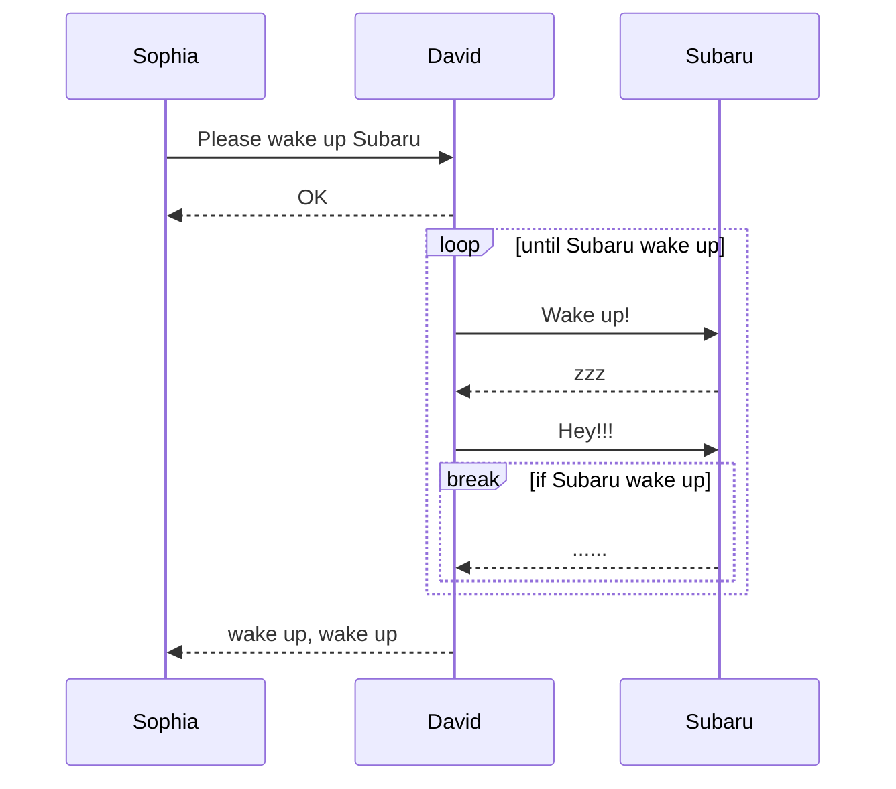

<!-- ALL-CONTRIBUTORS-BADGE:START - Do not remove or modify this section -->
[](#contributors-)
<!-- ALL-CONTRIBUTORS-BADGE:END -->
[](https://pkg.go.dev/github.com/nao1215/markdown)
[](https://github.com/nao1215/markdown/actions/workflows/unit_test.yml)
[](https://github.com/nao1215/markdown/actions/workflows/reviewdog.yml)
[](https://github.com/nao1215/markdown/actions/workflows/gosec.yml)

# What is markdown package
The Package markdown is a simple markdown builder in golang. The markdown package assembles Markdown using method chaining, not uses a template engine like [html/template](https://pkg.go.dev/html/template). The syntax of Markdown follows **GitHub Markdown**.
  
The markdown package was initially developed to save test results in [nao1215/spectest](https://github.com/nao1215/spectest). Therefore, the markdown package implements the features required by spectest. For example, the markdown package supports **mermaid sequence diagrams**, which was a necessary feature in spectest.
  
Additionally, complex code that increases the complexity of the library, such as generating nested lists, will not be added. I want to keep this library as simple as possible.
  
## Supported OS and go version
- OS: Linux, macOS, Windows
- Go: 1.20 or later
  
## Supported Markdown features
- [x] Heading; H1, H2, H3, H4, H5, H6
- [x] Blockquote 
- [x] Bullet list
- [x] Ordered list
- [x] Checkbox list 
- [x] Code blocks
- [x] Horizontal rule 
- [x] Table
- [x] Text formatting; bold, italic, code, strikethrough, bold italic
- [x] Text with link
- [x] Text with image
- [x] Plain text
- [x] Details 
- [x] Alerts; NOTE, TIP, IMPORTANT, CAUTION, WARNING
- [x] mermaid (only support sequence diagram)

### Features not in Markdown syntax
- Generate badges; RedBadge(), YellowBadge(), GreenBadge().
- Generate an index for a directory full of markdown files; GenerateIndex()
  
## Example
### Basic usage
```go
package main

import (
	"os"

	md "github.com/nao1215/markdown"
)

func main() {
	md.NewMarkdown(os.Stdout).
		H1("This is H1").
		PlainText("This is plain text").
		H2f("This is %s with text format", "H2").
		PlainTextf("Text formatting, such as %s and %s, %s styles.",
			md.Bold("bold"), md.Italic("italic"), md.Code("code")).
		H2("Code Block").
		CodeBlocks(md.SyntaxHighlightGo,
			`package main
import "fmt"

func main() {
	fmt.Println("Hello, World!")
}`).
		H2("List").
		BulletList("Bullet Item 1", "Bullet Item 2", "Bullet Item 3").
		OrderedList("Ordered Item 1", "Ordered Item 2", "Ordered Item 3").
		H2("CheckBox").
		CheckBox([]md.CheckBoxSet{
			{Checked: false, Text: md.Code("sample code")},
			{Checked: true, Text: md.Link("Go", "https://golang.org")},
			{Checked: false, Text: md.Strikethrough("strikethrough")},
		}).
		H2("Blockquote").
		Blockquote("If you can dream it, you can do it.").
		H3("Horizontal Rule").
		HorizontalRule().
		H2("Table").
		Table(md.TableSet{
			Header: []string{"Name", "Age", "Country"},
			Rows: [][]string{
				{"David", "23", "USA"},
				{"John", "30", "UK"},
				{"Bob", "25", "Canada"},
			},
		}).
		H2("Image").
		PlainTextf(md.Image("sample_image", "./sample.png")).
		Build()
}
```

Output:
````
# This is H1
This is plain text
  
## This is H2 with text format
Text formatting, such as **bold** and *italic*, `code` styles.
  
## Code Block
```go
package main
import "fmt"

func main() {
        fmt.Println("Hello, World!")
}
```
  
## List
- Bullet Item 1
- Bullet Item 2
- Bullet Item 3
1. Ordered Item 1
2. Ordered Item 2
3. Ordered Item 3
  
## CheckBox
- [ ] `sample code`
- [x] [Go](https://golang.org)
- [ ] ~~strikethrough~~
  
## Blockquote
> If you can dream it, you can do it.
  
### Horizontal Rule
---
  
## Table
| NAME  | AGE | COUNTRY |
|-------|-----|---------|
| David |  23 | USA     |
| John  |  30 | UK      |
| Bob   |  25 | Canada  |

## Image

````

If you want to see how it looks in Markdown, please refer to the following link.
- [sample.md](./doc/generated_example.md)

### Generate Markdown using `"go generate ./..."`
You can generate Markdown using `go generate`. Please define code to generate Markdown first. Then, run `"go generate ./..."` to generate Markdown.

[Code example:](./doc/generate/main.go)
```go
package main

import (
	"os"

	md "github.com/nao1215/markdown"
)

//go:generate go run main.go

func main() {
	f, err := os.Create("generated.md")
	if err != nil {
		panic(err)
	}

	md.NewMarkdown(f).
		H1("go generate example").
		PlainText("This markdown is generated by `go generate`").
		Build()
}
```

Run below command:
```shell
go generate ./...
```

[Output:](./doc/generate/generated.md)
````text
# go generate example
This markdown is generated by `go generate`
````

### Generate alerts
The markdown package can create alerts. Alerts are useful for displaying important information in Markdown. This syntax is supported by GitHub.
[Code example:](./doc/alert/main.go)
```go
	md.NewMarkdown(f).
		H1("Alert example").
		Note("This is note").LF().
		Tip("This is tip").LF().
		Important("This is important").LF().
		Warning("This is warning").LF().
		Caution("This is caution").LF().
		Build()
```
  
[Output:](./doc/alert/generated.md)
````text
# Alert example
> [!NOTE]  
> This is note
  
> [!TIP]  
> This is tip
  
> [!IMPORTANT]  
> This is important
  
> [!WARNING]  
> This is warning
  
> [!CAUTION]  
> This is caution
````

Your alert will look like this;
> [!NOTE]  
> This is note
  
> [!TIP]  
> This is tip
  
> [!IMPORTANT]  
> This is important
  
> [!WARNING]  
> This is warning
  
> [!CAUTION]  
> This is caution

### Generate status badge
The markdown package can create red, yellow, and green status badges.
[Code example:](./doc/badge/main.go)
```go
	md.NewMarkdown(os.Stdout).
		H1("badge example").
		RedBadge("red_badge").
		YellowBadge("yellow_badge").
		GreenBadge("green_badge").
		Build()
```

[Output:](./doc/badge/generated.md)
````text
# badge example


````

Your badge will look like this;  


### Generate mermaid sequence diagram
Generate mermaid in markdown. You can generate mermaid using go generate. Please define code to generate Mermaid first. Then, run "go generate ./..." to generate it.

```go
package main

import (
	"os"

	"github.com/nao1215/markdown"
	"github.com/nao1215/mermaid/sequence"
)

//go:generate go run main.go

func main() {
	diagram := sequence.NewDiagram(os.Stdout).
		Participant("Sophia").
		Participant("David").
		Participant("Subaru").
		LF().
		SyncRequest("Sophia", "David", "Please wake up Subaru").
		SyncResponse("David", "Sophia", "OK").
		LF().
		LoopStart("until Subaru wake up").
		SyncRequest("David", "Subaru", "Wake up!").
		SyncResponse("Subaru", "David", "zzz").
		SyncRequest("David", "Subaru", "Hey!!!").
		BreakStart("if Subaru wake up").
		SyncResponse("Subaru", "David", "......").
		BreakEnd().
		LoopEnd().
		LF().
		SyncResponse("David", "Sophia", "wake up, wake up").
		String()

	markdown.NewMarkdown(os.Stdout).
		H2("Sequence Diagram").
		CodeBlocks(markdown.SyntaxHighlightMermaid, diagram).
		Build()
}
```

Plain text output: [markdown is here](./doc/sequence/generated.md)
````
## Sequence Diagram

````

Mermaid output:


## Creating an index for a directory full of markdown files
The markdown package can create an index for Markdown files within the specified directory. This feature was added to generate indexes for Markdown documents produced by [nao1215/spectest](https://github.com/nao1215/spectest).
  
For example, consider the following directory structure:

```shell
testdata
├── abc
│   ├── dummy.txt
│   ├── jkl
│   │   └── text.md
│   └── test.md
├── def
│   ├── test.md
│   └── test2.md
├── expected
│   └── index.md
├── ghi
└── test.md
```
  
In the following implementation, it creates an index markdown file containing links to all markdown files located within the testdata directory.

```go
		if err := GenerateIndex(
			"testdata", // target directory that contains markdown files
			WithTitle("Test Title"), // title of index markdown
			WithDescription([]string{"Test Description", "Next Description"}), // description of index markdown
		); err != nil {
			panic(err)
		}
```
  
The index Markdown file is created under "target directory/index.md" by default. If you want to change this path, please use the `WithWriter()` option. The link names in the file will be the first occurrence of H1 or H2 in the target Markdown. If neither H1 nor H2 is present, the link name will be the file name of the destination.  
  
[Output:](./doc/index.md)
```markdown
## Test Title
Test Description
  
Next Description
  
### testdata
- [test.md](test.md)
  
### abc
- [h2 is here](abc/test.md)
  
### jkl
- [text.md](abc/jkl/text.md)
  
### def
- [h2 is first, not h1](def/test.md)
- [h1 is here](def/test2.md)
  
### expected
- [Test Title](expected/index.md)
```
  
## License
[MIT License](./LICENSE)

## Contribution
First off, thanks for taking the time to contribute! Contributions are not only related to development. For example, GitHub Star motivates me to develop! Please feel free to contribute to this project.

[](https://star-history.com/#nao1215/markdown&Date)

### Contributors ✨

Thanks goes to these wonderful people ([emoji key](https://allcontributors.org/docs/en/emoji-key)):

<!-- ALL-CONTRIBUTORS-LIST:START - Do not remove or modify this section -->
<!-- prettier-ignore-start -->
<!-- markdownlint-disable -->
<table>
  <tbody>
    <tr>
      <td align="center" valign="top" width="14.28%"><a href="https://debimate.jp/"><br /><sub><b>CHIKAMATSU Naohiro</b></sub></a><br /><a href="https://github.com/nao1215/markdown/commits?author=nao1215" title="Code">💻</a></td>
      <td align="center" valign="top" width="14.28%"><a href="https://github.com/varmakarthik12"><br /><sub><b>Karthik Sundari</b></sub></a><br /><a href="https://github.com/nao1215/markdown/commits?author=varmakarthik12" title="Code">💻</a></td>
      <td align="center" valign="top" width="14.28%"><a href="https://github.com/Avihuc"><br /><sub><b>Avihuc</b></sub></a><br /><a href="https://github.com/nao1215/markdown/commits?author=Avihuc" title="Code">💻</a></td>
    </tr>
  </tbody>
  <tfoot>
    <tr>
      <td align="center" size="13px" colspan="7">
        
          <a href="https://all-contributors.js.org/docs/en/bot/usage">Add your contributions</a>
        </img>
      </td>
    </tr>
  </tfoot>
</table>

<!-- markdownlint-restore -->
<!-- prettier-ignore-end -->

<!-- ALL-CONTRIBUTORS-LIST:END -->

This project follows the [all-contributors](https://github.com/all-contributors/all-contributors) specification. Contributions of any kind welcome!
