<!-- ALL-CONTRIBUTORS-BADGE:START - Do not remove or modify this section -->
[](#contributors-)
<!-- ALL-CONTRIBUTORS-BADGE:END -->
[](https://pkg.go.dev/github.com/nao1215/markdown)
[](https://github.com/nao1215/markdown/actions/workflows/unit_test.yml)
[](https://github.com/nao1215/markdown/actions/workflows/reviewdog.yml)
[](https://github.com/nao1215/markdown/actions/workflows/gosec.yml)


[日本語](./doc/ja/README.md) | [Русский](./doc/ru/README.md) | [中文](./doc/zh-cn/README.md) | [한국어](./doc/ko/README.md) | [Español](./doc/es/README.md) | [Français](./doc/fr/README.md)

# What is markdown package
The Package markdown is a simple markdown builder in golang. The markdown package assembles Markdown using method chaining, not uses a template engine like [html/template](https://pkg.go.dev/html/template). The syntax of Markdown follows **GitHub Markdown**.
  
The markdown package was initially developed to save test results in [nao1215/spectest](https://github.com/nao1215/spectest). Therefore, the markdown package implements the features required by spectest. For example, the markdown package supports **mermaid diagrams (entity relationship diagram, sequence diagram, user journey diagram, git graph diagram, mindmap diagram, requirement diagram, xy chart, packet diagram, block diagram, kanban diagram, flowchart, pie chart, quadrant chart, state diagram, class diagram, Gantt chart, architecture diagram)**, which was a necessary feature in spectest.
  
Additionally, complex code that increases the complexity of the library, such as generating nested lists, will not be added. I want to keep this library as simple as possible.
  
## Supported OS and go version
- OS: Linux, macOS, Windows
- Go: 1.23 or later
  
## Supported Markdown features
- [x] Heading; H1, H2, H3, H4, H5, H6
- [x] Blockquote 
- [x] Bullet list
- [x] Ordered list
- [x] Checkbox list 
- [x] Code blocks
- [x] Horizontal rule 
- [x] Table
- [x] Text formatting; bold, italic, code, strikethrough, bold italic
- [x] Text with link
- [x] Reference link
- [x] Text with image
- [x] Plain text
- [x] Details 
- [x] Footnotes
- [x] Mathematical expressions
- [x] Alerts; NOTE, TIP, IMPORTANT, CAUTION, WARNING
- [x] mermaid sequence diagram
- [x] mermaid user journey diagram
- [x] mermaid git graph diagram
- [x] mermaid mindmap diagram
- [x] mermaid requirement diagram
- [x] mermaid xy chart
- [x] mermaid packet diagram
- [x] mermaid block diagram
- [x] mermaid kanban diagram
- [x] mermaid entity relationship diagram
- [x] mermaid flowchart 
- [x] mermaid pie chart
- [x] mermaid quadrant chart
- [x] mermaid state diagram
- [x] mermaid class diagram
- [x] mermaid Gantt chart
- [x] mermaid architecture diagram (beta feature) 

### Features not in Markdown syntax
- Generate badges; RedBadge(), YellowBadge(), GreenBadge().
- Generate an index for a directory full of markdown files; GenerateIndex()
  
## Example
### Basic usage
```go
package main

import (
	"os"

	md "github.com/nao1215/markdown"
)

func main() {
	md.NewMarkdown(os.Stdout).
		H1("This is H1").
		PlainText("This is plain text").
		H2f("This is %s with text format", "H2").
		PlainTextf("Text formatting, such as %s and %s, %s styles.",
			md.Bold("bold"), md.Italic("italic"), md.Code("code")).
		H2("Code Block").
		CodeBlocks(md.SyntaxHighlightGo,
			`package main
import "fmt"

func main() {
	fmt.Println("Hello, World!")
}`).
		H2("List").
		BulletList("Bullet Item 1", "Bullet Item 2", "Bullet Item 3").
		OrderedList("Ordered Item 1", "Ordered Item 2", "Ordered Item 3").
		H2("CheckBox").
		CheckBox([]md.CheckBoxSet{
			{Checked: false, Text: md.Code("sample code")},
			{Checked: true, Text: md.Link("Go", "https://golang.org")},
			{Checked: false, Text: md.Strikethrough("strikethrough")},
		}).
		H2("Blockquote").
		Blockquote("If you can dream it, you can do it.").
		H3("Horizontal Rule").
		HorizontalRule().
		H2("Table").
		Table(md.TableSet{
			Header: []string{"Name", "Age", "Country"},
			Rows: [][]string{
				{"David", "23", "USA"},
				{"John", "30", "UK"},
				{"Bob", "25", "Canada"},
			},
		}).
		H2("Image").
		PlainTextf(md.Image("sample_image", "./sample.png")).
		Build()
}
```

Output:
````
# This is H1
This is plain text
  
## This is H2 with text format
Text formatting, such as **bold** and *italic*, `code` styles.
  
## Code Block
```go
package main
import "fmt"

func main() {
        fmt.Println("Hello, World!")
}
```
  
## List
- Bullet Item 1
- Bullet Item 2
- Bullet Item 3
1. Ordered Item 1
2. Ordered Item 2
3. Ordered Item 3
  
## CheckBox
- [ ] `sample code`
- [x] [Go](https://golang.org)
- [ ] ~~strikethrough~~
  
## Blockquote
> If you can dream it, you can do it.
  
### Horizontal Rule
---
  
## Table
| NAME  | AGE | COUNTRY |
|-------|-----|---------|
| David |  23 | USA     |
| John  |  30 | UK      |
| Bob   |  25 | Canada  |

## Image

````

If you want to see how it looks in Markdown, please refer to the following link.
- [sample.md](./doc/generated_example.md)

### Generate Markdown using `"go generate ./..."`
You can generate Markdown using `go generate`. Please define code to generate Markdown first. Then, run `"go generate ./..."` to generate Markdown.

[Code example:](./doc/generate/main.go)
```go
package main

import (
	"os"

	md "github.com/nao1215/markdown"
)

//go:generate go run main.go

func main() {
	f, err := os.Create("generated.md")
	if err != nil {
		panic(err)
	}
	defer f.Close()

	md.NewMarkdown(f).
		H1("go generate example").
		PlainText("This markdown is generated by `go generate`").
		Build()
}
```

Run below command:
```shell
go generate ./...
```

[Output:](./doc/generate/generated.md)
````text
# go generate example
This markdown is generated by `go generate`
````

### Alerts syntax
The markdown package can create alerts. Alerts are useful for displaying important information in Markdown. This syntax is supported by GitHub.
[Code example:](./doc/alert/main.go)
```go
	md.NewMarkdown(f).
		H1("Alert example").
		Note("This is note").LF().
		Tip("This is tip").LF().
		Important("This is important").LF().
		Warning("This is warning").LF().
		Caution("This is caution").LF().
		Build()
```
  
[Output:](./doc/alert/generated.md)
````text
# Alert example
> [!NOTE]  
> This is note
  
> [!TIP]  
> This is tip
  
> [!IMPORTANT]  
> This is important
  
> [!WARNING]  
> This is warning
  
> [!CAUTION]  
> This is caution
````

Your alert will look like this;
> [!NOTE]  
> This is note
  
> [!TIP]  
> This is tip
  
> [!IMPORTANT]  
> This is important
  
> [!WARNING]  
> This is warning
  
> [!CAUTION]  
> This is caution

### Status badge syntax
The markdown package can create red, yellow, and green status badges.
[Code example:](./doc/badge/main.go)
```go
	md.NewMarkdown(os.Stdout).
		H1("badge example").
		RedBadge("red_badge").
		YellowBadge("yellow_badge").
		GreenBadge("green_badge").
		BlueBadge("blue_badge").
		Build()
```

[Output:](./doc/badge/generated.md)
````text
# badge example


````

Your badge will look like this;  


### Mermaid sequence diagram syntax

```go
package main

import (
	"io"
	"os"

	"github.com/nao1215/markdown"
	"github.com/nao1215/markdown/mermaid/sequence"
)

//go:generate go run main.go

func main() {
	diagram := sequence.NewDiagram(io.Discard).
		Participant("Sophia").
		Participant("David").
		Participant("Subaru").
		LF().
		SyncRequest("Sophia", "David", "Please wake up Subaru").
		SyncResponse("David", "Sophia", "OK").
		LF().
		LoopStart("until Subaru wake up").
		SyncRequest("David", "Subaru", "Wake up!").
		SyncResponse("Subaru", "David", "zzz").
		SyncRequest("David", "Subaru", "Hey!!!").
		BreakStart("if Subaru wake up").
		SyncResponse("Subaru", "David", "......").
		BreakEnd().
		LoopEnd().
		LF().
		SyncResponse("David", "Sophia", "wake up, wake up").
		String()

	markdown.NewMarkdown(os.Stdout).
		H2("Sequence Diagram").
		CodeBlocks(markdown.SyntaxHighlightMermaid, diagram).
		Build()
}
```

Plain text output: [markdown is here](./doc/sequence/generated.md)
````
## Sequence Diagram
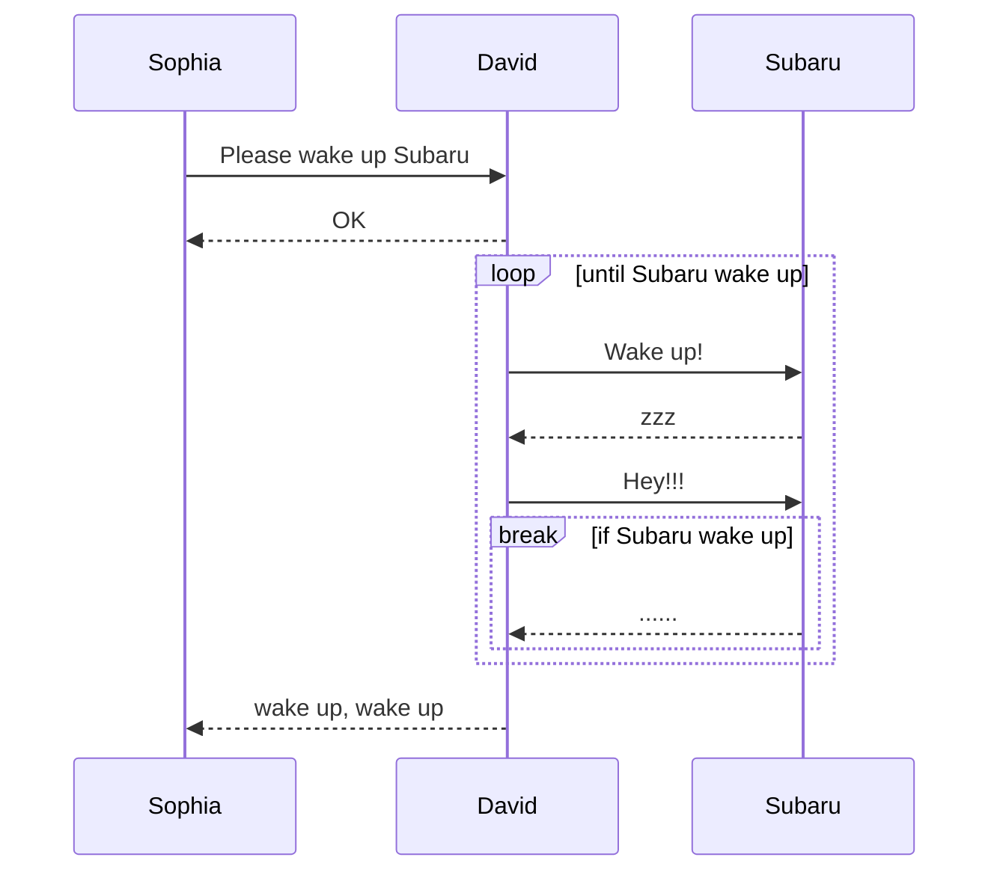
```mermaid
sequenceDiagram
    participant Sophia
    participant David
    participant Subaru

    Sophia->>David: Please wake up Subaru
    David-->>Sophia: OK

    loop until Subaru wake up
    David->>Subaru: Wake up!
    Subaru-->>David: zzz
    David->>Subaru: Hey!!!
    break if Subaru wake up
    Subaru-->>David: ......
    end
    end

    David-->>Sophia: wake up, wake up
```
````

Mermaid output:

```mermaid
sequenceDiagram
    participant Sophia
    participant David
    participant Subaru

    Sophia->>David: Please wake up Subaru
    David-->>Sophia: OK

    loop until Subaru wake up
    David->>Subaru: Wake up!
    Subaru-->>David: zzz
    David->>Subaru: Hey!!!
    break if Subaru wake up
    Subaru-->>David: ......
    end
    end

    David-->>Sophia: wake up, wake up
```

### Mermaid user journey diagram syntax

```go
package main

import (
	"io"
	"os"

	"github.com/nao1215/markdown"
	"github.com/nao1215/markdown/mermaid/userjourney"
)

//go:generate go run main.go

func main() {
	diagram := userjourney.NewDiagram(
		io.Discard,
		userjourney.WithTitle("Checkout Journey"),
	).
		Section("Discover").
		Task("Browse products", userjourney.ScoreVerySatisfied, "Customer").
		Task("Add item to cart", userjourney.ScoreSatisfied, "Customer").
		LF().
		Section("Checkout").
		Task("Enter shipping details", userjourney.ScoreNeutral, "Customer").
		Task("Complete payment", userjourney.ScoreSatisfied, "Customer", "Payment Service").
		String()

	if err := markdown.NewMarkdown(os.Stdout).
		H2("User Journey Diagram").
		CodeBlocks(markdown.SyntaxHighlightMermaid, diagram).
		Build(); err != nil {
		panic(err)
	}
}
```

Plain text output: [markdown is here](./doc/userjourney/generated.md)
````text
## User Journey Diagram
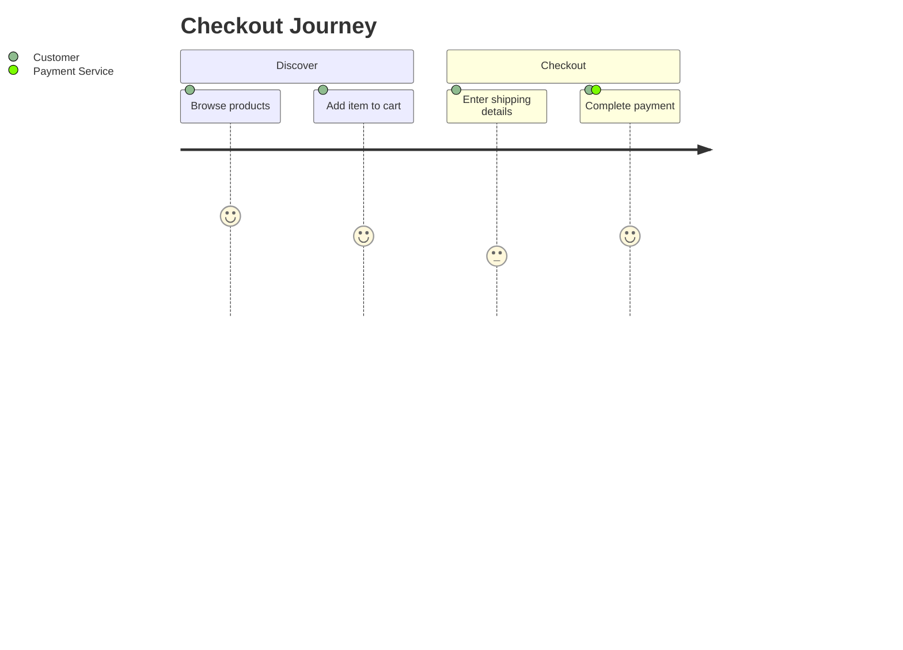
```mermaid
journey
    title Checkout Journey
    section Discover
        Browse products: 5: Customer
        Add item to cart: 4: Customer

    section Checkout
        Enter shipping details: 3: Customer
        Complete payment: 4: Customer, Payment Service
```
````

Mermaid output:

```mermaid
journey
    title Checkout Journey
    section Discover
        Browse products: 5: Customer
        Add item to cart: 4: Customer

    section Checkout
        Enter shipping details: 3: Customer
        Complete payment: 4: Customer, Payment Service
```

### Mermaid git graph syntax

```go
package main

import (
	"io"
	"os"

	"github.com/nao1215/markdown"
	"github.com/nao1215/markdown/mermaid/gitgraph"
)

//go:generate go run main.go

func main() {
	diagram := gitgraph.NewDiagram(
		io.Discard,
		gitgraph.WithTitle("Release Flow"),
	).
		Commit(gitgraph.WithCommitID("init"), gitgraph.WithCommitTag("v0.1.0")).
		Branch("develop", gitgraph.WithBranchOrder(2)).
		Checkout("develop").
		Commit(gitgraph.WithCommitType(gitgraph.CommitTypeHighlight)).
		Checkout("main").
		Merge("develop", gitgraph.WithCommitTag("v1.0.0")).
		String()

	if err := markdown.NewMarkdown(os.Stdout).
		H2("Git Graph").
		CodeBlocks(markdown.SyntaxHighlightMermaid, diagram).
		Build(); err != nil {
		panic(err)
	}
}
```

Plain text output: [markdown is here](./doc/gitgraph/generated.md)
````text
## Git Graph

```mermaid
---
title: Release Flow
---
gitGraph
    commit id: "init" tag: "v0.1.0"
    branch develop order: 2
    checkout develop
    commit type: HIGHLIGHT
    checkout main
    merge develop tag: "v1.0.0"
```
````

Mermaid output:
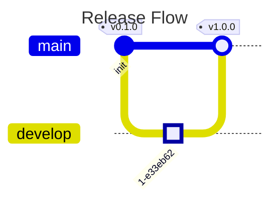
```mermaid
---
title: Release Flow
---
gitGraph
    commit id: "init" tag: "v0.1.0"
    branch develop order: 2
    checkout develop
    commit type: HIGHLIGHT
    checkout main
    merge develop tag: "v1.0.0"
```

### Mermaid mindmap syntax

```go
package main

import (
	"io"
	"os"

	"github.com/nao1215/markdown"
	"github.com/nao1215/markdown/mermaid/mindmap"
)

//go:generate go run main.go

func main() {
	diagram := mindmap.NewDiagram(
		io.Discard,
		mindmap.WithTitle("Product Strategy Mindmap"),
	).
		Root("Product Strategy").
		Child("Market").
		Child("SMB").
		Sibling("Enterprise").
		Parent().
		Sibling("Execution").
		Child("Q1").
		Sibling("Q2").
		String()

	if err := markdown.NewMarkdown(os.Stdout).
		H2("Mindmap").
		CodeBlocks(markdown.SyntaxHighlightMermaid, diagram).
		Build(); err != nil {
		panic(err)
	}
}
```

Plain text output: [markdown is here](./doc/mindmap/generated.md)
````text
## Mindmap
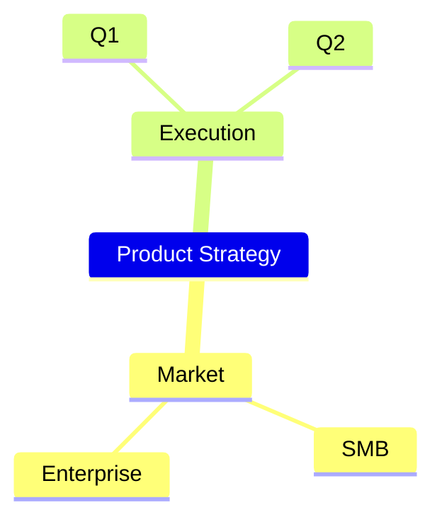
```mermaid
---
title: Product Strategy Mindmap
---
mindmap
    Product Strategy
        Market
            SMB
            Enterprise
        Execution
            Q1
            Q2
```
````

Mermaid output:

```mermaid
---
title: Product Strategy Mindmap
---
mindmap
    Product Strategy
        Market
            SMB
            Enterprise
        Execution
            Q1
            Q2
```

### Mermaid requirement diagram syntax

```go
package main

import (
	"io"
	"os"

	"github.com/nao1215/markdown"
	"github.com/nao1215/markdown/mermaid/requirement"
)

//go:generate go run main.go

func main() {
	diagram := requirement.NewDiagram(
		io.Discard,
		requirement.WithTitle("Checkout Requirements"),
	).
		SetDirection(requirement.DirectionTB).
		Requirement(
			"Login",
			requirement.WithID("REQ-1"),
			requirement.WithText("The system shall support login."),
			requirement.WithRisk(requirement.RiskHigh),
			requirement.WithVerifyMethod(requirement.VerifyMethodTest),
			requirement.WithRequirementClasses("critical"),
		).
		FunctionalRequirement(
			"RememberSession",
			requirement.WithID("REQ-2"),
			requirement.WithText("The system shall remember the user."),
			requirement.WithRisk(requirement.RiskMedium),
			requirement.WithVerifyMethod(requirement.VerifyMethodInspection),
		).
		Element(
			"AuthService",
			requirement.WithElementType("system"),
			requirement.WithDocRef("docs/auth.md"),
			requirement.WithElementClasses("service"),
		).
		From("AuthService").
		Satisfies("Login").
		From("RememberSession").
		Verifies("Login").
		ClassDefs(
			requirement.Def("critical", "fill:#f96,stroke:#333,stroke-width:2px"),
			requirement.Def("service", "fill:#9cf,stroke:#333,stroke-width:1px"),
		).
		String()

	if err := markdown.NewMarkdown(os.Stdout).
		H2("Requirement Diagram").
		CodeBlocks(markdown.SyntaxHighlightMermaid, diagram).
		Build(); err != nil {
		panic(err)
	}
}
```

Plain text output: [markdown is here](./doc/requirement/generated.md)
````text
## Requirement Diagram
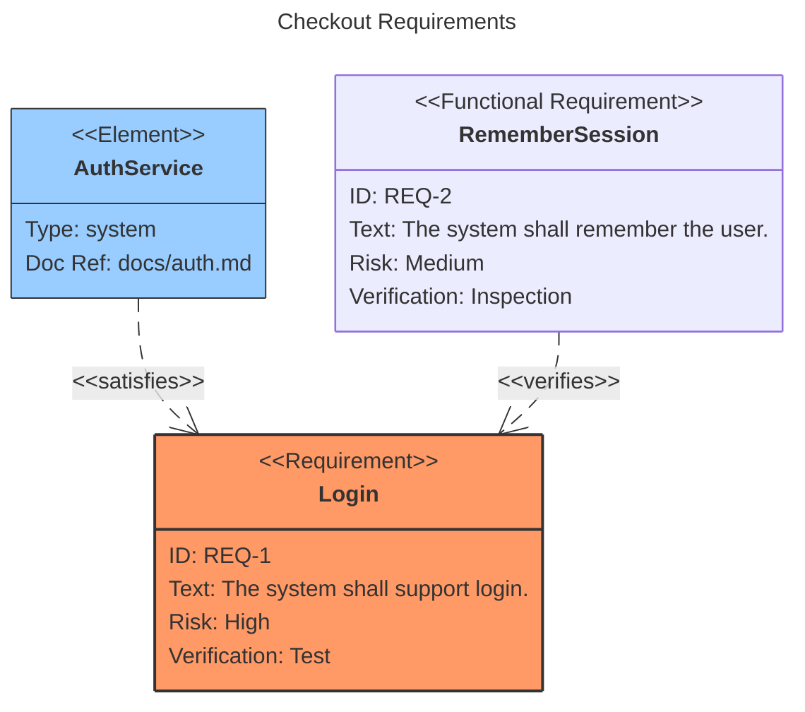
```mermaid
---
title: Checkout Requirements
---
requirementDiagram
    direction TB
    requirement Login:::critical {
        id: "REQ-1"
        text: "The system shall support login."
        risk: High
        verifymethod: Test
    }
    functionalRequirement RememberSession {
        id: "REQ-2"
        text: "The system shall remember the user."
        risk: Medium
        verifymethod: Inspection
    }
    element AuthService:::service {
        type: "system"
        docRef: "docs/auth.md"
    }
    AuthService - satisfies -> Login
    RememberSession - verifies -> Login
    classDef critical fill:#f96,stroke:#333,stroke-width:2px
    classDef service fill:#9cf,stroke:#333,stroke-width:1px
```
````

Mermaid output:

```mermaid
---
title: Checkout Requirements
---
requirementDiagram
    direction TB
    requirement Login:::critical {
        id: "REQ-1"
        text: "The system shall support login."
        risk: High
        verifymethod: Test
    }
    functionalRequirement RememberSession {
        id: "REQ-2"
        text: "The system shall remember the user."
        risk: Medium
        verifymethod: Inspection
    }
    element AuthService:::service {
        type: "system"
        docRef: "docs/auth.md"
    }
    AuthService - satisfies -> Login
    RememberSession - verifies -> Login
    classDef critical fill:#f96,stroke:#333,stroke-width:2px
    classDef service fill:#9cf,stroke:#333,stroke-width:1px
```

### Mermaid XY chart syntax

```go
package main

import (
	"io"
	"os"

	"github.com/nao1215/markdown"
	"github.com/nao1215/markdown/mermaid/xychart"
)

//go:generate go run main.go

func main() {
	diagram := xychart.NewDiagram(
		io.Discard,
		xychart.WithTitle("Sales Revenue"),
	).
		XAxisLabels("Jan", "Feb", "Mar", "Apr", "May", "Jun").
		YAxisRangeWithTitle("Revenue (k$)", 0, 100).
		Bar(25, 40, 60, 80, 70, 90).
		Line(30, 50, 70, 85, 75, 95).
		String()

	if err := markdown.NewMarkdown(os.Stdout).
		H2("XY Chart").
		CodeBlocks(markdown.SyntaxHighlightMermaid, diagram).
		Build(); err != nil {
		panic(err)
	}
}
```

Plain text output: [markdown is here](./doc/xychart/generated.md)
````text
## XY Chart
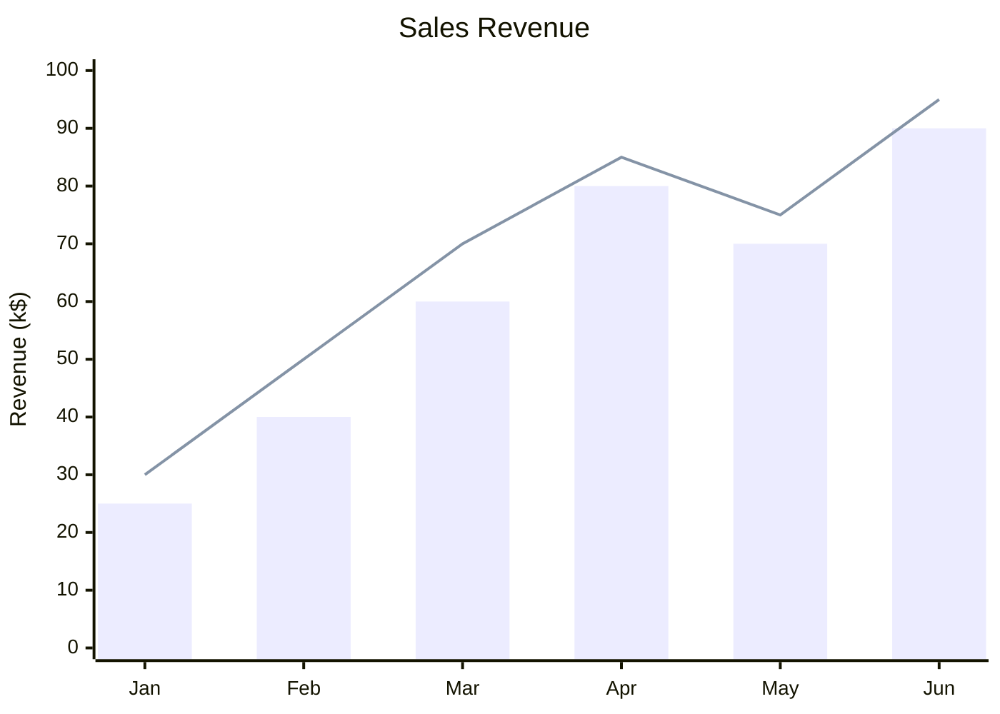
```mermaid
xychart
    title "Sales Revenue"
    x-axis [Jan, Feb, Mar, Apr, May, Jun]
    y-axis "Revenue (k$)" 0 --> 100
    bar [25, 40, 60, 80, 70, 90]
    line [30, 50, 70, 85, 75, 95]
```
````

Mermaid output:

```mermaid
xychart
    title "Sales Revenue"
    x-axis [Jan, Feb, Mar, Apr, May, Jun]
    y-axis "Revenue (k$)" 0 --> 100
    bar [25, 40, 60, 80, 70, 90]
    line [30, 50, 70, 85, 75, 95]
```

### Mermaid packet syntax

```go
package main

import (
	"io"
	"os"

	"github.com/nao1215/markdown"
	"github.com/nao1215/markdown/mermaid/packet"
)

//go:generate go run main.go

func main() {
	diagram := packet.NewDiagram(
		io.Discard,
		packet.WithTitle("UDP Packet"),
	).
		Next(16, "Source Port").
		Next(16, "Destination Port").
		Field(32, 47, "Length").
		Field(48, 63, "Checksum").
		Field(64, 95, "Data (variable length)").
		String()

	if err := markdown.NewMarkdown(os.Stdout).
		H2("Packet").
		CodeBlocks(markdown.SyntaxHighlightMermaid, diagram).
		Build(); err != nil {
		panic(err)
	}
}
```

Plain text output: [markdown is here](./doc/packet/generated.md)
````text
## Packet
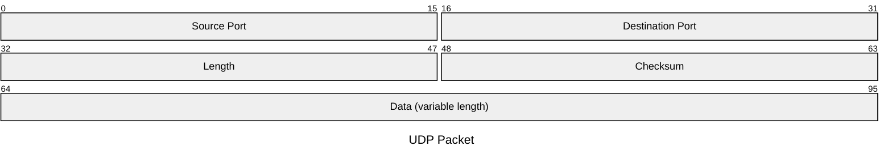
```mermaid
packet
    title UDP Packet
    +16: "Source Port"
    +16: "Destination Port"
    32-47: "Length"
    48-63: "Checksum"
    64-95: "Data (variable length)"
```
````

Mermaid output:

```mermaid
packet
    title UDP Packet
    +16: "Source Port"
    +16: "Destination Port"
    32-47: "Length"
    48-63: "Checksum"
    64-95: "Data (variable length)"
```

### Mermaid block syntax

```go
package main

import (
	"io"
	"os"

	"github.com/nao1215/markdown"
	"github.com/nao1215/markdown/mermaid/block"
)

//go:generate go run main.go

func main() {
	diagram := block.NewDiagram(
		io.Discard,
		block.WithTitle("Checkout Architecture"),
	).
		Columns(3).
		Row(
			block.Node("Frontend"),
			block.ArrowRight("toBackend", block.WithArrowLabel("calls")),
			block.Node("Backend"),
		).
		Row(
			block.Space(2),
			block.ArrowDown("toDB"),
		).
		Row(
			block.Node("Database", block.WithNodeLabel("Primary DB"), block.WithNodeShape(block.ShapeCylinder)),
			block.Space(),
			block.Node("Cache", block.WithNodeLabel("Cache"), block.WithNodeShape(block.ShapeRound)),
		).
		Link("Backend", "Database").
		LinkWithLabel("Backend", "reads from", "Cache").
		String()

	if err := markdown.NewMarkdown(os.Stdout).
		H2("Block Diagram").
		CodeBlocks(markdown.SyntaxHighlightMermaid, diagram).
		Build(); err != nil {
		panic(err)
	}
}
```

Plain text output: [markdown is here](./doc/block/generated.md)
````text
## Block Diagram
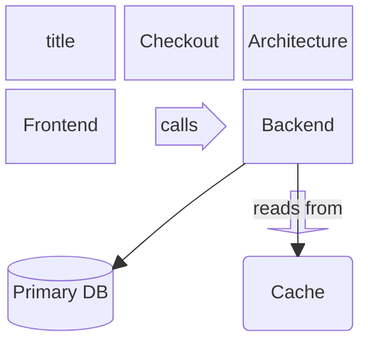
```mermaid
block
    title Checkout Architecture
    columns 3
    Frontend toBackend<["calls"]>(right) Backend
    space:2 toDB<["&nbsp;"]>(down)
    Database[("Primary DB")] space Cache("Cache")
    Backend --> Database
    Backend -- "reads from" --> Cache
```
````

Mermaid output:

```mermaid
block
    title Checkout Architecture
    columns 3
    Frontend toBackend<["calls"]>(right) Backend
    space:2 toDB<["&nbsp;"]>(down)
    Database[("Primary DB")] space Cache("Cache")
    Backend --> Database
    Backend -- "reads from" --> Cache
```

### Mermaid kanban syntax

```go
package main

import (
	"io"
	"os"

	"github.com/nao1215/markdown"
	"github.com/nao1215/markdown/mermaid/kanban"
)

//go:generate go run main.go

func main() {
	diagram := kanban.NewDiagram(
		io.Discard,
		kanban.WithTitle("Sprint Board"),
		kanban.WithTicketBaseURL("https://example.com/tickets/"),
	).
		Column("Todo").
		Task("Define scope").
		Task(
			"Create login page",
			kanban.WithTaskTicket("MB-101"),
			kanban.WithTaskAssigned("Alice"),
			kanban.WithTaskPriority(kanban.PriorityHigh),
		).
		Column("In Progress").
		Task("Review API", kanban.WithTaskPriority(kanban.PriorityVeryHigh)).
		String()

	if err := markdown.NewMarkdown(os.Stdout).
		H2("Kanban Diagram").
		CodeBlocks(markdown.SyntaxHighlightMermaid, diagram).
		Build(); err != nil {
		panic(err)
	}
}
```

Plain text output: [markdown is here](./doc/kanban/generated.md)
````text
## Kanban Diagram
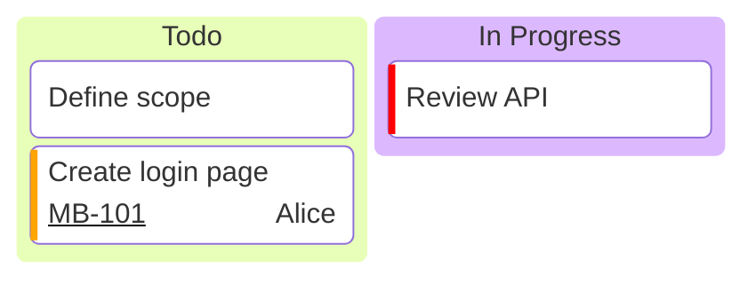
```mermaid
---
title: Sprint Board
config:
  kanban:
    ticketBaseUrl: 'https://example.com/tickets/'
---
kanban
    [Todo]
        [Define scope]
        [Create login page]@{ ticket: 'MB-101', assigned: 'Alice', priority: 'High' }
    [In Progress]
        [Review API]@{ priority: 'Very High' }
```
````

Mermaid output:

```mermaid
---
title: Sprint Board
config:
  kanban:
    ticketBaseUrl: 'https://example.com/tickets/'
---
kanban
    [Todo]
        [Define scope]
        [Create login page]@{ ticket: 'MB-101', assigned: 'Alice', priority: 'High' }
    [In Progress]
        [Review API]@{ priority: 'Very High' }
```

### Entity Relationship Diagram syntax

```go
package main

import (
	"os"

	"github.com/nao1215/markdown"
	"github.com/nao1215/markdown/mermaid/er"
)

//go:generate go run main.go

func main() {
	f, err := os.Create("generated.md")
	if err != nil {
		panic(err)
	}
	defer f.Close()

	teachers := er.NewEntity(
		"teachers",
		[]*er.Attribute{
			{
				Type:         "int",
				Name:         "id",
				IsPrimaryKey: true,
				IsForeignKey: false,
				IsUniqueKey:  true,
				Comment:      "Teacher ID",
			},
			{
				Type:         "string",
				Name:         "name",
				IsPrimaryKey: false,
				IsForeignKey: false,
				IsUniqueKey:  false,
				Comment:      "Teacher Name",
			},
		},
	)
	students := er.NewEntity(
		"students",
		[]*er.Attribute{
			{
				Type:         "int",
				Name:         "id",
				IsPrimaryKey: true,
				IsForeignKey: false,
				IsUniqueKey:  true,
				Comment:      "Student ID",
			},
			{
				Type:         "string",
				Name:         "name",
				IsPrimaryKey: false,
				IsForeignKey: false,
				IsUniqueKey:  false,
				Comment:      "Student Name",
			},
			{
				Type:         "int",
				Name:         "teacher_id",
				IsPrimaryKey: false,
				IsForeignKey: true,
				IsUniqueKey:  true,
				Comment:      "Teacher ID",
			},
		},
	)
	schools := er.NewEntity(
		"schools",
		[]*er.Attribute{
			{
				Type:         "int",
				Name:         "id",
				IsPrimaryKey: true,
				IsForeignKey: false,
				IsUniqueKey:  true,
				Comment:      "School ID",
			},
			{
				Type:         "string",
				Name:         "name",
				IsPrimaryKey: false,
				IsForeignKey: false,
				IsUniqueKey:  false,
				Comment:      "School Name",
			},
			{
				Type:         "int",
				Name:         "teacher_id",
				IsPrimaryKey: false,
				IsForeignKey: true,
				IsUniqueKey:  true,
				Comment:      "Teacher ID",
			},
		},
	)

	erString := er.NewDiagram(f).
		Relationship(
			teachers,
			students,
			er.ExactlyOneRelationship, // "||"
			er.ZeroToMoreRelationship, // "}o"
			er.Identifying,            // "--"
			"Teacher has many students",
		).
		Relationship(
			teachers,
			schools,
			er.OneToMoreRelationship,  // "|}"
			er.ExactlyOneRelationship, // "||"
			er.NonIdentifying,         // ".."
			"School has many teachers",
		).
		String()

	err = markdown.NewMarkdown(f).
		H2("Entity Relationship Diagram").
		CodeBlocks(markdown.SyntaxHighlightMermaid, erString).
		Build()

	if err != nil {
		panic(err)
	}
}
```

Plain text output: [markdown is here](./doc/er/generated.md)
````
## Entity Relationship Diagram
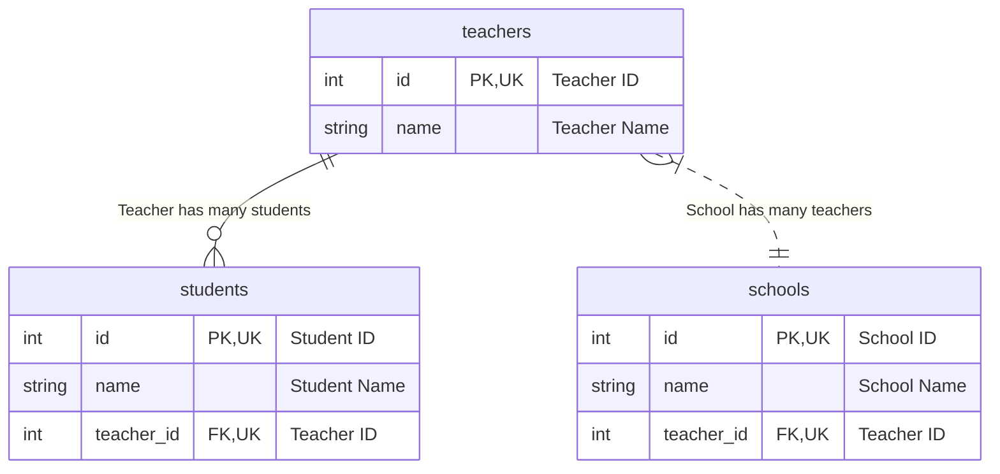
```mermaid
erDiagram
	teachers ||--o{ students : "Teacher has many students"
	teachers }|..|| schools : "School has many teachers"
	schools {
		int id PK,UK "School ID"
		string name  "School Name"
		int teacher_id FK,UK "Teacher ID"
	}
	students {
		int id PK,UK "Student ID"
		string name  "Student Name"
		int teacher_id FK,UK "Teacher ID"
	}
	teachers {
		int id PK,UK "Teacher ID"
		string name  "Teacher Name"
	}

```
````

Mermaid output:

```mermaid
erDiagram
	teachers ||--o{ students : "Teacher has many students"
	teachers }|..|| schools : "School has many teachers"
	schools {
		int id PK,UK "School ID"
		string name  "School Name"
		int teacher_id FK,UK "Teacher ID"
	}
	students {
		int id PK,UK "Student ID"
		string name  "Student Name"
		int teacher_id FK,UK "Teacher ID"
	}
	teachers {
		int id PK,UK "Teacher ID"
		string name  "Teacher Name"
	}
```

### Flowchart syntax

```go
package main

import (
	"io"
	"os"

	"github.com/nao1215/markdown"
	"github.com/nao1215/markdown/mermaid/flowchart"
)

//go:generate go run main.go

func main() {
	f, err := os.Create("generated.md")
	if err != nil {
		panic(err)
	}
	defer f.Close()

	fc := flowchart.NewFlowchart(
		io.Discard,
		flowchart.WithTitle("mermaid flowchart builder"),
		flowchart.WithOrientalTopToBottom(),
	).
		NodeWithText("A", "Node A").
		StadiumNode("B", "Node B").
		SubroutineNode("C", "Node C").
		DatabaseNode("D", "Database").
		LinkWithArrowHead("A", "B").
		LinkWithArrowHeadAndText("B", "D", "send original data").
		LinkWithArrowHead("B", "C").
		DottedLinkWithText("C", "D", "send filtered data").
		String()

	err = markdown.NewMarkdown(f).
		H2("Flowchart").
		CodeBlocks(markdown.SyntaxHighlightMermaid, fc).
		Build()

	if err != nil {
		panic(err)
	}
}
```

Plain text output: [markdown is here](./doc/flowchart/generated.md)
````
## Flowchart
```mermaid
---
title: mermaid flowchart builder
---
flowchart TB
	A["Node A"]
	B(["Node B"])
	C[["Node C"]]
	D[("Database")]
	A-->B
	B-->|"send original data"|D
	B-->C
	C-. "send filtered data" .-> D
```
````

Mermaid output:
```mermaid
flowchart TB
	A["Node A"]
	B(["Node B"])
	C[["Node C"]]
	D[("Database")]
	A-->B
	B-->|"send original data"|D
	B-->C
	C-. "send filtered data" .-> D
```

### Pie chart syntax

```go
package main

import (
	"io"
	"os"

	"github.com/nao1215/markdown"
	"github.com/nao1215/markdown/mermaid/piechart"
)

//go:generate go run main.go

func main() {
	f, err := os.Create("generated.md")
	if err != nil {
		panic(err)
	}
	defer f.Close()

	chart := piechart.NewPieChart(
		io.Discard,
		piechart.WithTitle("mermaid pie chart builder"),
		piechart.WithShowData(true),
	).
		LabelAndIntValue("A", 10).
		LabelAndFloatValue("B", 20.1).
		LabelAndIntValue("C", 30).
		String()

	err = markdown.NewMarkdown(f).
		H2("Pie Chart").
		CodeBlocks(markdown.SyntaxHighlightMermaid, chart).
		Build()

	if err != nil {
		panic(err)
	}
}
```

Plain text output: [markdown is here](./doc/piechart/generated.md)
````
## Pie Chart
```mermaid
%%{init: {"pie": {"textPosition": 0.75}, "themeVariables": {"pieOuterStrokeWidth": "5px"}} }%%
pie showData
    title mermaid pie chart builder
    "A" : 10
    "B" : 20.100000
    "C" : 30
```
````

Mermaid output:
```mermaid
%%{init: {"pie": {"textPosition": 0.75}, "themeVariables": {"pieOuterStrokeWidth": "5px"}} }%%
pie showData
    title mermaid pie chart builder
    "A" : 10
    "B" : 20.100000
    "C" : 30
```

### Architecture Diagrams (beta feature)

[The mermaid provides a feature to visualize infrastructure architecture as a beta version](https://mermaid.js.org/syntax/architecture.html), and that feature has been introduced.

```go
package main

import (
	"io"
	"os"

	"github.com/nao1215/markdown"
	"github.com/nao1215/markdown/mermaid/arch"
)

//go:generate go run main.go

func main() {
	f, err := os.Create("generated.md")
	if err != nil {
		panic(err)
	}
	defer f.Close()

	diagram := arch.NewArchitecture(io.Discard).
		Service("left_disk", arch.IconDisk, "Disk").
		Service("top_disk", arch.IconDisk, "Disk").
		Service("bottom_disk", arch.IconDisk, "Disk").
		Service("top_gateway", arch.IconInternet, "Gateway").
		Service("bottom_gateway", arch.IconInternet, "Gateway").
		Junction("junctionCenter").
		Junction("junctionRight").
		LF().
		Edges(
			arch.Edge{
				ServiceID: "left_disk",
				Position:  arch.PositionRight,
				Arrow:     arch.ArrowNone,
			},
			arch.Edge{
				ServiceID: "junctionCenter",
				Position:  arch.PositionLeft,
				Arrow:     arch.ArrowNone,
			}).
		Edges(
			arch.Edge{
				ServiceID: "top_disk",
				Position:  arch.PositionBottom,
				Arrow:     arch.ArrowNone,
			},
			arch.Edge{
				ServiceID: "junctionCenter",
				Position:  arch.PositionTop,
				Arrow:     arch.ArrowNone,
			}).
		Edges(
			arch.Edge{
				ServiceID: "bottom_disk",
				Position:  arch.PositionTop,
				Arrow:     arch.ArrowNone,
			},
			arch.Edge{
				ServiceID: "junctionCenter",
				Position:  arch.PositionBottom,
				Arrow:     arch.ArrowNone,
			}).
		Edges(
			arch.Edge{
				ServiceID: "junctionCenter",
				Position:  arch.PositionRight,
				Arrow:     arch.ArrowNone,
			},
			arch.Edge{
				ServiceID: "junctionRight",
				Position:  arch.PositionLeft,
				Arrow:     arch.ArrowNone,
			}).
		Edges(
			arch.Edge{
				ServiceID: "top_gateway",
				Position:  arch.PositionBottom,
				Arrow:     arch.ArrowNone,
			},
			arch.Edge{
				ServiceID: "junctionRight",
				Position:  arch.PositionTop,
				Arrow:     arch.ArrowNone,
			}).
		Edges(
			arch.Edge{
				ServiceID: "bottom_gateway",
				Position:  arch.PositionTop,
				Arrow:     arch.ArrowNone,
			},
			arch.Edge{
				ServiceID: "junctionRight",
				Position:  arch.PositionBottom,
				Arrow:     arch.ArrowNone,
			}).String() //nolint

	err = markdown.NewMarkdown(f).
		H2("Architecture Diagram").
		CodeBlocks(markdown.SyntaxHighlightMermaid, diagram).
		Build()

	if err != nil {
		panic(err)
	}
```

Plain text output: [markdown is here](./doc/architecture/generated.md)
````
## Architecture Diagram
```mermaid
architecture-beta
    service left_disk(disk)[Disk]
    service top_disk(disk)[Disk]
    service bottom_disk(disk)[Disk]
    service top_gateway(internet)[Gateway]
    service bottom_gateway(internet)[Gateway]
    junction junctionCenter
    junction junctionRight

    left_disk:R -- L:junctionCenter
    top_disk:B -- T:junctionCenter
    bottom_disk:T -- B:junctionCenter
    junctionCenter:R -- L:junctionRight
    top_gateway:B -- T:junctionRight
    bottom_gateway:T -- B:junctionRight
```
````

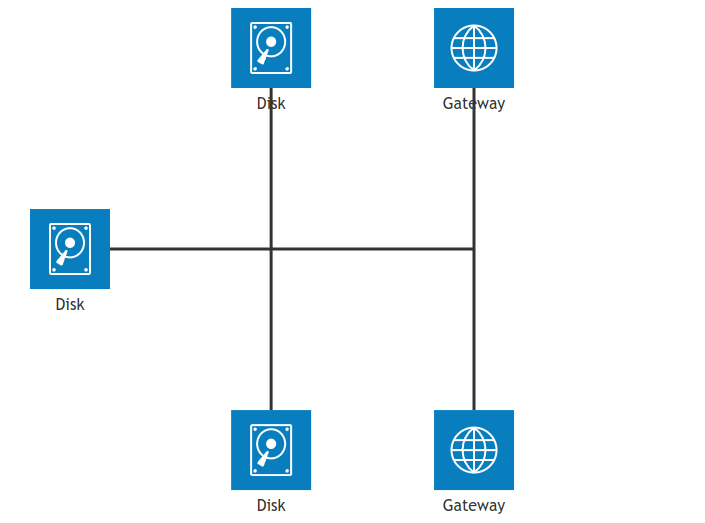

### State Diagram syntax

```go
package main

import (
	"io"
	"os"

	"github.com/nao1215/markdown"
	"github.com/nao1215/markdown/mermaid/state"
)

//go:generate go run main.go

func main() {
	f, err := os.Create("generated.md")
	if err != nil {
		panic(err)
	}
	defer f.Close()

	diagram := state.NewDiagram(io.Discard, state.WithTitle("Order State Machine")).
		StartTransition("Pending").
		State("Pending", "Order received").
		State("Processing", "Preparing order").
		State("Shipped", "Order in transit").
		State("Delivered", "Order completed").
		LF().
		TransitionWithNote("Pending", "Processing", "payment confirmed").
		TransitionWithNote("Processing", "Shipped", "items packed").
		TransitionWithNote("Shipped", "Delivered", "customer received").
		LF().
		NoteRight("Pending", "Waiting for payment").
		NoteRight("Processing", "Preparing items").
		LF().
		EndTransition("Delivered").
		String()

	err = markdown.NewMarkdown(f).
		H2("State Diagram").
		CodeBlocks(markdown.SyntaxHighlightMermaid, diagram).
		Build()

	if err != nil {
		panic(err)
	}
}
```

Plain text output: [markdown is here](./doc/state/generated.md)
````
## State Diagram
```mermaid
---
title: Order State Machine
---
stateDiagram-v2
    [*] --> Pending
    Pending : Order received
    Processing : Preparing order
    Shipped : Order in transit
    Delivered : Order completed

    Pending --> Processing : payment confirmed
    Processing --> Shipped : items packed
    Shipped --> Delivered : customer received

    note right of Pending : Waiting for payment
    note right of Processing : Preparing items

    Delivered --> [*]
```
````

Mermaid output:
```mermaid
---
title: Order State Machine
---
stateDiagram-v2
    [*] --> Pending
    Pending : Order received
    Processing : Preparing order
    Shipped : Order in transit
    Delivered : Order completed

    Pending --> Processing : payment confirmed
    Processing --> Shipped : items packed
    Shipped --> Delivered : customer received

    note right of Pending : Waiting for payment
    note right of Processing : Preparing items

    Delivered --> [*]
```

### Class Diagram syntax

```go
package main

import (
	"io"
	"os"

	"github.com/nao1215/markdown"
	"github.com/nao1215/markdown/mermaid/class"
)

//go:generate go run main.go

func main() {
	f, err := os.Create("generated.md")
	if err != nil {
		panic(err)
	}
	defer f.Close()

	diagram := class.NewDiagram(
		io.Discard,
		class.WithTitle("Checkout Domain"),
	).
		SetDirection(class.DirectionLR).
		Class(
			"Order",
			class.WithPublicField("string", "id"),
			class.WithPublicMethod("Create", "error", "items []LineItem"),
			class.WithPublicMethod("Pay", "error"),
		).
		Class(
			"LineItem",
			class.WithPublicField("string", "sku"),
			class.WithPublicField("int", "quantity"),
			class.WithPublicMethod("Subtotal", "int"),
		).
		Interface("PaymentGateway")

	diagram.From("Order").
		Composition("LineItem", class.WithOneToMany(), class.WithRelationLabel("contains")).
		Association("PaymentGateway", class.WithRelationLabel("uses"))

	diagramString := diagram.
		NoteFor("Order", "Aggregate Root").
		String()

	err = markdown.NewMarkdown(f).
		H2("Class Diagram").
		CodeBlocks(markdown.SyntaxHighlightMermaid, diagramString).
		Build()

	if err != nil {
		panic(err)
	}
}
```

Plain text output: [markdown is here](./doc/class/generated.md)
````text
## Class Diagram
```mermaid
---
title: Checkout Domain
---
classDiagram
    direction LR
    class Order {
        +string id
        +Create(items []LineItem) error
        +Pay() error
    }
    class LineItem {
        +string sku
        +int quantity
        +Subtotal() int
    }
    class PaymentGateway
    <<Interface>> PaymentGateway
    Order "1" *-- "many" LineItem : contains
    Order --> PaymentGateway : uses
    note for Order "Aggregate Root"
```
````

Mermaid output:
```mermaid
---
title: Checkout Domain
---
classDiagram
    direction LR
    class Order {
        +string id
        +Create(items []LineItem) error
        +Pay() error
    }
    class LineItem {
        +string sku
        +int quantity
        +Subtotal() int
    }
    class PaymentGateway
    <<Interface>> PaymentGateway
    Order "1" *-- "many" LineItem : contains
    Order --> PaymentGateway : uses
    note for Order "Aggregate Root"
```

### Quadrant Chart syntax

```go
package main

import (
	"io"
	"os"

	"github.com/nao1215/markdown"
	"github.com/nao1215/markdown/mermaid/quadrant"
)

//go:generate go run main.go

func main() {
	f, err := os.Create("generated.md")
	if err != nil {
		panic(err)
	}
	defer f.Close()

	chart := quadrant.NewChart(io.Discard, quadrant.WithTitle("Product Prioritization")).
		XAxis("Low Effort", "High Effort").
		YAxis("Low Value", "High Value").
		LF().
		Quadrant1("Quick Wins").
		Quadrant2("Major Projects").
		Quadrant3("Fill Ins").
		Quadrant4("Thankless Tasks").
		LF().
		Point("Feature A", 0.9, 0.85).
		Point("Feature B", 0.25, 0.75).
		Point("Feature C", 0.15, 0.20).
		Point("Feature D", 0.80, 0.15).
		String()

	err = markdown.NewMarkdown(f).
		H2("Quadrant Chart").
		CodeBlocks(markdown.SyntaxHighlightMermaid, chart).
		Build()

	if err != nil {
		panic(err)
	}
}
```

Plain text output: [markdown is here](./doc/quadrant/generated.md)
````
## Quadrant Chart
```mermaid
quadrantChart
    title Product Prioritization
    x-axis Low Effort --> High Effort
    y-axis Low Value --> High Value

    quadrant-1 Quick Wins
    quadrant-2 Major Projects
    quadrant-3 Fill Ins
    quadrant-4 Thankless Tasks

    Feature A: [0.90, 0.85]
    Feature B: [0.25, 0.75]
    Feature C: [0.15, 0.20]
    Feature D: [0.80, 0.15]
```
````

Mermaid output:
```mermaid
quadrantChart
    title Product Prioritization
    x-axis Low Effort --> High Effort
    y-axis Low Value --> High Value

    quadrant-1 Quick Wins
    quadrant-2 Major Projects
    quadrant-3 Fill Ins
    quadrant-4 Thankless Tasks

    Feature A: [0.90, 0.85]
    Feature B: [0.25, 0.75]
    Feature C: [0.15, 0.20]
    Feature D: [0.80, 0.15]
```

### Gantt Chart syntax

```go
package main

import (
	"io"
	"os"

	"github.com/nao1215/markdown"
	"github.com/nao1215/markdown/mermaid/gantt"
)

//go:generate go run main.go

func main() {
	f, err := os.Create("generated.md")
	if err != nil {
		panic(err)
	}
	defer f.Close()

	chart := gantt.NewChart(
		io.Discard,
		gantt.WithTitle("Project Schedule"),
		gantt.WithDateFormat("YYYY-MM-DD"),
	).
		Section("Planning").
		DoneTaskWithID("Requirements", "req", "2024-01-01", "5d").
		DoneTaskWithID("Design", "design", "2024-01-08", "3d").
		Section("Development").
		CriticalActiveTaskWithID("Coding", "code", "2024-01-12", "10d").
		TaskAfterWithID("Review", "review", "code", "2d").
		Section("Release").
		MilestoneWithID("Launch", "launch", "2024-01-26").
		String()

	err = markdown.NewMarkdown(f).
		H2("Gantt Chart").
		CodeBlocks(markdown.SyntaxHighlightMermaid, chart).
		Build()

	if err != nil {
		panic(err)
	}
}
```

Plain text output: [markdown is here](./doc/gantt/generated.md)
````
## Gantt Chart
```mermaid
gantt
    title Project Schedule
    dateFormat YYYY-MM-DD
    section Planning
    Requirements :done, req, 2024-01-01, 5d
    Design :done, design, 2024-01-08, 3d
    section Development
    Coding :crit, active, code, 2024-01-12, 10d
    Review :review, after code, 2d
    section Release
    Launch :milestone, launch, 2024-01-26, 0d
```
````

Mermaid output:
```mermaid
gantt
    title Project Schedule
    dateFormat YYYY-MM-DD
    section Planning
    Requirements :done, req, 2024-01-01, 5d
    Design :done, design, 2024-01-08, 3d
    section Development
    Coding :crit, active, code, 2024-01-12, 10d
    Review :review, after code, 2d
    section Release
    Launch :milestone, launch, 2024-01-26, 0d
```

## Creating an index for a directory full of markdown files
The markdown package can create an index for Markdown files within the specified directory. This feature was added to generate indexes for Markdown documents produced by [nao1215/spectest](https://github.com/nao1215/spectest).
  
For example, consider the following directory structure:

```shell
testdata
├── abc
│   ├── dummy.txt
│   ├── jkl
│   │   └── text.md
│   └── test.md
├── def
│   ├── test.md
│   └── test2.md
├── expected
│   └── index.md
├── ghi
└── test.md
```
  
In the following implementation, it creates an index markdown file containing links to all markdown files located within the testdata directory.

```go
		if err := GenerateIndex(
			"testdata", // target directory that contains markdown files
			WithTitle("Test Title"), // title of index markdown
			WithDescription([]string{"Test Description", "Next Description"}), // description of index markdown
		); err != nil {
			panic(err)
		}
```
  
The index Markdown file is created under "target directory/index.md" by default. If you want to change this path, please use the `WithWriter()` option. The link names in the file will be the first occurrence of H1 or H2 in the target Markdown. If neither H1 nor H2 is present, the link name will be the file name of the destination.  
  
[Output:](./doc/index.md)
```markdown
## Test Title
Test Description
  
Next Description
  
### testdata
- [test.md](test.md)
  
### abc
- [h2 is here](abc/test.md)
  
### jkl
- [text.md](abc/jkl/text.md)
  
### def
- [h2 is first, not h1](def/test.md)
- [h1 is here](def/test2.md)
  
### expected
- [Test Title](expected/index.md)
```
  
## License
[MIT License](./LICENSE)

## Contribution
First off, thanks for taking the time to contribute! See [CONTRIBUTING.md](./CONTRIBUTING.md) for more information. Contributions are not only related to development. For example, GitHub Star motivates me to develop! Please feel free to contribute to this project.

[](https://star-history.com/#nao1215/markdown&Date)

### Contributors ✨

Thanks goes to these wonderful people ([emoji key](https://allcontributors.org/docs/en/emoji-key)):

<!-- ALL-CONTRIBUTORS-LIST:START - Do not remove or modify this section -->
<!-- prettier-ignore-start -->
<!-- markdownlint-disable -->
<table>
  <tbody>
    <tr>
      <td align="center" valign="top" width="14.28%"><a href="https://debimate.jp/"><br /><sub><b>CHIKAMATSU Naohiro</b></sub></a><br /><a href="https://github.com/nao1215/markdown/commits?author=nao1215" title="Code">💻</a></td>
      <td align="center" valign="top" width="14.28%"><a href="https://github.com/varmakarthik12"><br /><sub><b>Karthik Sundari</b></sub></a><br /><a href="https://github.com/nao1215/markdown/commits?author=varmakarthik12" title="Code">💻</a></td>
      <td align="center" valign="top" width="14.28%"><a href="https://github.com/Avihuc"><br /><sub><b>Avihuc</b></sub></a><br /><a href="https://github.com/nao1215/markdown/commits?author=Avihuc" title="Code">💻</a></td>
      <td align="center" valign="top" width="14.28%"><a href="https://www.claranceliberi.me/"><br /><sub><b>Clarance Liberiste Ntwari</b></sub></a><br /><a href="https://github.com/nao1215/markdown/commits?author=claranceliberi" title="Code">💻</a></td>
      <td align="center" valign="top" width="14.28%"><a href="https://github.com/amitaifrey"><br /><sub><b>Amitai Frey</b></sub></a><br /><a href="https://github.com/nao1215/markdown/commits?author=amitaifrey" title="Code">💻</a></td>
    </tr>
  </tbody>
  <tfoot>
    <tr>
      <td align="center" size="13px" colspan="7">
        
          <a href="https://all-contributors.js.org/docs/en/bot/usage">Add your contributions</a>
        </img>
      </td>
    </tr>
  </tfoot>
</table>

<!-- markdownlint-restore -->
<!-- prettier-ignore-end -->

<!-- ALL-CONTRIBUTORS-LIST:END -->

This project follows the [all-contributors](https://github.com/all-contributors/all-contributors) specification. Contributions of any kind welcome!
