<!-- ALL-CONTRIBUTORS-BADGE:START - Do not remove or modify this section -->
[](#contributors-)
<!-- ALL-CONTRIBUTORS-BADGE:END -->
[](https://pkg.go.dev/github.com/nao1215/markdown)
[](https://github.com/nao1215/markdown/actions/workflows/unit_test.yml)
[](https://github.com/nao1215/markdown/actions/workflows/reviewdog.yml)
[](https://github.com/nao1215/markdown/actions/workflows/gosec.yml)


# What is markdown package

The markdown package is a simple Markdown builder in Go. It assembles Markdown using method chaining, and does not use a template engine like [html/template](https://pkg.go.dev/html/template). The syntax follows GitHub Markdown.

It covers the GitHub Markdown syntax: headings, lists, checkbox lists, tables, code blocks, blockquotes, horizontal rules, text formatting, links, images, details, footnotes, math expressions, and alerts. It also builds 24 mermaid diagram types, from sequence and flowchart to Gantt, C4 context, and Wardley map; each one has an example below. Two helpers go beyond Markdown syntax: status badges and an index for a directory full of markdown files.

Complex code that increases the complexity of the library, such as generating nested lists, will not be added. I want to keep this library as simple as possible.

## Supported OS and go version
- OS: Linux, macOS, Windows
- Go: 1.23 or later

## Example
### Basic usage
```go
package main

import (
	"os"

	md "github.com/nao1215/markdown"
)

func main() {
	md.NewMarkdown(os.Stdout, md.WithBlockSpacing()).
		H1("This is H1").
		PlainText("This is plain text").
		H2f("This is %s with text format", "H2").
		PlainTextf("Text formatting, such as %s and %s, %s styles.",
			md.Bold("bold"), md.Italic("italic"), md.Code("code")).
		H2("Code Block").
		CodeBlocks(md.SyntaxHighlightGo,
			`package main
import "fmt"

func main() {
	fmt.Println("Hello, World!")
}`).
		H2("List").
		BulletList("Bullet Item 1", "Bullet Item 2", "Bullet Item 3").
		OrderedList("Ordered Item 1", "Ordered Item 2", "Ordered Item 3").
		H2("CheckBox").
		CheckBox([]md.CheckBoxSet{
			{Checked: false, Text: md.Code("sample code")},
			{Checked: true, Text: md.Link("Go", "https://golang.org")},
			{Checked: false, Text: md.Strikethrough("strikethrough")},
		}).
		H2("Blockquote").
		Blockquote("If you can dream it, you can do it.").
		H3("Horizontal Rule").
		HorizontalRule().
		H2("Table").
		Table(md.TableSet{
			Header: []string{"Name", "Age", "Country"},
			Rows: [][]string{
				{"David", "23", "USA"},
				{"John", "30", "UK"},
				{"Bob", "25", "Canada"},
			},
		}).
		H2("Image").
		PlainTextf(md.Image("sample_image", "./sample.png")).
		Build()
}
```

Output:
````
# This is H1

This is plain text

## This is H2 with text format

Text formatting, such as **bold** and *italic*, `code` styles.

## Code Block

```go
package main
import "fmt"

func main() {
	fmt.Println("Hello, World!")
}
```

## List

- Bullet Item 1
- Bullet Item 2
- Bullet Item 3

1. Ordered Item 1
2. Ordered Item 2
3. Ordered Item 3

## CheckBox

- [ ] `sample code`
- [x] [Go](https://golang.org)
- [ ] ~~strikethrough~~

## Blockquote

> If you can dream it, you can do it.

### Horizontal Rule

---

## Table

| Name | Age | Country |
|---------|---------|---------|
| David | 23 | USA |
| John | 30 | UK |
| Bob | 25 | Canada |

## Image


````

If you want to see how it looks in Markdown, please refer to the following link.
- [sample.md](./doc/generated_example.md)

### Generate Markdown using `"go generate ./..."`
You can generate Markdown using `go generate`. Please define code to generate Markdown first. Then, run `"go generate ./..."` to generate Markdown.

[Code example:](./doc/generate/main.go)
```go
package main

import (
	"os"

	md "github.com/nao1215/markdown"
)

//go:generate go run main.go

func main() {
	f, err := os.Create("generated.md")
	if err != nil {
		panic(err)
	}
	defer f.Close()

	md.NewMarkdown(f).
		H1("go generate example").
		PlainText("This markdown is generated by `go generate`").
		Build()
}
```

Run below command:
```shell
go generate ./...
```

[Output:](./doc/generate/generated.md)
````text
# go generate example
This markdown is generated by `go generate`
````

### Alerts syntax
The markdown package can create alerts. Alerts are useful for displaying important information in Markdown. This syntax is supported by GitHub.
[Code example:](./doc/alert/main.go)
```go
	md.NewMarkdown(f).
		H1("Alert example").
		Note("This is note").LF().
		Tip("This is tip").LF().
		Important("This is important").LF().
		Warning("This is warning").LF().
		Caution("This is caution").LF().
		Build()
```
  
[Output:](./doc/alert/generated.md)
````text
# Alert example
> [!NOTE]  
> This is note
  
> [!TIP]  
> This is tip
  
> [!IMPORTANT]  
> This is important
  
> [!WARNING]  
> This is warning
  
> [!CAUTION]  
> This is caution
````

Your alert will look like this;
> [!NOTE]  
> This is note
  
> [!TIP]  
> This is tip
  
> [!IMPORTANT]  
> This is important
  
> [!WARNING]  
> This is warning
  
> [!CAUTION]  
> This is caution

### Status badge syntax
The markdown package can create red, yellow, and green status badges.
[Code example:](./doc/badge/main.go)
```go
	md.NewMarkdown(os.Stdout).
		H1("badge example").
		RedBadge("red_badge").
		YellowBadge("yellow_badge").
		GreenBadge("green_badge").
		BlueBadge("blue_badge").
		Build()
```

[Output:](./doc/badge/generated.md)
````text
# badge example


````

Your badge will look like this;  


### Mermaid sequence diagram syntax

```go
package main

import (
	"io"
	"os"

	"github.com/nao1215/markdown"
	"github.com/nao1215/markdown/mermaid/sequence"
)

//go:generate go run main.go

func main() {
	diagram := sequence.NewDiagram(io.Discard).
		Participant("Sophia").
		Participant("David").
		Participant("Subaru").
		LF().
		SyncRequest("Sophia", "David", "Please wake up Subaru").
		SyncResponse("David", "Sophia", "OK").
		LF().
		LoopStart("until Subaru wake up").
		SyncRequest("David", "Subaru", "Wake up!").
		SyncResponse("Subaru", "David", "zzz").
		SyncRequest("David", "Subaru", "Hey!!!").
		BreakStart("if Subaru wake up").
		SyncResponse("Subaru", "David", "......").
		BreakEnd().
		LoopEnd().
		LF().
		SyncResponse("David", "Sophia", "wake up, wake up").
		String()

	markdown.NewMarkdown(os.Stdout, markdown.WithBlockSpacing()).
		H2("Sequence Diagram").
		CodeBlocks(markdown.SyntaxHighlightMermaid, diagram).
		Build()
}
```

Plain text output: [markdown is here](./doc/sequence/generated.md)
````
## Sequence Diagram

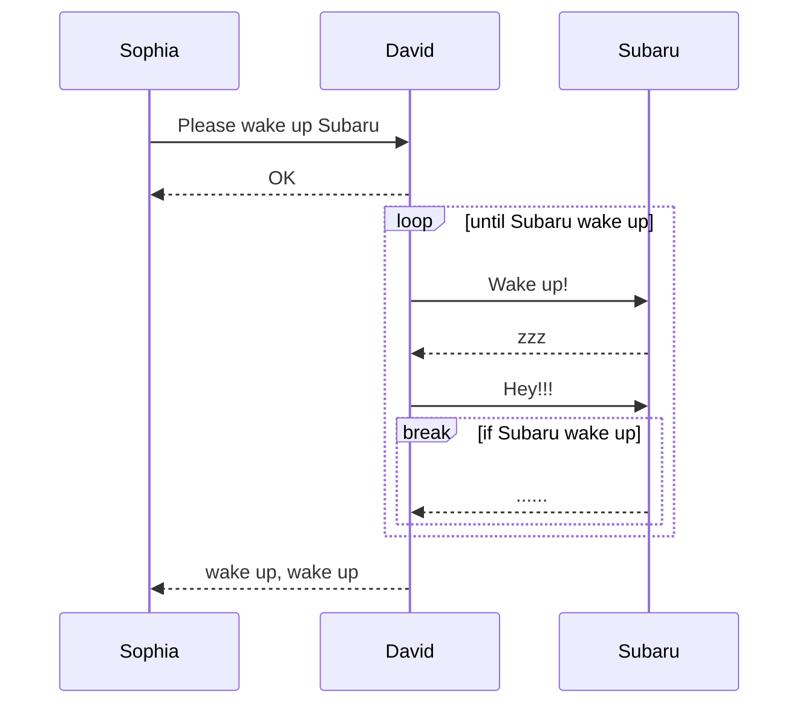
```mermaid
sequenceDiagram
    participant Sophia
    participant David
    participant Subaru

    Sophia->>David: Please wake up Subaru
    David-->>Sophia: OK

    loop until Subaru wake up
    David->>Subaru: Wake up!
    Subaru-->>David: zzz
    David->>Subaru: Hey!!!
    break if Subaru wake up
    Subaru-->>David: ......
    end
    end

    David-->>Sophia: wake up, wake up
```
````

Mermaid output:

```mermaid
sequenceDiagram
    participant Sophia
    participant David
    participant Subaru

    Sophia->>David: Please wake up Subaru
    David-->>Sophia: OK

    loop until Subaru wake up
    David->>Subaru: Wake up!
    Subaru-->>David: zzz
    David->>Subaru: Hey!!!
    break if Subaru wake up
    Subaru-->>David: ......
    end
    end

    David-->>Sophia: wake up, wake up
```

### Mermaid user journey diagram syntax

```go
package main

import (
	"io"
	"os"

	"github.com/nao1215/markdown"
	"github.com/nao1215/markdown/mermaid/userjourney"
)

//go:generate go run main.go

func main() {
	diagram := userjourney.NewDiagram(
		io.Discard,
		userjourney.WithTitle("Checkout Journey"),
	).
		Section("Discover").
		Task("Browse products", userjourney.ScoreVerySatisfied, "Customer").
		Task("Add item to cart", userjourney.ScoreSatisfied, "Customer").
		LF().
		Section("Checkout").
		Task("Enter shipping details", userjourney.ScoreNeutral, "Customer").
		Task("Complete payment", userjourney.ScoreSatisfied, "Customer", "Payment Service").
		String()

	if err := markdown.NewMarkdown(os.Stdout, markdown.WithBlockSpacing()).
		H2("User Journey Diagram").
		CodeBlocks(markdown.SyntaxHighlightMermaid, diagram).
		Build(); err != nil {
		panic(err)
	}
}
```

Plain text output: [markdown is here](./doc/userjourney/generated.md)
````text
## User Journey Diagram

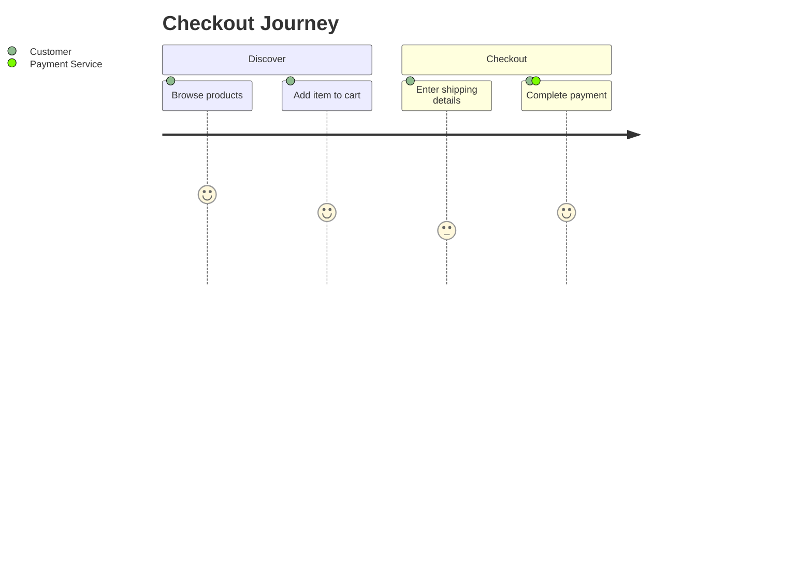
```mermaid
journey
    title Checkout Journey
    section Discover
        Browse products: 5: Customer
        Add item to cart: 4: Customer

    section Checkout
        Enter shipping details: 3: Customer
        Complete payment: 4: Customer, Payment Service
```
````

Mermaid output:

```mermaid
journey
    title Checkout Journey
    section Discover
        Browse products: 5: Customer
        Add item to cart: 4: Customer

    section Checkout
        Enter shipping details: 3: Customer
        Complete payment: 4: Customer, Payment Service
```

### Mermaid git graph syntax

```go
package main

import (
	"io"
	"os"

	"github.com/nao1215/markdown"
	"github.com/nao1215/markdown/mermaid/gitgraph"
)

//go:generate go run main.go

func main() {
	diagram := gitgraph.NewDiagram(
		io.Discard,
		gitgraph.WithTitle("Release Flow"),
	).
		Commit(gitgraph.WithCommitID("init"), gitgraph.WithCommitTag("v0.1.0")).
		Branch("develop", gitgraph.WithBranchOrder(2)).
		Checkout("develop").
		Commit(gitgraph.WithCommitType(gitgraph.CommitTypeHighlight)).
		Checkout("main").
		Merge("develop", gitgraph.WithCommitTag("v1.0.0")).
		String()

	if err := markdown.NewMarkdown(os.Stdout, markdown.WithBlockSpacing()).
		H2("Git Graph").
		CodeBlocks(markdown.SyntaxHighlightMermaid, diagram).
		Build(); err != nil {
		panic(err)
	}
}
```

Plain text output: [markdown is here](./doc/gitgraph/generated.md)
````text
## Git Graph

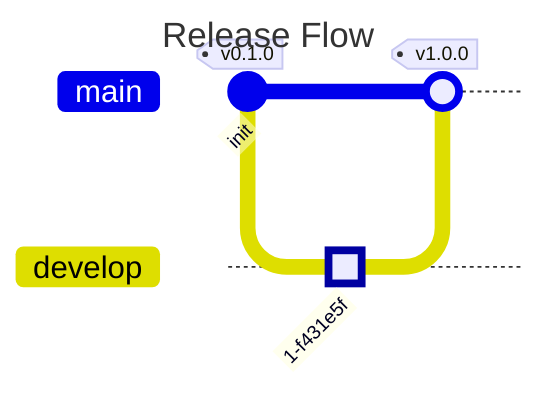
```mermaid
---
title: "Release Flow"
---
gitGraph
    commit id: "init" tag: "v0.1.0"
    branch develop order: 2
    checkout develop
    commit type: HIGHLIGHT
    checkout main
    merge develop tag: "v1.0.0"
```
````

Mermaid output:
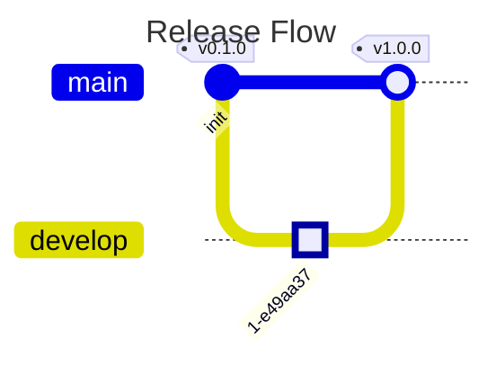
```mermaid
---
title: "Release Flow"
---
gitGraph
    commit id: "init" tag: "v0.1.0"
    branch develop order: 2
    checkout develop
    commit type: HIGHLIGHT
    checkout main
    merge develop tag: "v1.0.0"
```

### Mermaid mindmap syntax

```go
package main

import (
	"io"
	"os"

	"github.com/nao1215/markdown"
	"github.com/nao1215/markdown/mermaid/mindmap"
)

//go:generate go run main.go

func main() {
	diagram := mindmap.NewDiagram(
		io.Discard,
		mindmap.WithTitle("Product Strategy Mindmap"),
	).
		Root("Product Strategy").
		Child("Market").
		Child("SMB").
		Sibling("Enterprise").
		Parent().
		Sibling("Execution").
		Child("Q1").
		Sibling("Q2").
		String()

	if err := markdown.NewMarkdown(os.Stdout, markdown.WithBlockSpacing()).
		H2("Mindmap").
		CodeBlocks(markdown.SyntaxHighlightMermaid, diagram).
		Build(); err != nil {
		panic(err)
	}
}
```

Plain text output: [markdown is here](./doc/mindmap/generated.md)
````text
## Mindmap

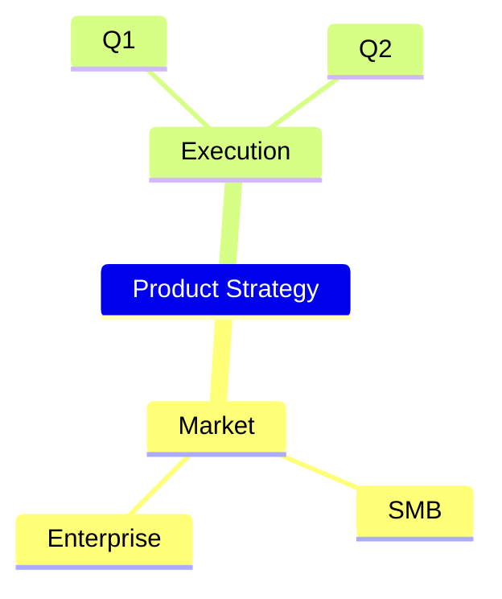
```mermaid
---
title: "Product Strategy Mindmap"
---
mindmap
    Product Strategy
        Market
            SMB
            Enterprise
        Execution
            Q1
            Q2
```
````

Mermaid output:

```mermaid
---
title: "Product Strategy Mindmap"
---
mindmap
    Product Strategy
        Market
            SMB
            Enterprise
        Execution
            Q1
            Q2
```

### Mermaid requirement diagram syntax

```go
package main

import (
	"io"
	"os"

	"github.com/nao1215/markdown"
	"github.com/nao1215/markdown/mermaid/requirement"
)

//go:generate go run main.go

func main() {
	diagram := requirement.NewDiagram(
		io.Discard,
		requirement.WithTitle("Checkout Requirements"),
	).
		SetDirection(requirement.DirectionTB).
		Requirement(
			"Login",
			requirement.WithID("REQ-1"),
			requirement.WithText("The system shall support login."),
			requirement.WithRisk(requirement.RiskHigh),
			requirement.WithVerifyMethod(requirement.VerifyMethodTest),
			requirement.WithRequirementClasses("critical"),
		).
		FunctionalRequirement(
			"RememberSession",
			requirement.WithID("REQ-2"),
			requirement.WithText("The system shall remember the user."),
			requirement.WithRisk(requirement.RiskMedium),
			requirement.WithVerifyMethod(requirement.VerifyMethodInspection),
		).
		Element(
			"AuthService",
			requirement.WithElementType("system"),
			requirement.WithDocRef("docs/auth.md"),
			requirement.WithElementClasses("service"),
		).
		From("AuthService").
		Satisfies("Login").
		From("RememberSession").
		Verifies("Login").
		ClassDefs(
			requirement.Def("critical", "fill:#f96,stroke:#333,stroke-width:2px"),
			requirement.Def("service", "fill:#9cf,stroke:#333,stroke-width:1px"),
		).
		String()

	if err := markdown.NewMarkdown(os.Stdout, markdown.WithBlockSpacing()).
		H2("Requirement Diagram").
		CodeBlocks(markdown.SyntaxHighlightMermaid, diagram).
		Build(); err != nil {
		panic(err)
	}
}
```

Plain text output: [markdown is here](./doc/requirement/generated.md)
````text
## Requirement Diagram

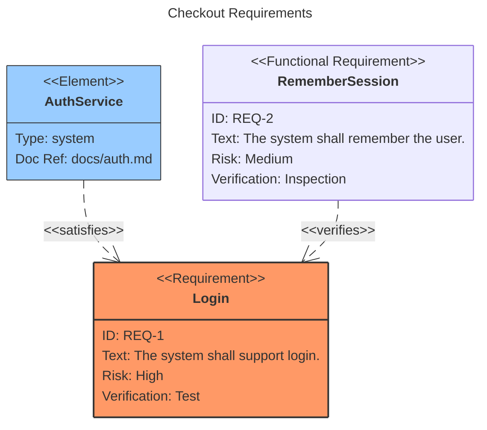
```mermaid
---
title: "Checkout Requirements"
---
requirementDiagram
    direction TB
    requirement Login:::critical {
        id: "REQ-1"
        text: "The system shall support login."
        risk: High
        verifymethod: Test
    }
    functionalRequirement RememberSession {
        id: "REQ-2"
        text: "The system shall remember the user."
        risk: Medium
        verifymethod: Inspection
    }
    element AuthService:::service {
        type: "system"
        docRef: "docs/auth.md"
    }
    AuthService - satisfies -> Login
    RememberSession - verifies -> Login
    classDef critical fill:#f96,stroke:#333,stroke-width:2px
    classDef service fill:#9cf,stroke:#333,stroke-width:1px
```
````

Mermaid output:

```mermaid
---
title: "Checkout Requirements"
---
requirementDiagram
    direction TB
    requirement Login:::critical {
        id: "REQ-1"
        text: "The system shall support login."
        risk: High
        verifymethod: Test
    }
    functionalRequirement RememberSession {
        id: "REQ-2"
        text: "The system shall remember the user."
        risk: Medium
        verifymethod: Inspection
    }
    element AuthService:::service {
        type: "system"
        docRef: "docs/auth.md"
    }
    AuthService - satisfies -> Login
    RememberSession - verifies -> Login
    classDef critical fill:#f96,stroke:#333,stroke-width:2px
    classDef service fill:#9cf,stroke:#333,stroke-width:1px
```

### Mermaid XY chart syntax

```go
package main

import (
	"io"
	"os"

	"github.com/nao1215/markdown"
	"github.com/nao1215/markdown/mermaid/xychart"
)

//go:generate go run main.go

func main() {
	diagram := xychart.NewDiagram(
		io.Discard,
		xychart.WithTitle("Sales Revenue"),
	).
		XAxisLabels("Jan", "Feb", "Mar", "Apr", "May", "Jun").
		YAxisRangeWithTitle("Revenue (k$)", 0, 100).
		Bar(25, 40, 60, 80, 70, 90).
		Line(30, 50, 70, 85, 75, 95).
		String()

	if err := markdown.NewMarkdown(os.Stdout, markdown.WithBlockSpacing()).
		H2("XY Chart").
		CodeBlocks(markdown.SyntaxHighlightMermaid, diagram).
		Build(); err != nil {
		panic(err)
	}
}
```

Plain text output: [markdown is here](./doc/xychart/generated.md)
````text
## XY Chart

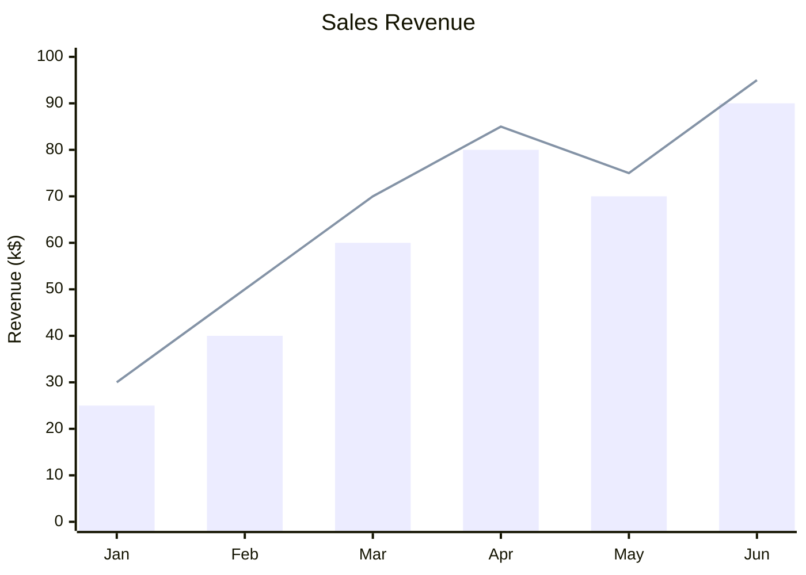
```mermaid
xychart
    title "Sales Revenue"
    x-axis [Jan, Feb, Mar, Apr, May, Jun]
    y-axis "Revenue (k$)" 0 --> 100
    bar [25, 40, 60, 80, 70, 90]
    line [30, 50, 70, 85, 75, 95]
```
````

Mermaid output:

```mermaid
xychart
    title "Sales Revenue"
    x-axis [Jan, Feb, Mar, Apr, May, Jun]
    y-axis "Revenue (k$)" 0 --> 100
    bar [25, 40, 60, 80, 70, 90]
    line [30, 50, 70, 85, 75, 95]
```

### Mermaid packet syntax

```go
package main

import (
	"io"
	"os"

	"github.com/nao1215/markdown"
	"github.com/nao1215/markdown/mermaid/packet"
)

//go:generate go run main.go

func main() {
	diagram := packet.NewDiagram(
		io.Discard,
		packet.WithTitle("UDP Packet"),
	).
		Next(16, "Source Port").
		Next(16, "Destination Port").
		Field(32, 47, "Length").
		Field(48, 63, "Checksum").
		Field(64, 95, "Data (variable length)").
		String()

	if err := markdown.NewMarkdown(os.Stdout, markdown.WithBlockSpacing()).
		H2("Packet").
		CodeBlocks(markdown.SyntaxHighlightMermaid, diagram).
		Build(); err != nil {
		panic(err)
	}
}
```

Plain text output: [markdown is here](./doc/packet/generated.md)
````text
## Packet

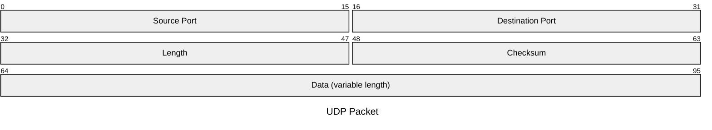
```mermaid
packet
    title UDP Packet
    +16: "Source Port"
    +16: "Destination Port"
    32-47: "Length"
    48-63: "Checksum"
    64-95: "Data (variable length)"
```
````

Mermaid output:

```mermaid
packet
    title UDP Packet
    +16: "Source Port"
    +16: "Destination Port"
    32-47: "Length"
    48-63: "Checksum"
    64-95: "Data (variable length)"
```

### Mermaid block syntax

```go
package main

import (
	"io"
	"os"

	"github.com/nao1215/markdown"
	"github.com/nao1215/markdown/mermaid/block"
)

//go:generate go run main.go

func main() {
	diagram := block.NewDiagram(
		io.Discard,
		block.WithTitle("Checkout Architecture"),
	).
		Columns(3).
		Row(
			block.Node("Frontend"),
			block.ArrowRight("toBackend", block.WithArrowLabel("calls")),
			block.Node("Backend"),
		).
		Row(
			block.Space(2),
			block.ArrowDown("toDB"),
		).
		Row(
			block.Node("Database", block.WithNodeLabel("Primary DB"), block.WithNodeShape(block.ShapeCylinder)),
			block.Space(),
			block.Node("Cache", block.WithNodeLabel("Cache"), block.WithNodeShape(block.ShapeRound)),
		).
		Link("Backend", "Database").
		LinkWithLabel("Backend", "reads from", "Cache").
		String()

	if err := markdown.NewMarkdown(os.Stdout, markdown.WithBlockSpacing()).
		H2("Block Diagram").
		CodeBlocks(markdown.SyntaxHighlightMermaid, diagram).
		Build(); err != nil {
		panic(err)
	}
}
```

Plain text output: [markdown is here](./doc/block/generated.md)
````text
## Block Diagram

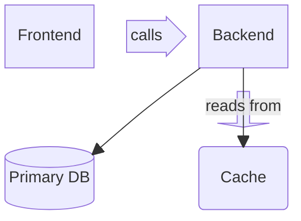
```mermaid
---
title: "Checkout Architecture"
---
block
    columns 3
    Frontend toBackend<["calls"]>(right) Backend
    space:2 toDB<["&nbsp;"]>(down)
    Database[("Primary DB")] space Cache("Cache")
    Backend --> Database
    Backend -- "reads from" --> Cache
```
````

Mermaid output:

```mermaid
---
title: "Checkout Architecture"
---
block
    columns 3
    Frontend toBackend<["calls"]>(right) Backend
    space:2 toDB<["&nbsp;"]>(down)
    Database[("Primary DB")] space Cache("Cache")
    Backend --> Database
    Backend -- "reads from" --> Cache
```

### Mermaid kanban syntax

```go
package main

import (
	"io"
	"os"

	"github.com/nao1215/markdown"
	"github.com/nao1215/markdown/mermaid/kanban"
)

//go:generate go run main.go

func main() {
	diagram := kanban.NewDiagram(
		io.Discard,
		kanban.WithTitle("Sprint Board"),
		kanban.WithTicketBaseURL("https://example.com/tickets/"),
	).
		Column("Todo").
		Task("Define scope").
		Task(
			"Create login page",
			kanban.WithTaskTicket("MB-101"),
			kanban.WithTaskAssigned("Alice"),
			kanban.WithTaskPriority(kanban.PriorityHigh),
		).
		Column("In Progress").
		Task("Review API", kanban.WithTaskPriority(kanban.PriorityVeryHigh)).
		String()

	if err := markdown.NewMarkdown(os.Stdout, markdown.WithBlockSpacing()).
		H2("Kanban Diagram").
		CodeBlocks(markdown.SyntaxHighlightMermaid, diagram).
		Build(); err != nil {
		panic(err)
	}
}
```

Plain text output: [markdown is here](./doc/kanban/generated.md)
````text
## Kanban Diagram

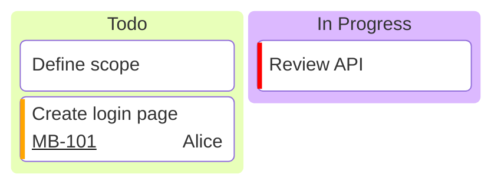
```mermaid
---
title: "Sprint Board"
config:
  kanban:
    ticketBaseUrl: 'https://example.com/tickets/'
---
kanban
    [Todo]
        [Define scope]
        [Create login page]@{ ticket: 'MB-101', assigned: 'Alice', priority: 'High' }
    [In Progress]
        [Review API]@{ priority: 'Very High' }
```
````

Mermaid output:

```mermaid
---
title: "Sprint Board"
config:
  kanban:
    ticketBaseUrl: 'https://example.com/tickets/'
---
kanban
    [Todo]
        [Define scope]
        [Create login page]@{ ticket: 'MB-101', assigned: 'Alice', priority: 'High' }
    [In Progress]
        [Review API]@{ priority: 'Very High' }
```

### Entity Relationship Diagram syntax

```go
package main

import (
	"os"

	"github.com/nao1215/markdown"
	"github.com/nao1215/markdown/mermaid/er"
)

//go:generate go run main.go

func main() {
	f, err := os.Create("generated.md")
	if err != nil {
		panic(err)
	}
	defer f.Close()

	teachers := er.NewEntity(
		"teachers",
		[]*er.Attribute{
			{
				Type:         "int",
				Name:         "id",
				IsPrimaryKey: true,
				IsForeignKey: false,
				IsUniqueKey:  true,
				Comment:      "Teacher ID",
			},
			{
				Type:         "string",
				Name:         "name",
				IsPrimaryKey: false,
				IsForeignKey: false,
				IsUniqueKey:  false,
				Comment:      "Teacher Name",
			},
		},
	)
	students := er.NewEntity(
		"students",
		[]*er.Attribute{
			{
				Type:         "int",
				Name:         "id",
				IsPrimaryKey: true,
				IsForeignKey: false,
				IsUniqueKey:  true,
				Comment:      "Student ID",
			},
			{
				Type:         "string",
				Name:         "name",
				IsPrimaryKey: false,
				IsForeignKey: false,
				IsUniqueKey:  false,
				Comment:      "Student Name",
			},
			{
				Type:         "int",
				Name:         "teacher_id",
				IsPrimaryKey: false,
				IsForeignKey: true,
				IsUniqueKey:  true,
				Comment:      "Teacher ID",
			},
		},
	)
	schools := er.NewEntity(
		"schools",
		[]*er.Attribute{
			{
				Type:         "int",
				Name:         "id",
				IsPrimaryKey: true,
				IsForeignKey: false,
				IsUniqueKey:  true,
				Comment:      "School ID",
			},
			{
				Type:         "string",
				Name:         "name",
				IsPrimaryKey: false,
				IsForeignKey: false,
				IsUniqueKey:  false,
				Comment:      "School Name",
			},
			{
				Type:         "int",
				Name:         "teacher_id",
				IsPrimaryKey: false,
				IsForeignKey: true,
				IsUniqueKey:  true,
				Comment:      "Teacher ID",
			},
		},
	)

	erString := er.NewDiagram(f).
		Relationship(
			teachers,
			students,
			er.ExactlyOneRelationship, // "||"
			er.ZeroToMoreRelationship, // "}o"
			er.Identifying,            // "--"
			"Teacher has many students",
		).
		Relationship(
			teachers,
			schools,
			er.OneToMoreRelationship,  // "|}"
			er.ExactlyOneRelationship, // "||"
			er.NonIdentifying,         // ".."
			"School has many teachers",
		).
		String()

	err = markdown.NewMarkdown(f, markdown.WithBlockSpacing()).
		H2("Entity Relationship Diagram").
		CodeBlocks(markdown.SyntaxHighlightMermaid, erString).
		Build()

	if err != nil {
		panic(err)
	}
}
```

Plain text output: [markdown is here](./doc/er/generated.md)
````
## Entity Relationship Diagram

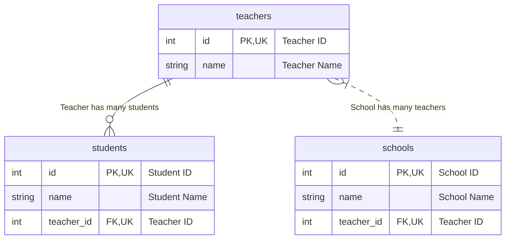
```mermaid
erDiagram
    teachers ||--o{ students : "Teacher has many students"
    teachers }|..|| schools : "School has many teachers"
    schools {
        int id PK,UK "School ID"
        string name  "School Name"
        int teacher_id FK,UK "Teacher ID"
    }
    students {
        int id PK,UK "Student ID"
        string name  "Student Name"
        int teacher_id FK,UK "Teacher ID"
    }
    teachers {
        int id PK,UK "Teacher ID"
        string name  "Teacher Name"
    }

```
````

Mermaid output:

```mermaid
erDiagram
	teachers ||--o{ students : "Teacher has many students"
	teachers }|..|| schools : "School has many teachers"
	schools {
		int id PK,UK "School ID"
		string name  "School Name"
		int teacher_id FK,UK "Teacher ID"
	}
	students {
		int id PK,UK "Student ID"
		string name  "Student Name"
		int teacher_id FK,UK "Teacher ID"
	}
	teachers {
		int id PK,UK "Teacher ID"
		string name  "Teacher Name"
	}
```

### Flowchart syntax

```go
package main

import (
	"io"
	"os"

	"github.com/nao1215/markdown"
	"github.com/nao1215/markdown/mermaid/flowchart"
)

//go:generate go run main.go

func main() {
	f, err := os.Create("generated.md")
	if err != nil {
		panic(err)
	}
	defer f.Close()

	fc := flowchart.NewFlowchart(
		io.Discard,
		flowchart.WithTitle("mermaid flowchart builder"),
		flowchart.WithOrientalTopToBottom(),
	).
		Subgraph("ingest", "Ingest").
		SubgraphDirection(flowchart.DirectionLR).
		NodeWithText("A", "Node A").
		StadiumNode("B", "Node B").
		LinkWithArrowHead("A", "B").
		SubgraphEnd().
		SubroutineNode("C", "Node C").
		DatabaseNode("D", "Database").
		LinkWithArrowHeadAndText("B", "D", "send original data").
		LinkWithArrowHead("B", "C").
		DottedLinkWithText("C", "D", "send filtered data").
		ClassDef("stored", "fill:#d4f7d4,stroke:#2b8a3e").
		Class("D", "stored").
		Style("C", "fill:#fff3bf,stroke:#e67700").
		ClickHref("D", "https://example.com/database", "The database").
		String()

	err = markdown.NewMarkdown(f, markdown.WithBlockSpacing()).
		H2("Flowchart").
		CodeBlocks(markdown.SyntaxHighlightMermaid, fc).
		Build()

	if err != nil {
		panic(err)
	}
}
```

Plain text output: [markdown is here](./doc/flowchart/generated.md)
````
## Flowchart

```mermaid
---
title: "mermaid flowchart builder"
---
flowchart TB
    subgraph ingest["Ingest"]
        direction LR
        A["Node A"]
        B(["Node B"])
        A-->B
    end
    C[["Node C"]]
    D[("Database")]
    B-->|"send original data"|D
    B-->C
    C-. "send filtered data" .-> D
    classDef stored fill:#d4f7d4,stroke:#2b8a3e
    class D stored
    style C fill:#fff3bf,stroke:#e67700
    click D "https://example.com/database" "The database"
```
````

Mermaid output:
```mermaid
---
title: "mermaid flowchart builder"
---
flowchart TB
    subgraph ingest["Ingest"]
        direction LR
        A["Node A"]
        B(["Node B"])
        A-->B
    end
    C[["Node C"]]
    D[("Database")]
    B-->|"send original data"|D
    B-->C
    C-. "send filtered data" .-> D
    classDef stored fill:#d4f7d4,stroke:#2b8a3e
    class D stored
    style C fill:#fff3bf,stroke:#e67700
    click D "https://example.com/database" "The database"
```

### Pie chart syntax

```go
package main

import (
	"io"
	"os"

	"github.com/nao1215/markdown"
	"github.com/nao1215/markdown/mermaid/piechart"
)

//go:generate go run main.go

func main() {
	f, err := os.Create("generated.md")
	if err != nil {
		panic(err)
	}
	defer f.Close()

	chart := piechart.NewPieChart(
		io.Discard,
		piechart.WithTitle("mermaid pie chart builder"),
		piechart.WithShowData(true),
	).
		LabelAndIntValue("A", 10).
		LabelAndFloatValue("B", 20.1).
		LabelAndIntValue("C", 30).
		String()

	err = markdown.NewMarkdown(f, markdown.WithBlockSpacing()).
		H2("Pie Chart").
		CodeBlocks(markdown.SyntaxHighlightMermaid, chart).
		Build()

	if err != nil {
		panic(err)
	}
}
```

Plain text output: [markdown is here](./doc/piechart/generated.md)
````
## Pie Chart

```mermaid
%%{init: {"pie": {"textPosition": 0.75}, "themeVariables": {"pieOuterStrokeWidth": "5px"}} }%%
pie showData
    title mermaid pie chart builder
    "A" : 10
    "B" : 20.100000
    "C" : 30
```
````

Mermaid output:
```mermaid
%%{init: {"pie": {"textPosition": 0.75}, "themeVariables": {"pieOuterStrokeWidth": "5px"}} }%%
pie showData
    title mermaid pie chart builder
    "A" : 10
    "B" : 20.100000
    "C" : 30
```

### Architecture Diagrams (beta feature)

[The mermaid provides a feature to visualize infrastructure architecture as a beta version](https://mermaid.js.org/syntax/architecture.html), and that feature has been introduced.

```go
package main

import (
	"io"
	"os"

	"github.com/nao1215/markdown"
	"github.com/nao1215/markdown/mermaid/arch"
)

//go:generate go run main.go

func main() {
	f, err := os.Create("generated.md")
	if err != nil {
		panic(err)
	}
	defer f.Close()

	diagram := arch.NewArchitecture(io.Discard).
		Service("left_disk", arch.IconDisk, "Disk").
		Service("top_disk", arch.IconDisk, "Disk").
		Service("bottom_disk", arch.IconDisk, "Disk").
		Service("top_gateway", arch.IconInternet, "Gateway").
		Service("bottom_gateway", arch.IconInternet, "Gateway").
		Junction("junctionCenter").
		Junction("junctionRight").
		LF().
		Edges(
			arch.Edge{
				ServiceID: "left_disk",
				Position:  arch.PositionRight,
				Arrow:     arch.ArrowNone,
			},
			arch.Edge{
				ServiceID: "junctionCenter",
				Position:  arch.PositionLeft,
				Arrow:     arch.ArrowNone,
			}).
		Edges(
			arch.Edge{
				ServiceID: "top_disk",
				Position:  arch.PositionBottom,
				Arrow:     arch.ArrowNone,
			},
			arch.Edge{
				ServiceID: "junctionCenter",
				Position:  arch.PositionTop,
				Arrow:     arch.ArrowNone,
			}).
		Edges(
			arch.Edge{
				ServiceID: "bottom_disk",
				Position:  arch.PositionTop,
				Arrow:     arch.ArrowNone,
			},
			arch.Edge{
				ServiceID: "junctionCenter",
				Position:  arch.PositionBottom,
				Arrow:     arch.ArrowNone,
			}).
		Edges(
			arch.Edge{
				ServiceID: "junctionCenter",
				Position:  arch.PositionRight,
				Arrow:     arch.ArrowNone,
			},
			arch.Edge{
				ServiceID: "junctionRight",
				Position:  arch.PositionLeft,
				Arrow:     arch.ArrowNone,
			}).
		Edges(
			arch.Edge{
				ServiceID: "top_gateway",
				Position:  arch.PositionBottom,
				Arrow:     arch.ArrowNone,
			},
			arch.Edge{
				ServiceID: "junctionRight",
				Position:  arch.PositionTop,
				Arrow:     arch.ArrowNone,
			}).
		Edges(
			arch.Edge{
				ServiceID: "bottom_gateway",
				Position:  arch.PositionTop,
				Arrow:     arch.ArrowNone,
			},
			arch.Edge{
				ServiceID: "junctionRight",
				Position:  arch.PositionBottom,
				Arrow:     arch.ArrowNone,
			}).String() //nolint

	err = markdown.NewMarkdown(f, markdown.WithBlockSpacing()).
		H2("Architecture Diagram").
		CodeBlocks(markdown.SyntaxHighlightMermaid, diagram).
		Build()

	if err != nil {
		panic(err)
	}
```

Plain text output: [markdown is here](./doc/architecture/generated.md)
````
## Architecture Diagram

```mermaid
architecture-beta
    service left_disk(disk)[Disk]
    service top_disk(disk)[Disk]
    service bottom_disk(disk)[Disk]
    service top_gateway(internet)[Gateway]
    service bottom_gateway(internet)[Gateway]
    junction junctionCenter
    junction junctionRight

    left_disk:R -- L:junctionCenter
    top_disk:B -- T:junctionCenter
    bottom_disk:T -- B:junctionCenter
    junctionCenter:R -- L:junctionRight
    top_gateway:B -- T:junctionRight
    bottom_gateway:T -- B:junctionRight
```
````

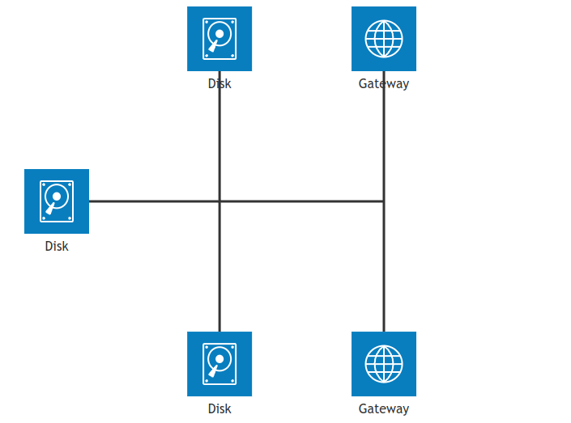

### State Diagram syntax

```go
package main

import (
	"io"
	"os"

	"github.com/nao1215/markdown"
	"github.com/nao1215/markdown/mermaid/state"
)

//go:generate go run main.go

func main() {
	f, err := os.Create("generated.md")
	if err != nil {
		panic(err)
	}
	defer f.Close()

	diagram := state.NewDiagram(io.Discard, state.WithTitle("Order State Machine")).
		StartTransition("Pending").
		State("Pending", "Order received").
		State("Processing", "Preparing order").
		State("Shipped", "Order in transit").
		State("Delivered", "Order completed").
		LF().
		TransitionWithNote("Pending", "Processing", "payment confirmed").
		TransitionWithNote("Processing", "Shipped", "items packed").
		TransitionWithNote("Shipped", "Delivered", "customer received").
		LF().
		NoteRight("Pending", "Waiting for payment").
		NoteRight("Processing", "Preparing items").
		LF().
		EndTransition("Delivered").
		String()

	err = markdown.NewMarkdown(f, markdown.WithBlockSpacing()).
		H2("State Diagram").
		CodeBlocks(markdown.SyntaxHighlightMermaid, diagram).
		Build()

	if err != nil {
		panic(err)
	}
}
```

Plain text output: [markdown is here](./doc/state/generated.md)
````
## State Diagram

```mermaid
---
title: "Order State Machine"
---
stateDiagram-v2
    [*] --> Pending
    Pending : Order received
    Processing : Preparing order
    Shipped : Order in transit
    Delivered : Order completed

    Pending --> Processing : payment confirmed
    Processing --> Shipped : items packed
    Shipped --> Delivered : customer received

    note right of Pending : Waiting for payment
    note right of Processing : Preparing items

    Delivered --> [*]
```
````

Mermaid output:
```mermaid
---
title: "Order State Machine"
---
stateDiagram-v2
    [*] --> Pending
    Pending : Order received
    Processing : Preparing order
    Shipped : Order in transit
    Delivered : Order completed

    Pending --> Processing : payment confirmed
    Processing --> Shipped : items packed
    Shipped --> Delivered : customer received

    note right of Pending : Waiting for payment
    note right of Processing : Preparing items

    Delivered --> [*]
```

### Class Diagram syntax

```go
package main

import (
	"io"
	"os"

	"github.com/nao1215/markdown"
	"github.com/nao1215/markdown/mermaid/class"
)

//go:generate go run main.go

func main() {
	f, err := os.Create("generated.md")
	if err != nil {
		panic(err)
	}
	defer f.Close()

	diagram := class.NewDiagram(
		io.Discard,
		class.WithTitle("Checkout Domain"),
	).
		SetDirection(class.DirectionLR).
		Class(
			"Order",
			class.WithPublicField("string", "id"),
			class.WithPublicMethod("Create", "error", "items []LineItem"),
			class.WithPublicMethod("Pay", "error"),
		).
		Class(
			"LineItem",
			class.WithPublicField("string", "sku"),
			class.WithPublicField("int", "quantity"),
			class.WithPublicMethod("Subtotal", "int"),
		).
		Interface("PaymentGateway")

	diagram.From("Order").
		Composition("LineItem", class.WithOneToMany(), class.WithRelationLabel("contains")).
		Association("PaymentGateway", class.WithRelationLabel("uses"))

	diagramString := diagram.
		NoteFor("Order", "Aggregate Root").
		String()

	err = markdown.NewMarkdown(f, markdown.WithBlockSpacing()).
		H2("Class Diagram").
		CodeBlocks(markdown.SyntaxHighlightMermaid, diagramString).
		Build()

	if err != nil {
		panic(err)
	}
}
```

Plain text output: [markdown is here](./doc/class/generated.md)
````text
## Class Diagram

```mermaid
---
title: "Checkout Domain"
---
classDiagram
    direction LR
    class Order {
        +string id
        +Create(items []LineItem) error
        +Pay() error
    }
    class LineItem {
        +string sku
        +int quantity
        +Subtotal() int
    }
    class PaymentGateway {
        <<Interface>>
    }
    Order "1" *-- "many" LineItem : contains
    Order --> PaymentGateway : uses
    note for Order "Aggregate Root"
```
````

Mermaid output:
```mermaid
---
title: "Checkout Domain"
---
classDiagram
    direction LR
    class Order {
        +string id
        +Create(items []LineItem) error
        +Pay() error
    }
    class LineItem {
        +string sku
        +int quantity
        +Subtotal() int
    }
    class PaymentGateway {
        <<Interface>>
    }
    Order "1" *-- "many" LineItem : contains
    Order --> PaymentGateway : uses
    note for Order "Aggregate Root"
```

### Quadrant Chart syntax

```go
package main

import (
	"io"
	"os"

	"github.com/nao1215/markdown"
	"github.com/nao1215/markdown/mermaid/quadrant"
)

//go:generate go run main.go

func main() {
	f, err := os.Create("generated.md")
	if err != nil {
		panic(err)
	}
	defer f.Close()

	chart := quadrant.NewChart(io.Discard, quadrant.WithTitle("Product Prioritization")).
		XAxis("Low Effort", "High Effort").
		YAxis("Low Value", "High Value").
		LF().
		Quadrant1("Quick Wins").
		Quadrant2("Major Projects").
		Quadrant3("Fill Ins").
		Quadrant4("Thankless Tasks").
		LF().
		Point("Feature A", 0.9, 0.85).
		Point("Feature B", 0.25, 0.75).
		Point("Feature C", 0.15, 0.20).
		Point("Feature D", 0.80, 0.15).
		String()

	err = markdown.NewMarkdown(f, markdown.WithBlockSpacing()).
		H2("Quadrant Chart").
		CodeBlocks(markdown.SyntaxHighlightMermaid, chart).
		Build()

	if err != nil {
		panic(err)
	}
}
```

Plain text output: [markdown is here](./doc/quadrant/generated.md)
````
## Quadrant Chart

```mermaid
quadrantChart
    title Product Prioritization
    x-axis Low Effort --> High Effort
    y-axis Low Value --> High Value

    quadrant-1 Quick Wins
    quadrant-2 Major Projects
    quadrant-3 Fill Ins
    quadrant-4 Thankless Tasks

    Feature A: [0.90, 0.85]
    Feature B: [0.25, 0.75]
    Feature C: [0.15, 0.20]
    Feature D: [0.80, 0.15]
```
````

Mermaid output:
```mermaid
quadrantChart
    title Product Prioritization
    x-axis Low Effort --> High Effort
    y-axis Low Value --> High Value

    quadrant-1 Quick Wins
    quadrant-2 Major Projects
    quadrant-3 Fill Ins
    quadrant-4 Thankless Tasks

    Feature A: [0.90, 0.85]
    Feature B: [0.25, 0.75]
    Feature C: [0.15, 0.20]
    Feature D: [0.80, 0.15]
```

### Gantt Chart syntax

```go
package main

import (
	"io"
	"os"

	"github.com/nao1215/markdown"
	"github.com/nao1215/markdown/mermaid/gantt"
)

//go:generate go run main.go

func main() {
	f, err := os.Create("generated.md")
	if err != nil {
		panic(err)
	}
	defer f.Close()

	chart := gantt.NewChart(
		io.Discard,
		gantt.WithTitle("Project Schedule"),
		gantt.WithDateFormat("YYYY-MM-DD"),
	).
		Section("Planning").
		DoneTaskWithID("Requirements", "req", "2024-01-01", "5d").
		DoneTaskWithID("Design", "design", "2024-01-08", "3d").
		Section("Development").
		CriticalActiveTaskWithID("Coding", "code", "2024-01-12", "10d").
		TaskAfterWithID("Review", "review", "code", "2d").
		Section("Release").
		MilestoneWithID("Launch", "launch", "2024-01-26").
		String()

	err = markdown.NewMarkdown(f, markdown.WithBlockSpacing()).
		H2("Gantt Chart").
		CodeBlocks(markdown.SyntaxHighlightMermaid, chart).
		Build()

	if err != nil {
		panic(err)
	}
}
```

Plain text output: [markdown is here](./doc/gantt/generated.md)
````
## Gantt Chart

```mermaid
gantt
    title Software Development Schedule
    dateFormat YYYY-MM-DD
    section Planning
    Requirements Analysis :done, req, 2024-01-01, 7d
    System Design :done, design, 2024-01-08, 5d

    section Development
    Backend Development :crit, active, backend, 2024-01-15, 14d
    Frontend Development :active, frontend, 2024-01-15, 14d
    Integration :integrate, after backend, 5d

    section Testing
    Unit Testing :unit, after integrate, 3d
    Integration Testing :inttest, after unit, 4d
    UAT :uat, after inttest, 5d

    section Deployment
    Staging Deploy :after uat, 2d
    Production Release :crit, milestone, 2024-03-01, 0d
```
````

Mermaid output:
```mermaid
gantt
    title Project Schedule
    dateFormat YYYY-MM-DD
    section Planning
    Requirements :done, req, 2024-01-01, 5d
    Design :done, design, 2024-01-08, 3d
    section Development
    Coding :crit, active, code, 2024-01-12, 10d
    Review :review, after code, 2d
    section Release
    Launch :milestone, launch, 2024-01-26, 0d
```

### Timeline syntax

```go
package main

import (
	"io"
	"os"

	"github.com/nao1215/markdown"
	"github.com/nao1215/markdown/mermaid/timeline"
)

//go:generate go run main.go

func main() {
	f, err := os.Create("generated.md")
	if err != nil {
		panic(err)
	}
	defer f.Close()

	diagram := timeline.NewDiagram(
		io.Discard,
		timeline.WithTitle("History of Social Media"),
	).
		Period("2002", "LinkedIn").
		Section("Second wave").
		Period("2004", "Facebook", "Google").
		Period("2005", "YouTube").
		Section("Third wave").
		Period("2006", "Twitter").
		Event("Reddit").
		String()

	err = markdown.NewMarkdown(f, markdown.WithBlockSpacing()).
		H2("Timeline").
		CodeBlocks(markdown.SyntaxHighlightMermaid, diagram).
		Build()

	if err != nil {
		panic(err)
	}
}
```

A period holds as many events as you give it, and `Event` adds one more to the period written last. A colon in a section name, a period or an event is emitted as `#58;`, because a colon is what separates a period from its events; it reaches the reader as a colon either way, so `Period("09:00", "Stand up")` says what it looks like. The title keeps its colons: mermaid reads it as the rest of the line.

Plain text output: [markdown is here](./doc/timeline/generated.md)
````
## Timeline

```mermaid
timeline
    title History of Social Media
    2002 : LinkedIn
    section Second wave
        2004 : Facebook : Google
        2005 : YouTube
    section Third wave
        2006 : Twitter : Reddit
```
````

Mermaid output:
```mermaid
timeline
    title History of Social Media
    2002 : LinkedIn
    section Second wave
        2004 : Facebook : Google
        2005 : YouTube
    section Third wave
        2006 : Twitter : Reddit
```

### Sankey syntax

```go
package main

import (
	"io"
	"os"

	"github.com/nao1215/markdown"
	"github.com/nao1215/markdown/mermaid/sankey"
)

//go:generate go run main.go

func main() {
	f, err := os.Create("generated.md")
	if err != nil {
		panic(err)
	}
	defer f.Close()

	diagram := sankey.NewDiagram(io.Discard).
		Link("Agricultural 'waste'", "Bio-conversion", 124.729).
		Link("Bio-conversion", "Liquid", 0.597).
		Link("Bio-conversion", "Losses, and more", 26.862).
		Link("Bio-conversion", "Solid", 280.322).
		Link("Bio-conversion", "Gas", 81.144).
		String()

	err = markdown.NewMarkdown(f, markdown.WithBlockSpacing()).
		H2("Sankey").
		CodeBlocks(markdown.SyntaxHighlightMermaid, diagram).
		Build()

	if err != nil {
		panic(err)
	}
}
```

Nodes are never declared: a node exists because a flow names it, and two flows naming the same node are two flows through one node. The diagram body is CSV, so a node name holding a comma or a double quote is quoted for you, as `Losses, and more` is above.

Plain text output: [markdown is here](./doc/sankey/generated.md)
````
## Sankey

```mermaid
sankey-beta

Agricultural 'waste',Bio-conversion,124.729
Bio-conversion,Liquid,0.597
Bio-conversion,"Losses, and more",26.862
Bio-conversion,Solid,280.322
Bio-conversion,Gas,81.144
```
````

Mermaid output:
```mermaid
sankey-beta

Agricultural 'waste',Bio-conversion,124.729
Bio-conversion,Liquid,0.597
Bio-conversion,"Losses, and more",26.862
Bio-conversion,Solid,280.322
Bio-conversion,Gas,81.144
```

### Radar syntax

```go
package main

import (
	"io"
	"os"

	"github.com/nao1215/markdown"
	"github.com/nao1215/markdown/mermaid/radar"
)

//go:generate go run main.go

func main() {
	f, err := os.Create("generated.md")
	if err != nil {
		panic(err)
	}
	defer f.Close()

	chart := radar.NewDiagram(io.Discard, radar.WithTitle("Grades")).
		Axis("Math", "Science", "English").
		Axis("History", "Art").
		Curve("Alice", 85, 90, 80, 70, 75).
		Curve("Bob", 70, 75, 85, 80, 90).
		Max(100).
		Min(0).
		String()

	err = markdown.NewMarkdown(f, markdown.WithBlockSpacing()).
		H2("Radar").
		CodeBlocks(markdown.SyntaxHighlightMermaid, chart).
		Build()

	if err != nil {
		panic(err)
	}
}
```

Axes are declared once, in order, and every curve gives its values in that same order. mermaid wants an identifier in front of each label; nothing in a radar chart refers to one, so the package numbers them and you pass only the labels.

Plain text output: [markdown is here](./doc/radar/generated.md)
````
## Radar

```mermaid
---
title: "Grades"
---
radar-beta
  axis a1["Math"], a2["Science"], a3["English"]
  axis a4["History"], a5["Art"]
  curve c1["Alice"]{85, 90, 80, 70, 75}
  curve c2["Bob"]{70, 75, 85, 80, 90}
  max 100
  min 0
```
````

Mermaid output:
```mermaid
---
title: "Grades"
---
radar-beta
  axis a1["Math"], a2["Science"], a3["English"]
  axis a4["History"], a5["Art"]
  curve c1["Alice"]{85, 90, 80, 70, 75}
  curve c2["Bob"]{70, 75, 85, 80, 90}
  max 100
  min 0
```

### Treemap syntax

```go
package main

import (
	"io"
	"os"

	"github.com/nao1215/markdown"
	"github.com/nao1215/markdown/mermaid/treemap"
)

//go:generate go run main.go

func main() {
	f, err := os.Create("generated.md")
	if err != nil {
		panic(err)
	}
	defer f.Close()

	diagram := treemap.NewDiagram(io.Discard, treemap.WithTitle("Budget")).
		Section("Ops").
		Leaf("Salaries", 1200).
		Section("Cloud").
		Leaf("Compute", 400).
		Parent().
		Leaf("Travel", 300).
		Parent().
		Section("Marketing").
		Leaf("Ads", 800).
		String()

	err = markdown.NewMarkdown(f, markdown.WithBlockSpacing()).
		H2("Treemap").
		CodeBlocks(markdown.SyntaxHighlightMermaid, diagram).
		Build()

	if err != nil {
		panic(err)
	}
}
```

mermaid expresses the hierarchy with indentation, and the builder walks it rather than asking for a tree of objects: `Section` opens a level, `Leaf` puts a value in the current one, and `Parent` goes back up. A section carries no value of its own; mermaid gives it the sum of what it holds.

Plain text output: [markdown is here](./doc/treemap/generated.md)
````
## Treemap

```mermaid
---
title: "Budget"
---
treemap-beta
"Ops"
    "Salaries": 1200
    "Cloud"
        "Compute": 400
    "Travel": 300
"Marketing"
    "Ads": 800
```
````

Mermaid output:
```mermaid
---
title: "Budget"
---
treemap-beta
"Ops"
    "Salaries": 1200
    "Cloud"
        "Compute": 400
    "Travel": 300
"Marketing"
    "Ads": 800
```

### C4 context syntax

mermaid marks its C4 support experimental and says the syntax may change, so this package stays on the C4Context diagram: the people and the software systems around the one being described.

```go
package main

import (
	"io"
	"os"

	"github.com/nao1215/markdown"
	"github.com/nao1215/markdown/mermaid/c4"
)

//go:generate go run main.go

func main() {
	f, err := os.Create("generated.md")
	if err != nil {
		panic(err)
	}
	defer f.Close()

	diagram := c4.NewDiagram(io.Discard, c4.WithTitle("System Context: Internet Banking")).
		EnterpriseBoundary("bank", "Big Bank plc").
		Person("customer", "Personal Banking Customer", c4.WithDescription("A customer of the bank.")).
		SystemBoundary("banking", "Internet Banking").
		System("web", "Internet Banking System", c4.WithDescription("Shows account information.")).
		SystemDb("accounts", "Accounts Database").
		BoundaryEnd().
		BoundaryEnd().
		SystemExt("mail", "E-mail System", c4.WithDescription("The internal Microsoft Exchange system.")).
		Rel("customer", "web", "Views balances", c4.WithTechnology("HTTPS")).
		BiRel("web", "accounts", "Reads from and writes to", c4.WithTechnology("SQL/TCP")).
		Rel("web", "mail", "Sends e-mail using", c4.WithTechnology("SMTP")).
		String()

	err = markdown.NewMarkdown(f, markdown.WithBlockSpacing()).
		H2("C4 Context").
		CodeBlocks(markdown.SyntaxHighlightMermaid, diagram).
		Build()

	if err != nil {
		panic(err)
	}
}
```

A boundary is a pair of calls rather than a nested builder: `Boundary`, `EnterpriseBoundary` and `SystemBoundary` open one, everything after belongs to it, and `BoundaryEnd` closes it. Leaving one open is reported from `Build`, because mermaid refuses a diagram whose brace never closes.

Labels are escaped with the entity form mermaid decodes, so a quotation mark or a `#` in one cannot break the macro syntax. The title is the exception: mermaid reads the rest of the line, quotes and all, so the package does not quote it.

Plain text output: [markdown is here](./doc/c4/generated.md)
````
## C4 Context

```mermaid
C4Context
    title System Context: Internet Banking
    Enterprise_Boundary(bank, "Big Bank plc") {
        Person(customer, "Personal Banking Customer", "A customer of the bank.")
        System_Boundary(banking, "Internet Banking") {
            System(web, "Internet Banking System", "Shows account information.")
            SystemDb(accounts, "Accounts Database")
        }
    }
    System_Ext(mail, "E-mail System", "The internal Microsoft Exchange system.")
    Rel(customer, web, "Views balances", "HTTPS")
    BiRel(web, accounts, "Reads from and writes to", "SQL/TCP")
    Rel(web, mail, "Sends e-mail using", "SMTP")
```
````

Mermaid output:
```mermaid
C4Context
    title System Context: Internet Banking
    Enterprise_Boundary(bank, "Big Bank plc") {
        Person(customer, "Personal Banking Customer", "A customer of the bank.")
        System_Boundary(banking, "Internet Banking") {
            System(web, "Internet Banking System", "Shows account information.")
            SystemDb(accounts, "Accounts Database")
        }
    }
    System_Ext(mail, "E-mail System", "The internal Microsoft Exchange system.")
    Rel(customer, web, "Views balances", "HTTPS")
    BiRel(web, accounts, "Reads from and writes to", "SQL/TCP")
    Rel(web, mail, "Sends e-mail using", "SMTP")
```

### Venn syntax

```go
package main

import (
	"io"
	"os"

	"github.com/nao1215/markdown"
	"github.com/nao1215/markdown/mermaid/venn"
)

//go:generate go run main.go

func main() {
	f, err := os.Create("generated.md")
	if err != nil {
		panic(err)
	}
	defer f.Close()

	diagram := venn.NewDiagram(io.Discard, venn.WithTitle("What the languages share")).
		SetWithLabel("go", "Go").
		SetWithLabel("rust", "Rust").
		SetWithLabel("compiled", "Compiled and statically typed").
		String()

	err = markdown.NewMarkdown(f, markdown.WithBlockSpacing()).
		H2("Venn").
		CodeBlocks(markdown.SyntaxHighlightMermaid, diagram).
		Build()

	if err != nil {
		panic(err)
	}
}
```

A Venn diagram is the sets and nothing else: where they overlap is worked out by mermaid rather than declared, so there is no call for an intersection. A set name is written unquoted and mermaid reads only letters, digits, underscores and hyphens there, so `Set` reports a name outside that rather than mangling it; a label has no such limit, which is what `SetWithLabel` is for.

Plain text output: [markdown is here](./doc/venn/generated.md)
````
## Venn

```mermaid
venn-beta
    title What the languages share
    set go["Go"]
    set rust["Rust"]
    set compiled["Compiled and statically typed"]
```
````

Mermaid output:
```mermaid
venn-beta
    title What the languages share
    set go["Go"]
    set rust["Rust"]
    set compiled["Compiled and statically typed"]
```

### Wardley map syntax

```go
package main

import (
	"io"
	"os"

	"github.com/nao1215/markdown"
	"github.com/nao1215/markdown/mermaid/wardley"
)

//go:generate go run main.go

func main() {
	f, err := os.Create("generated.md")
	if err != nil {
		panic(err)
	}
	defer f.Close()

	diagram := wardley.NewMap(io.Discard, wardley.WithTitle("Checkout, as it stands")).
		Anchor("Customer", 0.95, 0.95).
		Component("Checkout (web)", 0.6, 0.8).
		Component("Payment service", 0.75, 0.5).
		Component("Card network", 0.95, 0.2).
		Link("Customer", "Checkout (web)").
		Link("Checkout (web)", "Payment service").
		Link("Payment service", "Card network").
		Evolve("Payment service", 0.9).
		String()

	err = markdown.NewMarkdown(f, markdown.WithBlockSpacing()).
		H2("Wardley map").
		CodeBlocks(markdown.SyntaxHighlightMermaid, diagram).
		Build()

	if err != nil {
		panic(err)
	}
}
```

The two coordinates are evolution and visibility, each from 0.0 to 1.0: evolution runs left to right, from something built for the first time to something bought as a commodity, and visibility runs bottom to top, from the plumbing to what the user actually touches. `Evolve` is what turns a map of today into an argument about tomorrow.

A name is written unquoted and mermaid reads only letters, digits, spaces, underscores, hyphens and parentheses there, refusing its own escape form as well, so a name outside that set is reported from `Build` rather than mangled into one that draws something else.

Plain text output: [markdown is here](./doc/wardley/generated.md)
````
## Wardley map

```mermaid
wardley-beta
    title Checkout, as it stands
    anchor Customer [0.95, 0.95]
    component Checkout (web) [0.6, 0.8]
    component Payment service [0.75, 0.5]
    component Card network [0.95, 0.2]
    Customer -> Checkout (web)
    Checkout (web) -> Payment service
    Payment service -> Card network
    evolve Payment service 0.9
```
````

Mermaid output:
```mermaid
wardley-beta
    title Checkout, as it stands
    anchor Customer [0.95, 0.95]
    component Checkout (web) [0.6, 0.8]
    component Payment service [0.75, 0.5]
    component Card network [0.95, 0.2]
    Customer -> Checkout (web)
    Checkout (web) -> Payment service
    Payment service -> Card network
    evolve Payment service 0.9
```

## Creating an index for a directory full of markdown files
The markdown package can create an index for Markdown files within the specified directory. This feature was added to generate indexes for Markdown documents produced by [nao1215/spectest](https://github.com/nao1215/spectest).
  
For example, consider the following directory structure:

```shell
testdata
├── abc
│   ├── dummy.txt
│   ├── jkl
│   │   └── text.md
│   └── test.md
├── def
│   ├── test.md
│   └── test2.md
├── expected
│   └── index.md
├── ghi
└── test.md
```
  
In the following implementation, it creates an index markdown file containing links to all markdown files located within the testdata directory.

```go
		if err := GenerateIndex(
			"testdata", // target directory that contains markdown files
			WithTitle("Test Title"), // title of index markdown
			WithDescription([]string{"Test Description", "Next Description"}), // description of index markdown
		); err != nil {
			panic(err)
		}
```
  
The index Markdown file is created under "target directory/index.md" by default. If you want to change this path, please use the `WithWriter()` option. The link names in the file will be the first occurrence of H1 or H2 in the target Markdown. If neither H1 nor H2 is present, the link name will be the file name of the destination.  
  
[Output:](./doc/index.md)
```markdown
## Test Title
Test Description
  
Next Description
  
### testdata
- [test.md](test.md)
  
### abc
- [h2 is here](abc/test.md)
  
### jkl
- [text.md](abc/jkl/text.md)
  
### def
- [h2 is first, not h1](def/test.md)
- [h1 is here](def/test2.md)
  
### expected
- [Test Title](expected/index.md)
```
  
## License
[MIT License](./LICENSE)

## Contribution
First off, thanks for taking the time to contribute! See [CONTRIBUTING.md](./CONTRIBUTING.md) for more information. Contributions are not only related to development. For example, GitHub Star motivates me to develop! Please feel free to contribute to this project.

### Contributors ✨

Thanks goes to these wonderful people ([emoji key](https://allcontributors.org/docs/en/emoji-key)):

<!-- ALL-CONTRIBUTORS-LIST:START - Do not remove or modify this section -->
<!-- prettier-ignore-start -->
<!-- markdownlint-disable -->
<table>
  <tbody>
    <tr>
      <td align="center" valign="top" width="14.28%"><a href="https://debimate.jp/"><br /><sub><b>CHIKAMATSU Naohiro</b></sub></a><br /><a href="https://github.com/nao1215/markdown/commits?author=nao1215" title="Code">💻</a></td>
      <td align="center" valign="top" width="14.28%"><a href="https://github.com/varmakarthik12"><br /><sub><b>Karthik Sundari</b></sub></a><br /><a href="https://github.com/nao1215/markdown/commits?author=varmakarthik12" title="Code">💻</a> <a href="https://github.com/nao1215/markdown/issues?q=author%3Avarmakarthik12" title="Ideas, Planning, & Feedback">🤔</a></td>
      <td align="center" valign="top" width="14.28%"><a href="https://github.com/Avihuc"><br /><sub><b>Avihuc</b></sub></a><br /><a href="https://github.com/nao1215/markdown/commits?author=Avihuc" title="Code">💻</a></td>
      <td align="center" valign="top" width="14.28%"><a href="https://www.claranceliberi.me/"><br /><sub><b>Clarance Liberiste Ntwari</b></sub></a><br /><a href="https://github.com/nao1215/markdown/commits?author=claranceliberi" title="Code">💻</a></td>
      <td align="center" valign="top" width="14.28%"><a href="https://github.com/amitaifrey"><br /><sub><b>Amitai Frey</b></sub></a><br /><a href="https://github.com/nao1215/markdown/commits?author=amitaifrey" title="Code">💻</a></td>
      <td align="center" valign="top" width="14.28%"><a href="https://github.com/wI2L"><br /><sub><b>William Poussier</b></sub></a><br /><a href="https://github.com/nao1215/markdown/issues?q=author%3AwI2L" title="Ideas, Planning, & Feedback">🤔</a></td>
      <td align="center" valign="top" width="14.28%"><a href="https://hibare.in/"><br /><sub><b>Shubham Hibare</b></sub></a><br /><a href="https://github.com/nao1215/markdown/issues?q=author%3Ahibare" title="Bug reports">🐛</a></td>
    </tr>
    <tr>
      <td align="center" valign="top" width="14.28%"><a href="https://barrymorrison.com/"><br /><sub><b>Barry Morrison</b></sub></a><br /><a href="https://github.com/nao1215/markdown/issues?q=author%3Aesacteksab" title="Ideas, Planning, & Feedback">🤔</a></td>
      <td align="center" valign="top" width="14.28%"><a href="https://github.com/chaunsin"><br /><sub><b>chaunsin</b></sub></a><br /><a href="https://github.com/nao1215/markdown/issues?q=author%3Achaunsin" title="Ideas, Planning, & Feedback">🤔</a></td>
    </tr>
  </tbody>
  <tfoot>
    <tr>
      <td align="center" size="13px" colspan="7">
        
          <a href="https://all-contributors.js.org/docs/en/bot/usage">Add your contributions</a>
        </img>
      </td>
    </tr>
  </tfoot>
</table>

<!-- markdownlint-restore -->
<!-- prettier-ignore-end -->

<!-- ALL-CONTRIBUTORS-LIST:END -->

This project follows the [all-contributors](https://github.com/all-contributors/all-contributors) specification. Contributions of any kind are welcome, and that includes bug reports and feature requests: several of the features above exist because someone opened an issue asking for them.
