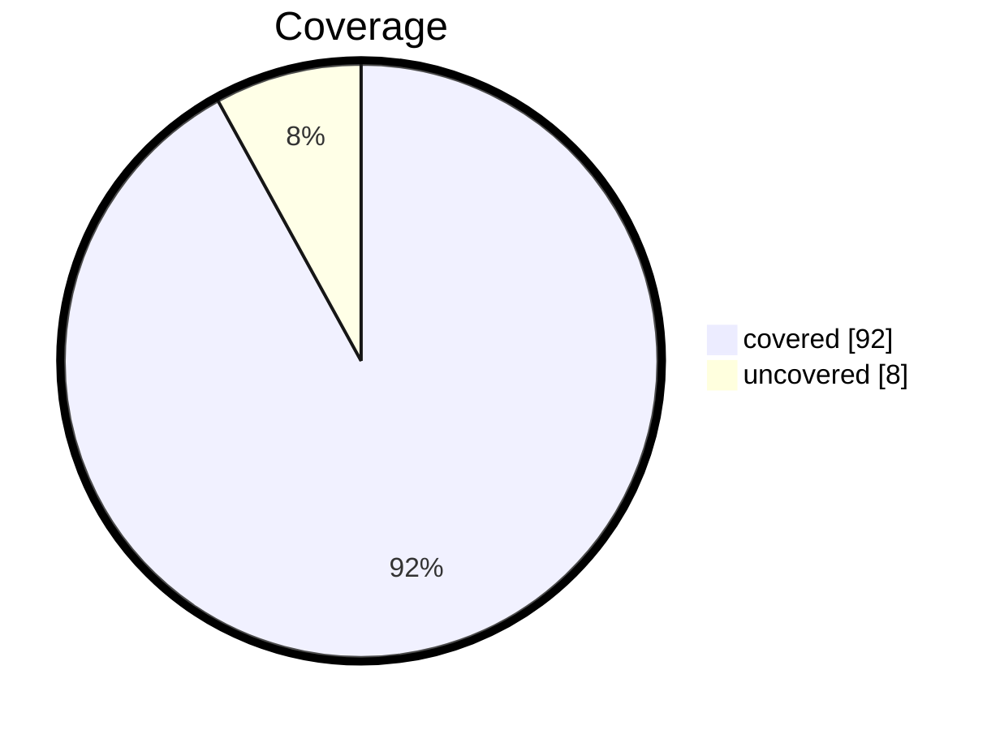

## Test Results

| Package | Passed | Failed |
|---------|---------|---------|
| api | 120 | 0 |
| core | 89 | 2 |

> [!WARNING]  
> 2 tests failed in core; see the failed step for logs.

```mermaid
%%{init: {"pie": {"textPosition": 0.75}, "themeVariables": {"pieOuterStrokeWidth": "5px"}} }%%
pie showData
    title Coverage
    "covered" : 92
    "uncovered" : 8
```
