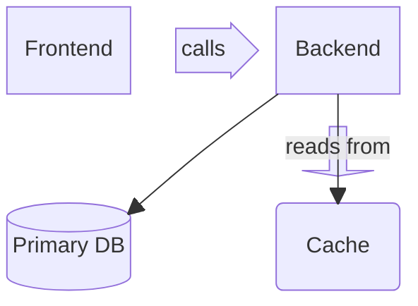

## Block Diagram

```mermaid
---
title: Checkout Architecture
---
block
    columns 3
    Frontend toBackend<["calls"]>(right) Backend
    space:2 toDB<["&nbsp;"]>(down)
    Database[("Primary DB")] space Cache("Cache")
    Backend --> Database
    Backend -- "reads from" --> Cache
```
