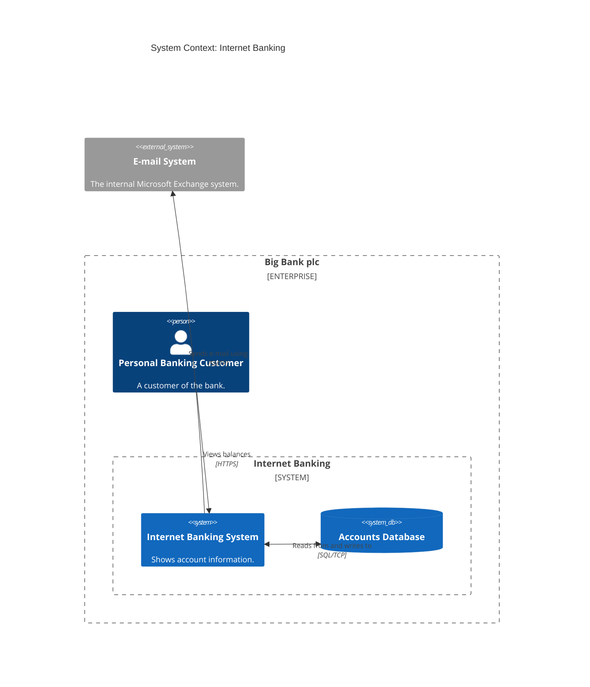

## C4 Context

```mermaid
C4Context
    title System Context: Internet Banking
    Enterprise_Boundary(bank, "Big Bank plc") {
        Person(customer, "Personal Banking Customer", "A customer of the bank.")
        System_Boundary(banking, "Internet Banking") {
            System(web, "Internet Banking System", "Shows account information.")
            SystemDb(accounts, "Accounts Database")
        }
    }
    System_Ext(mail, "E-mail System", "The internal Microsoft Exchange system.")
    Rel(customer, web, "Views balances", "HTTPS")
    BiRel(web, accounts, "Reads from and writes to", "SQL/TCP")
    Rel(web, mail, "Sends e-mail using", "SMTP")
```
