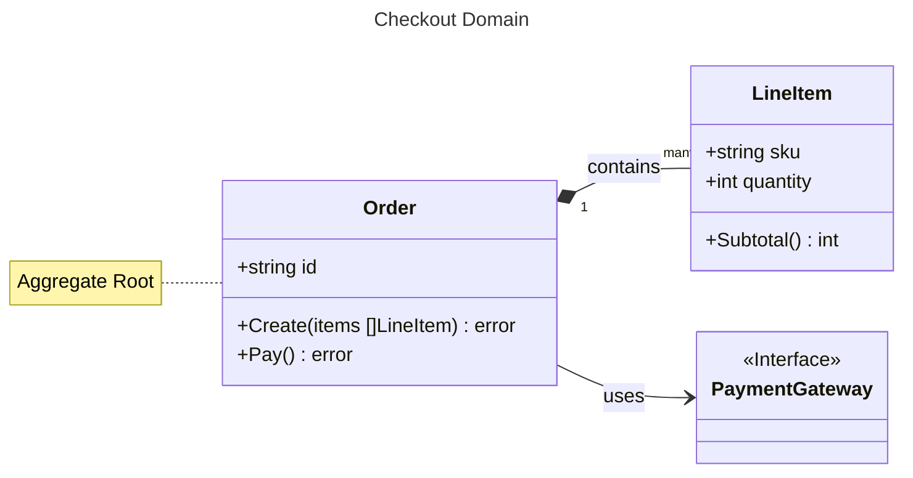

## Class Diagram

```mermaid
---
title: "Checkout Domain"
---
classDiagram
    direction LR
    class Order {
        +string id
        +Create(items []LineItem) error
        +Pay() error
    }
    class LineItem {
        +string sku
        +int quantity
        +Subtotal() int
    }
    class PaymentGateway {
        <<Interface>>
    }
    Order "1" *-- "many" LineItem : contains
    Order --> PaymentGateway : uses
    note for Order "Aggregate Root"
```
