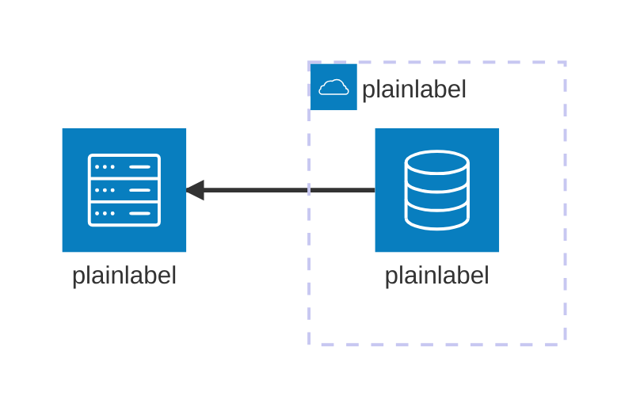

# Architecture rendering edge cases

Every label below holds the punctuation this diagram type can carry. Generated by doc/edgecase/main.go and rendered in continuous integration, so a quoting defect fails the build rather than reaching a diagram.

