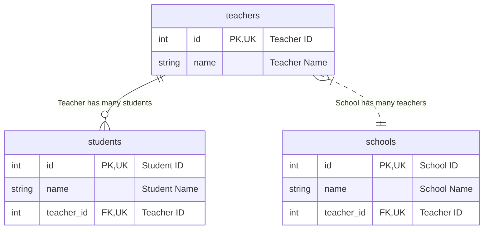

## Entity Relationship Diagram

```mermaid
erDiagram
    teachers ||--o{ students : "Teacher has many students"
    teachers }|..|| schools : "School has many teachers"
    schools {
        int id PK,UK "School ID"
        string name  "School Name"
        int teacher_id FK,UK "Teacher ID"
    }
    students {
        int id PK,UK "Student ID"
        string name  "Student Name"
        int teacher_id FK,UK "Teacher ID"
    }
    teachers {
        int id PK,UK "Teacher ID"
        string name  "Teacher Name"
    }

```