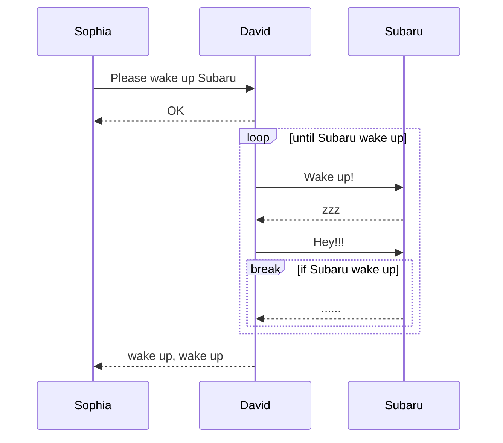
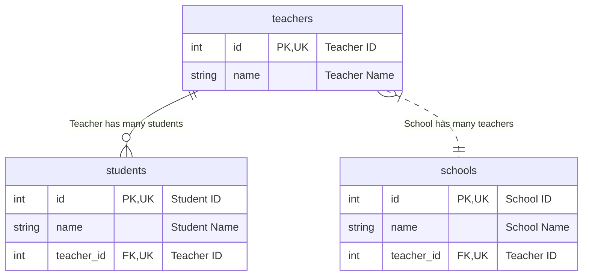
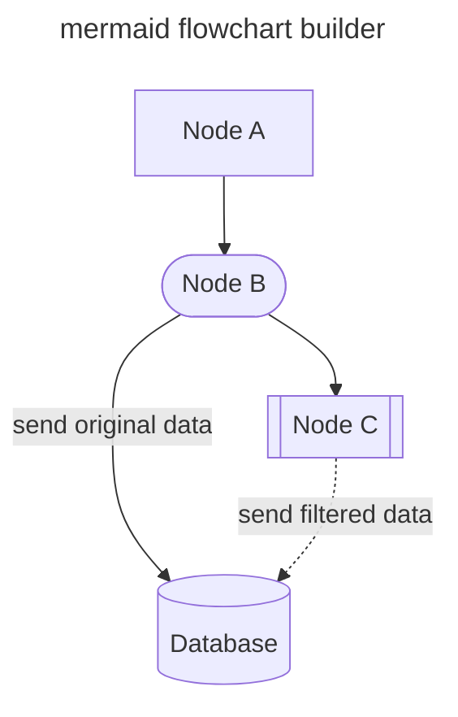
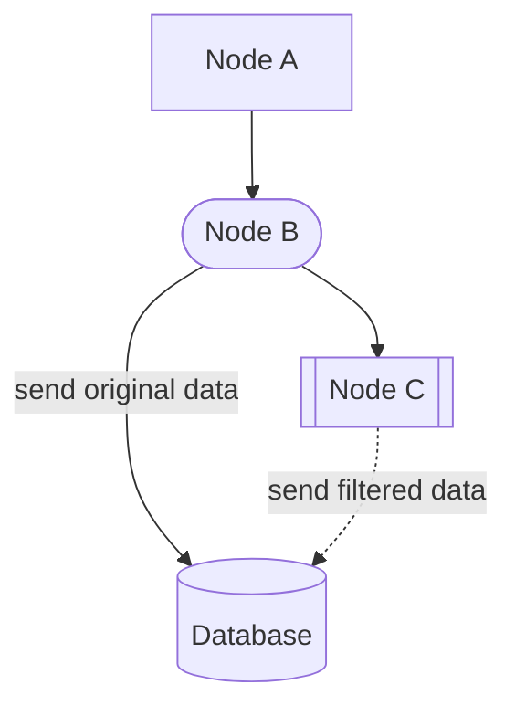
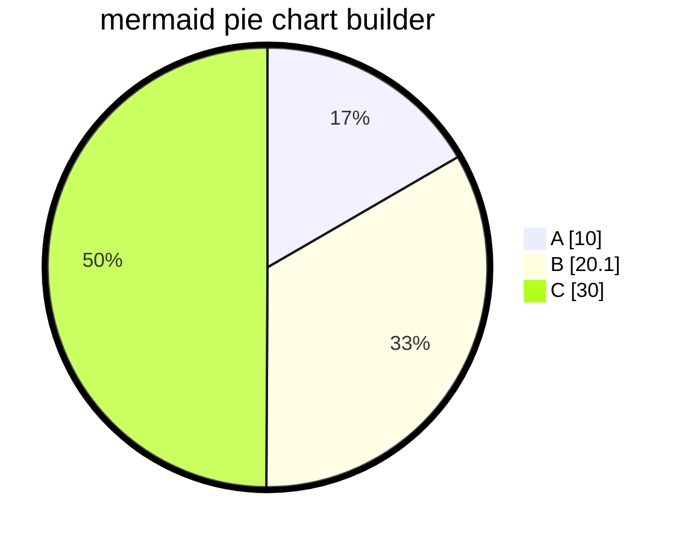
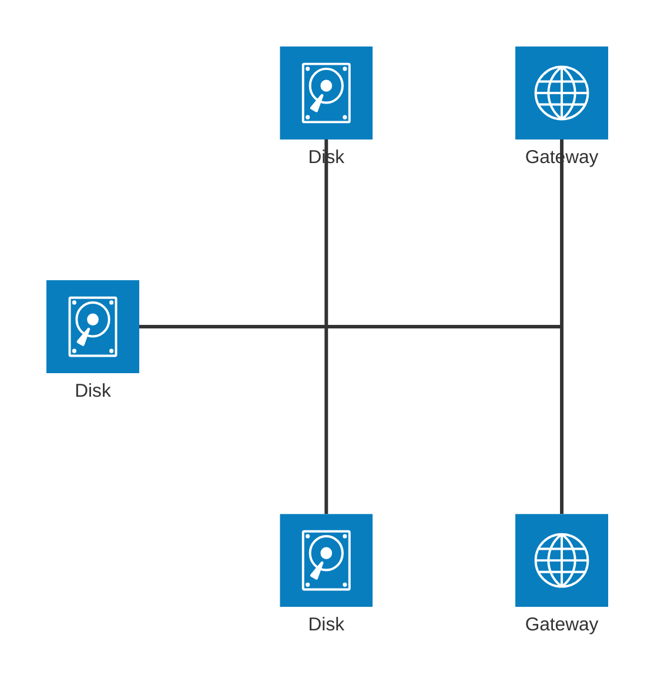
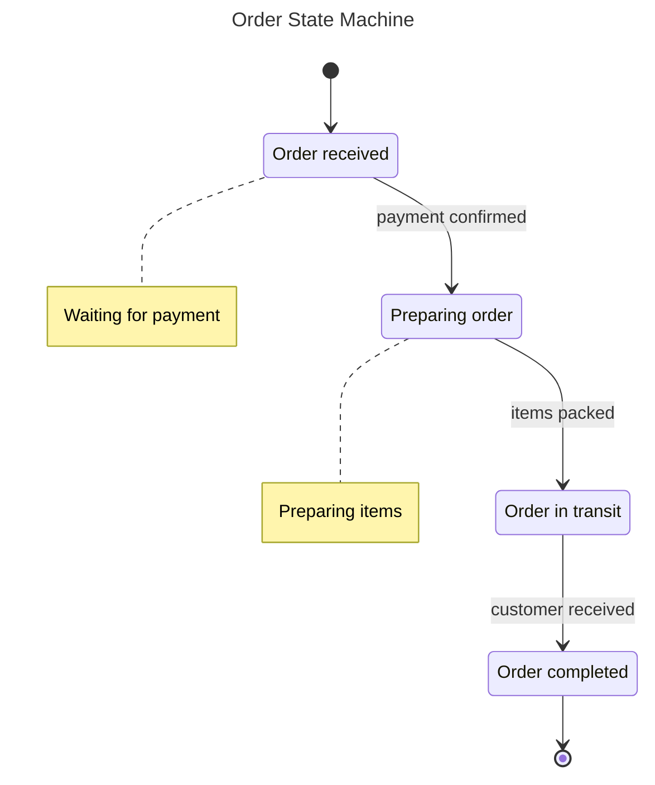
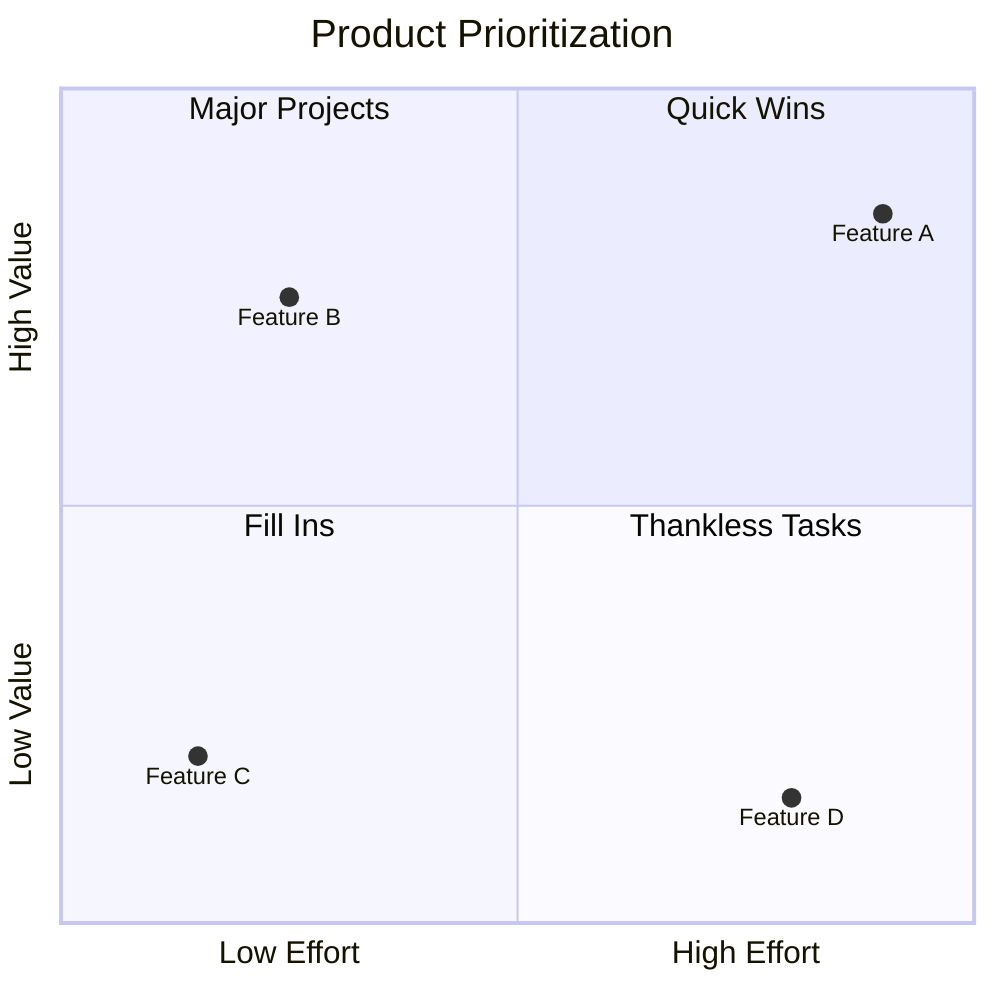

<!-- ALL-CONTRIBUTORS-BADGE:START - Do not remove or modify this section -->
[](#contributors-)
<!-- ALL-CONTRIBUTORS-BADGE:END -->
[](https://pkg.go.dev/github.com/nao1215/markdown)
[](https://github.com/nao1215/markdown/actions/workflows/unit_test.yml)
[](https://github.com/nao1215/markdown/actions/workflows/reviewdog.yml)
[](https://github.com/nao1215/markdown/actions/workflows/gosec.yml)


[English](../../README.md) | [日本語](../ja/README.md) | [Русский](../ru/README.md) | [中文](../zh-cn/README.md) | [한국어](../ko/README.md) | [Français](../fr/README.md)

# ¿Qué es el paquete markdown?
El paquete markdown es un constructor de markdown simple en Golang. El paquete markdown ensambla Markdown usando encadenamiento de métodos, no utiliza un motor de plantillas como [html/template](https://pkg.go.dev/html/template). La sintaxis de Markdown sigue **GitHub Markdown**.

El paquete markdown fue inicialmente desarrollado para guardar resultados de pruebas en [nao1215/spectest](https://github.com/nao1215/spectest). Por lo tanto, el paquete markdown implementa las características requeridas por spectest. Por ejemplo, el paquete markdown soporta **diagramas de secuencia mermaid (diagrama de relación de entidad, diagrama de secuencia, diagrama de flujo, gráfico circular, gráfico de cuadrantes, diagrama de estado, diagrama de arquitectura)**, que era una característica necesaria en spectest.

Además, no se añadirá código complejo que aumente la complejidad de la biblioteca, como generar listas anidadas. Quiero mantener esta biblioteca lo más simple posible.

## SO y versión de Go soportados
- SO: Linux, macOS, Windows
- Go: 1.21 o posterior

## Características de Markdown soportadas
- [x] Encabezados; H1, H2, H3, H4, H5, H6
- [x] Citas de bloque 
- [x] Lista de viñetas
- [x] Lista ordenada
- [x] Lista de casillas de verificación 
- [x] Bloques de código
- [x] Regla horizontal 
- [x] Tabla
- [x] Formato de texto; negrita, cursiva, código, tachado, negrita cursiva
- [x] Texto con enlace
- [x] Texto con imagen
- [x] Texto plano
- [x] Detalles 
- [x] Alertas; NOTE, TIP, IMPORTANT, CAUTION, WARNING
- [x] diagrama de secuencia mermaid
- [x] diagrama de relación de entidad mermaid
- [x] diagrama de flujo mermaid 
- [x] gráfico circular mermaid
- [x] gráfico de cuadrantes mermaid
- [x] diagrama de estado mermaid
- [x] diagrama de arquitectura mermaid (característica beta) 

### Características no en la sintaxis de Markdown
- Generar insignias; RedBadge(), YellowBadge(), GreenBadge().
- Generar un índice para un directorio lleno de archivos markdown; GenerateIndex()

## Ejemplo
### Uso básico
```go
package main

import (
	"os"

	md "github.com/nao1215/markdown"
)

func main() {
	md.NewMarkdown(os.Stdout).
		H1("This is H1").
		PlainText("This is plain text").
		H2f("This is %s with text format", "H2").
		PlainTextf("Text formatting, such as %s and %s, %s styles.",
			md.Bold("bold"), md.Italic("italic"), md.Code("code")).
		H2("Code Block").
		CodeBlocks(md.SyntaxHighlightGo,
			`package main
import "fmt"

func main() {
	fmt.Println("Hello, World!")
}`).
		H2("List").
		BulletList("Bullet Item 1", "Bullet Item 2", "Bullet Item 3").
		OrderedList("Ordered Item 1", "Ordered Item 2", "Ordered Item 3").
		H2("CheckBox").
		CheckBox([]md.CheckBoxSet{
			{Checked: false, Text: md.Code("sample code")},
			{Checked: true, Text: md.Link("Go", "https://golang.org")},
			{Checked: false, Text: md.Strikethrough("strikethrough")},
		}).
		H2("Blockquote").
		Blockquote("If you can dream it, you can do it.").
		H3("Horizontal Rule").
		HorizontalRule().
		H2("Table").
		Table(md.TableSet{
			Header: []string{"Name", "Age", "Country"},
			Rows: [][]string{
				{"David", "23", "USA"},
				{"John", "30", "UK"},
				{"Bob", "25", "Canada"},
			},
		}).
		H2("Image").
		PlainTextf(md.Image("sample_image", "./sample.png")).
		Build()
}
```

Salida:
````
# This is H1
This is plain text

## This is H2 with text format
Text formatting, such as **bold** and *italic*, `code` styles.

## Code Block
```go
package main
import "fmt"

func main() {
        fmt.Println("Hello, World!")
}
```

## List
- Bullet Item 1
- Bullet Item 2
- Bullet Item 3
1. Ordered Item 1
2. Ordered Item 2
3. Ordered Item 3

## CheckBox
- [ ] `sample code`
- [x] [Go](https://golang.org)
- [ ] ~~strikethrough~~

## Blockquote
> If you can dream it, you can do it.

### Horizontal Rule
---

## Table
| NAME  | AGE | COUNTRY |
|-------|-----|---------|
| David |  23 | USA     |
| John  |  30 | UK      |
| Bob   |  25 | Canada  |

## Image

````

Si quieres ver cómo se ve en Markdown, por favor consulta el siguiente enlace.
- [sample.md](../generated_example.md)

### Generar Markdown usando `"go generate ./..."`
Puedes generar Markdown usando `go generate`. Por favor define código para generar Markdown primero. Luego, ejecuta `"go generate ./..."` para generar Markdown.

[Ejemplo de código:](../generate/main.go)
```go
package main

import (
	"os"

	md "github.com/nao1215/markdown"
)

//go:generate go run main.go

func main() {
	f, err := os.Create("generated.md")
	if err != nil {
		panic(err)
	}
	defer f.Close()

	md.NewMarkdown(f).
		H1("go generate example").
		PlainText("This markdown is generated by `go generate`").
		Build()
}
```

Ejecuta el comando de abajo:
```shell
go generate ./...
```

[Salida:](../generate/generated.md)
````text
# go generate example
This markdown is generated by `go generate`
````

### Sintaxis de alertas
El paquete markdown puede crear alertas. Las alertas son útiles para mostrar información importante en Markdown. Esta sintaxis es soportada por GitHub.
[Ejemplo de código:](../alert/main.go)
```go
	md.NewMarkdown(f).
		H1("Alert example").
		Note("This is note").LF().
		Tip("This is tip").LF().
		Important("This is important").LF().
		Warning("This is warning").LF().
		Caution("This is caution").LF().
		Build()
```

[Salida:](../alert/generated.md)
````text
# Alert example
> [!NOTE]  
> This is note

> [!TIP]  
> This is tip

> [!IMPORTANT]  
> This is important

> [!WARNING]  
> This is warning

> [!CAUTION]  
> This is caution
````

Tu alerta se verá así;
> [!NOTE]  
> This is note

> [!TIP]  
> This is tip

> [!IMPORTANT]  
> This is important

> [!WARNING]  
> This is warning

> [!CAUTION]  
> This is caution

### Sintaxis de insignia de estado
El paquete markdown puede crear insignias de estado rojas, amarillas y verdes.
[Ejemplo de código:](../badge/main.go)
```go
	md.NewMarkdown(os.Stdout).
		H1("badge example").
		RedBadge("red_badge").
		YellowBadge("yellow_badge").
		GreenBadge("green_badge").
		BlueBadge("blue_badge").
		Build()
```

[Salida:](../badge/generated.md)
````text
# badge example


````

Tu insignia se verá así;  


### Sintaxis del diagrama de secuencia Mermaid

```go
package main

import (
	"os"

	"github.com/nao1215/markdown"
	"github.com/nao1215/mermaid/sequence"
)

//go:generate go run main.go

func main() {
	diagram := sequence.NewDiagram(io.Discard).
		Participant("Sophia").
		Participant("David").
		Participant("Subaru").
		LF().
		SyncRequest("Sophia", "David", "Please wake up Subaru").
		SyncResponse("David", "Sophia", "OK").
		LF().
		LoopStart("until Subaru wake up").
		SyncRequest("David", "Subaru", "Wake up!").
		SyncResponse("Subaru", "David", "zzz").
		SyncRequest("David", "Subaru", "Hey!!!").
		BreakStart("if Subaru wake up").
		SyncResponse("Subaru", "David", "......").
		BreakEnd().
		LoopEnd().
		LF().
		SyncResponse("David", "Sophia", "wake up, wake up").
		String()

	markdown.NewMarkdown(os.Stdout).
		H2("Sequence Diagram").
		CodeBlocks(markdown.SyntaxHighlightMermaid, diagram).
		Build()
}
```

Salida de texto plano: [markdown está aquí](../sequence/generated.md)
````
## Sequence Diagram

````

Salida Mermaid:


### Sintaxis del diagrama de relación de entidad

```go
package main

import (
	"os"

	"github.com/nao1215/markdown"
	"github.com/nao1215/markdown/mermaid/er"
)

//go:generate go run main.go

func main() {
	f, err := os.Create("generated.md")
	if err != nil {
		panic(err)
	}
	defer f.Close()

	teachers := er.NewEntity(
		"teachers",
		[]*er.Attribute{
			{
				Type:         "int",
				Name:         "id",
				IsPrimaryKey: true,
				IsForeignKey: false,
				IsUniqueKey:  true,
				Comment:      "Teacher ID",
			},
			{
				Type:         "string",
				Name:         "name",
				IsPrimaryKey: false,
				IsForeignKey: false,
				IsUniqueKey:  false,
				Comment:      "Teacher Name",
			},
		},
	)
	students := er.NewEntity(
		"students",
		[]*er.Attribute{
			{
				Type:         "int",
				Name:         "id",
				IsPrimaryKey: true,
				IsForeignKey: false,
				IsUniqueKey:  true,
				Comment:      "Student ID",
			},
			{
				Type:         "string",
				Name:         "name",
				IsPrimaryKey: false,
				IsForeignKey: false,
				IsUniqueKey:  false,
				Comment:      "Student Name",
			},
			{
				Type:         "int",
				Name:         "teacher_id",
				IsPrimaryKey: false,
				IsForeignKey: true,
				IsUniqueKey:  true,
				Comment:      "Teacher ID",
			},
		},
	)
	schools := er.NewEntity(
		"schools",
		[]*er.Attribute{
			{
				Type:         "int",
				Name:         "id",
				IsPrimaryKey: true,
				IsForeignKey: false,
				IsUniqueKey:  true,
				Comment:      "School ID",
			},
			{
				Type:         "string",
				Name:         "name",
				IsPrimaryKey: false,
				IsForeignKey: false,
				IsUniqueKey:  false,
				Comment:      "School Name",
			},
			{
				Type:         "int",
				Name:         "teacher_id",
				IsPrimaryKey: false,
				IsForeignKey: true,
				IsUniqueKey:  true,
				Comment:      "Teacher ID",
			},
		},
	)

	erString := er.NewDiagram(f).
		Relationship(
			teachers,
			students,
			er.ExactlyOneRelationship, // "||"
			er.ZeroToMoreRelationship, // "}o"
			er.Identifying,            // "--"
			"Teacher has many students",
		).
		Relationship(
			teachers,
			schools,
			er.OneToMoreRelationship,  // "|}"
			er.ExactlyOneRelationship, // "||"
			er.NonIdentifying,         // ".."
			"School has many teachers",
		).
		String()

	err = markdown.NewMarkdown(f).
		H2("Entity Relationship Diagram").
		CodeBlocks(markdown.SyntaxHighlightMermaid, erString).
		Build()

	if err != nil {
		panic(err)
	}
}
```

Salida de texto plano: [markdown está aquí](../er/generated.md)
````
## Entity Relationship Diagram

````

Salida Mermaid:


### Sintaxis del diagrama de flujo

```go
package main

import (
	"io"
	"os"

	"github.com/nao1215/markdown"
	"github.com/nao1215/markdown/mermaid/flowchart"
)

//go:generate go run main.go

func main() {
	f, err := os.Create("generated.md")
	if err != nil {
		panic(err)
	}
	defer f.Close()

	fc := flowchart.NewFlowchart(
		io.Discard,
		flowchart.WithTitle("mermaid flowchart builder"),
		flowchart.WithOrientalTopToBottom(),
	).
		NodeWithText("A", "Node A").
		StadiumNode("B", "Node B").
		SubroutineNode("C", "Node C").
		DatabaseNode("D", "Database").
		LinkWithArrowHead("A", "B").
		LinkWithArrowHeadAndText("B", "D", "send original data").
		LinkWithArrowHead("B", "C").
		DottedLinkWithText("C", "D", "send filtered data").
		String()

	err = markdown.NewMarkdown(f).
		H2("Flowchart").
		CodeBlocks(markdown.SyntaxHighlightMermaid, fc).
		Build()

	if err != nil {
		panic(err)
	}
}
```

Salida de texto plano: [markdown está aquí](../flowchart/generated.md)
````
## Flowchart

````

Salida Mermaid:


### Sintaxis del gráfico circular

```go
package main

import (
	"io"
	"os"

	"github.com/nao1215/markdown"
	"github.com/nao1215/markdown/mermaid/piechart"
)

//go:generate go run main.go

func main() {
	f, err := os.Create("generated.md")
	if err != nil {
		panic(err)
	}
	defer f.Close()

	chart := piechart.NewPieChart(
		io.Discard,
		piechart.WithTitle("mermaid pie chart builder"),
		piechart.WithShowData(true),
	).
		LabelAndIntValue("A", 10).
		LabelAndFloatValue("B", 20.1).
		LabelAndIntValue("C", 30).
		String()

	err = markdown.NewMarkdown(f).
		H2("Pie Chart").
		CodeBlocks(markdown.SyntaxHighlightMermaid, chart).
		Build()

	if err != nil {
		panic(err)
	}
}
```

Salida de texto plano: [markdown está aquí](../piechart/generated.md)
````
## Pie Chart

````

Salida Mermaid:


### Diagramas de arquitectura (característica beta)

[El mermaid proporciona una característica para visualizar la arquitectura de infraestructura como una versión beta](https://mermaid.js.org/syntax/architecture.html), y esa característica ha sido introducida.

```go
package main

import (
	"io"
	"os"

	"github.com/nao1215/markdown"
	"github.com/nao1215/markdown/mermaid/arch"
)

//go:generate go run main.go

func main() {
	f, err := os.Create("generated.md")
	if err != nil {
		panic(err)
	}
	defer f.Close()

	diagram := arch.NewArchitecture(io.Discard).
		Service("left_disk", arch.IconDisk, "Disk").
		Service("top_disk", arch.IconDisk, "Disk").
		Service("bottom_disk", arch.IconDisk, "Disk").
		Service("top_gateway", arch.IconInternet, "Gateway").
		Service("bottom_gateway", arch.IconInternet, "Gateway").
		Junction("junctionCenter").
		Junction("junctionRight").
		LF().
		Edges(
			arch.Edge{
				ServiceID: "left_disk",
				Position:  arch.PositionRight,
				Arrow:     arch.ArrowNone,
			},
			arch.Edge{
				ServiceID: "junctionCenter",
				Position:  arch.PositionLeft,
				Arrow:     arch.ArrowNone,
			}).
		Edges(
			arch.Edge{
				ServiceID: "top_disk",
				Position:  arch.PositionBottom,
				Arrow:     arch.ArrowNone,
			},
			arch.Edge{
				ServiceID: "junctionCenter",
				Position:  arch.PositionTop,
				Arrow:     arch.ArrowNone,
			}).
		Edges(
			arch.Edge{
				ServiceID: "bottom_disk",
				Position:  arch.PositionTop,
				Arrow:     arch.ArrowNone,
			},
			arch.Edge{
				ServiceID: "junctionCenter",
				Position:  arch.PositionBottom,
				Arrow:     arch.ArrowNone,
			}).
		Edges(
			arch.Edge{
				ServiceID: "junctionCenter",
				Position:  arch.PositionRight,
				Arrow:     arch.ArrowNone,
			},
			arch.Edge{
				ServiceID: "junctionRight",
				Position:  arch.PositionLeft,
				Arrow:     arch.ArrowNone,
			}).
		Edges(
			arch.Edge{
				ServiceID: "top_gateway",
				Position:  arch.PositionBottom,
				Arrow:     arch.ArrowNone,
			},
			arch.Edge{
				ServiceID: "junctionRight",
				Position:  arch.PositionTop,
				Arrow:     arch.ArrowNone,
			}).
		Edges(
			arch.Edge{
				ServiceID: "bottom_gateway",
				Position:  arch.PositionTop,
				Arrow:     arch.ArrowNone,
			},
			arch.Edge{
				ServiceID: "junctionRight",
				Position:  arch.PositionBottom,
				Arrow:     arch.ArrowNone,
			}).String() //nolint

	err = markdown.NewMarkdown(f).
		H2("Architecture Diagram").
		CodeBlocks(markdown.SyntaxHighlightMermaid, diagram).
		Build()

	if err != nil {
		panic(err)
	}
```

Salida de texto plano: [markdown está aquí](../architecture/generated.md)
````
## Architecture Diagram

````


### Sintaxis del diagrama de estado

```go
package main

import (
	"io"
	"os"

	"github.com/nao1215/markdown"
	"github.com/nao1215/markdown/mermaid/state"
)

//go:generate go run main.go

func main() {
	f, err := os.Create("generated.md")
	if err != nil {
		panic(err)
	}
	defer f.Close()

	diagram := state.NewDiagram(io.Discard, state.WithTitle("Order State Machine")).
		StartTransition("Pending").
		State("Pending", "Order received").
		State("Processing", "Preparing order").
		State("Shipped", "Order in transit").
		State("Delivered", "Order completed").
		LF().
		TransitionWithNote("Pending", "Processing", "payment confirmed").
		TransitionWithNote("Processing", "Shipped", "items packed").
		TransitionWithNote("Shipped", "Delivered", "customer received").
		LF().
		NoteRight("Pending", "Waiting for payment").
		NoteRight("Processing", "Preparing items").
		LF().
		EndTransition("Delivered").
		String()

	err = markdown.NewMarkdown(f).
		H2("State Diagram").
		CodeBlocks(markdown.SyntaxHighlightMermaid, diagram).
		Build()

	if err != nil {
		panic(err)
	}
}
```

Salida de texto plano: [markdown está aquí](../state/generated.md)
````
## State Diagram

````

Salida Mermaid:


### Sintaxis del gráfico de cuadrantes

```go
package main

import (
	"io"
	"os"

	"github.com/nao1215/markdown"
	"github.com/nao1215/markdown/mermaid/quadrant"
)

//go:generate go run main.go

func main() {
	f, err := os.Create("generated.md")
	if err != nil {
		panic(err)
	}
	defer f.Close()

	chart := quadrant.NewChart(io.Discard, quadrant.WithTitle("Product Prioritization")).
		XAxis("Low Effort", "High Effort").
		YAxis("Low Value", "High Value").
		LF().
		Quadrant1("Quick Wins").
		Quadrant2("Major Projects").
		Quadrant3("Fill Ins").
		Quadrant4("Thankless Tasks").
		LF().
		Point("Feature A", 0.9, 0.85).
		Point("Feature B", 0.25, 0.75).
		Point("Feature C", 0.15, 0.20).
		Point("Feature D", 0.80, 0.15).
		String()

	err = markdown.NewMarkdown(f).
		H2("Quadrant Chart").
		CodeBlocks(markdown.SyntaxHighlightMermaid, chart).
		Build()

	if err != nil {
		panic(err)
	}
}
```

Salida de texto plano: [markdown está aquí](../quadrant/generated.md)
````
## Quadrant Chart

````

Salida Mermaid:


## Crear un índice para un directorio lleno de archivos markdown
El paquete markdown puede crear un índice para archivos Markdown dentro del directorio especificado. Esta característica fue añadida para generar índices para documentos Markdown producidos por [nao1215/spectest](https://github.com/nao1215/spectest).

Por ejemplo, considera la siguiente estructura de directorio:

```shell
testdata
├── abc
│   ├── dummy.txt
│   ├── jkl
│   │   └── text.md
│   └── test.md
├── def
│   ├── test.md
│   └── test2.md
├── expected
│   └── index.md
├── ghi
└── test.md
```

En la siguiente implementación, crea un archivo markdown índice que contiene enlaces a todos los archivos markdown ubicados dentro del directorio testdata.

```go
		if err := GenerateIndex(
			"testdata", // directorio objetivo que contiene archivos markdown
			WithTitle("Test Title"), // título del markdown índice
			WithDescription([]string{"Test Description", "Next Description"}), // descripción del markdown índice
		); err != nil {
			panic(err)
		}
```

El archivo Markdown índice se crea bajo "directorio objetivo/index.md" por defecto. Si quieres cambiar esta ruta, por favor usa la opción `WithWriter()`. Los nombres de los enlaces en el archivo serán la primera ocurrencia de H1 o H2 en el Markdown objetivo. Si ni H1 ni H2 están presentes, el nombre del enlace será el nombre del archivo del destino.

[Salida:](../index.md)
```markdown
## Test Title
Test Description

Next Description

### testdata
- [test.md](test.md)

### abc
- [h2 is here](abc/test.md)

### jkl
- [text.md](abc/jkl/text.md)

### def
- [h2 is first, not h1](def/test.md)
- [h1 is here](def/test2.md)

### expected
- [Test Title](expected/index.md)
```

## Licencia
[MIT License](../../LICENSE)

## Contribución
Primero que todo, ¡gracias por tomarte el tiempo para contribuir! Ve [CONTRIBUTING.md](../../CONTRIBUTING.md) para más información. Las contribuciones no están solo relacionadas con el desarrollo. Por ejemplo, ¡GitHub Star me motiva a desarrollar! Por favor siéntete libre de contribuir a este proyecto.

[](https://star-history.com/#nao1215/markdown&Date)

### Colaboradores ✨

Gracias a estas personas maravillosas ([clave de emoji](https://allcontributors.org/docs/en/emoji-key)):

<!-- ALL-CONTRIBUTORS-LIST:START - Do not remove or modify this section -->
<!-- prettier-ignore-start -->
<!-- markdownlint-disable -->
<table>
  <tbody>
    <tr>
      <td align="center" valign="top" width="14.28%"><a href="https://debimate.jp/"><br /><sub><b>CHIKAMATSU Naohiro</b></sub></a><br /><a href="https://github.com/nao1215/markdown/commits?author=nao1215" title="Code">💻</a></td>
      <td align="center" valign="top" width="14.28%"><a href="https://github.com/varmakarthik12"><br /><sub><b>Karthik Sundari</b></sub></a><br /><a href="https://github.com/nao1215/markdown/commits?author=varmakarthik12" title="Code">💻</a></td>
      <td align="center" valign="top" width="14.28%"><a href="https://github.com/Avihuc"><br /><sub><b>Avihuc</b></sub></a><br /><a href="https://github.com/nao1215/markdown/commits?author=Avihuc" title="Code">💻</a></td>
      <td align="center" valign="top" width="14.28%"><a href="https://www.claranceliberi.me/"><br /><sub><b>Clarance Liberiste Ntwari</b></sub></a><br /><a href="https://github.com/nao1215/markdown/commits?author=claranceliberi" title="Code">💻</a></td>
      <td align="center" valign="top" width="14.28%"><a href="https://github.com/amitaifrey"><br /><sub><b>Amitai Frey</b></sub></a><br /><a href="https://github.com/nao1215/markdown/commits?author=amitaifrey" title="Code">💻</a></td>
    </tr>
  </tbody>
  <tfoot>
    <tr>
      <td align="center" size="13px" colspan="7">
        
          <a href="https://all-contributors.js.org/docs/en/bot/usage">Add your contributions</a>
        </img>
      </td>
    </tr>
  </tfoot>
</table>

<!-- markdownlint-restore -->
<!-- prettier-ignore-end -->

<!-- ALL-CONTRIBUTORS-LIST:END -->

Este proyecto sigue la especificación [all-contributors](https://github.com/all-contributors/all-contributors). ¡Las contribuciones de cualquier tipo son bienvenidas!
