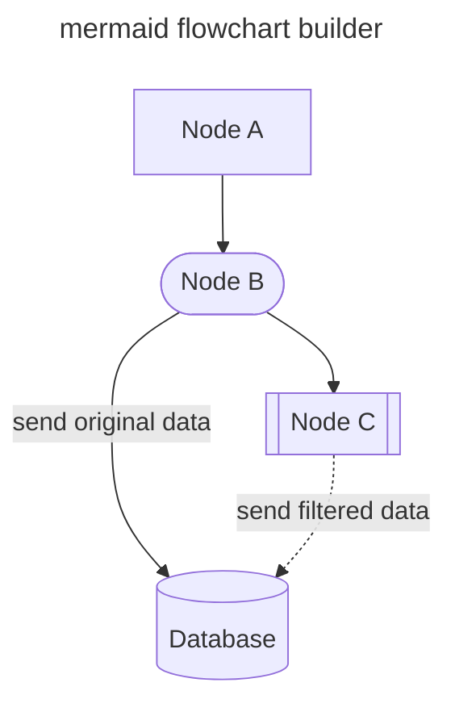

## Flowchart

```mermaid
---
title: mermaid flowchart builder
---
flowchart TB
	A["Node A"]
	B(["Node B"])
	C[["Node C"]]
	D[("Database")]
	A-->B
	B-->|"send original data"|D
	B-->C
	C-. "send filtered data" .-> D
```