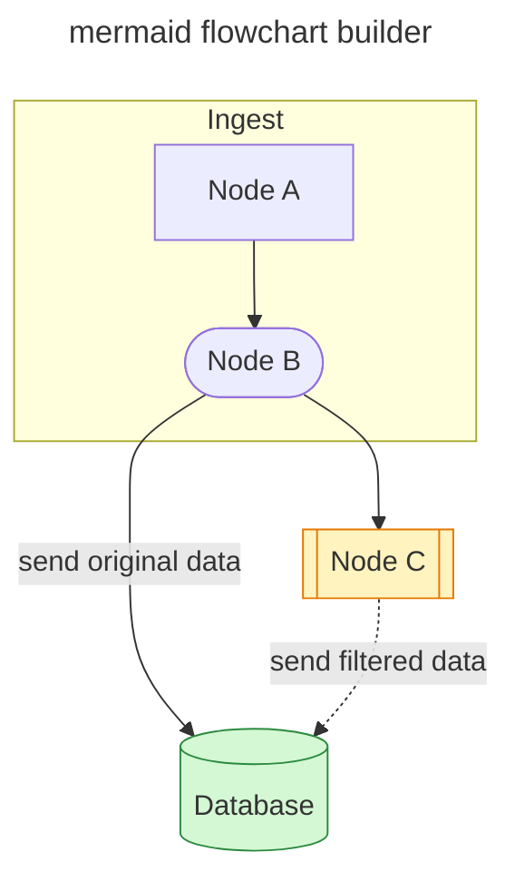

## Flowchart

```mermaid
---
title: "mermaid flowchart builder"
---
flowchart TB
    subgraph ingest["Ingest"]
        direction LR
        A["Node A"]
        B(["Node B"])
        A-->B
    end
    C[["Node C"]]
    D[("Database")]
    B-->|"send original data"|D
    B-->C
    C-. "send filtered data" .-> D
    classDef stored fill:#d4f7d4,stroke:#2b8a3e
    class D stored
    style C fill:#fff3bf,stroke:#e67700
    click D "https://example.com/database" "The database"
```
