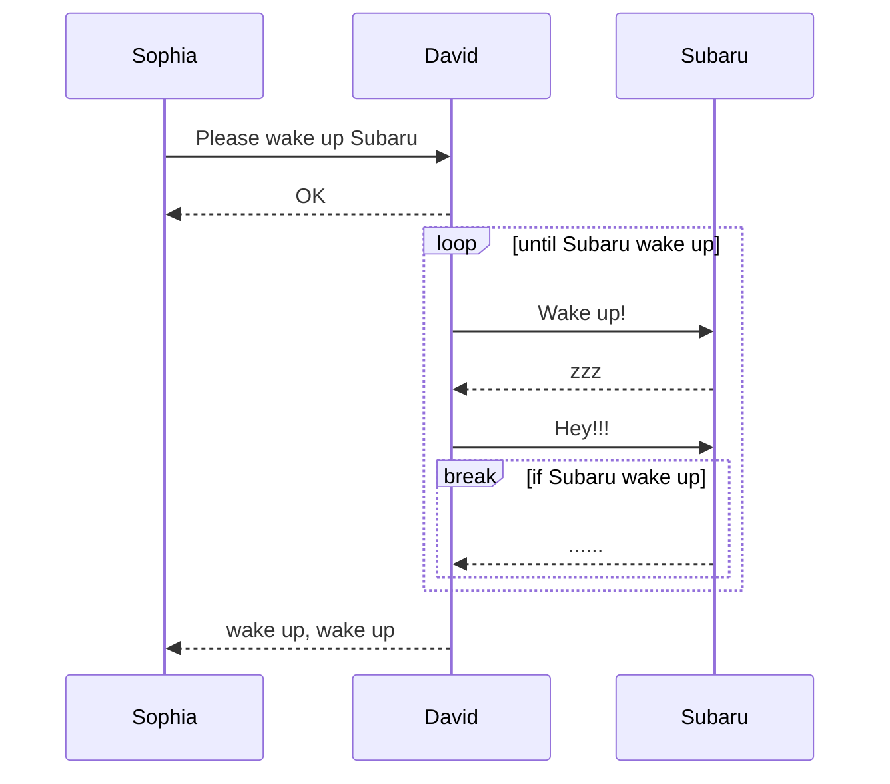
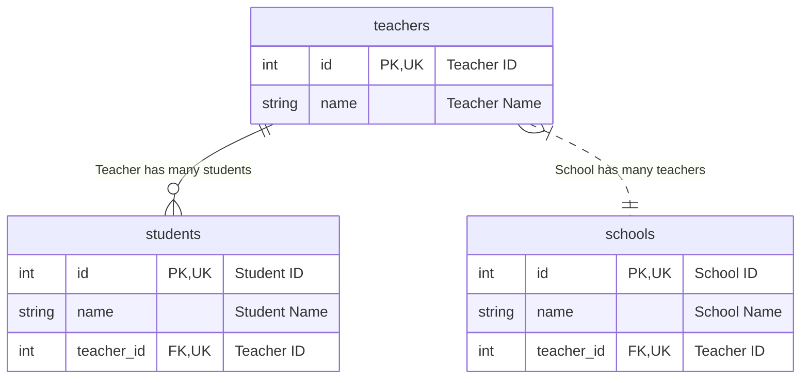
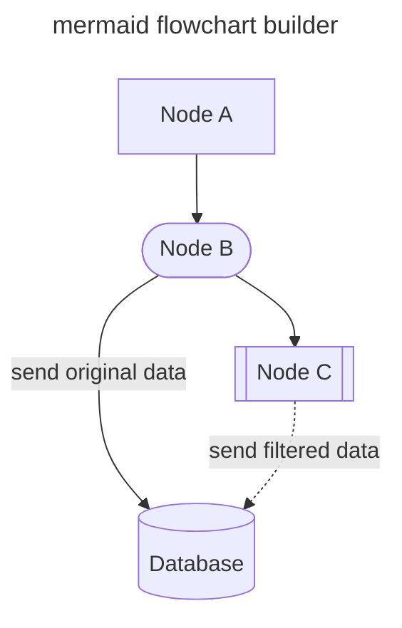
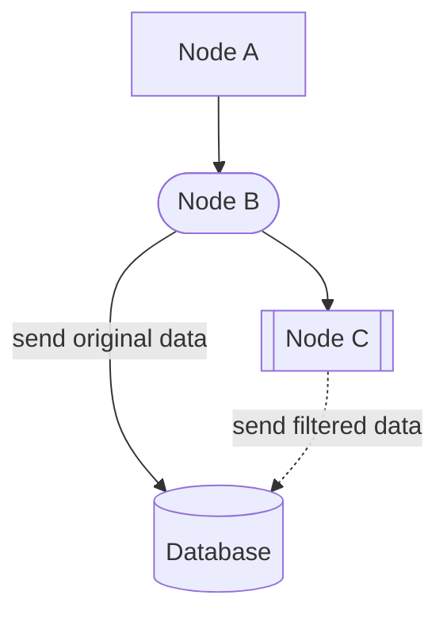
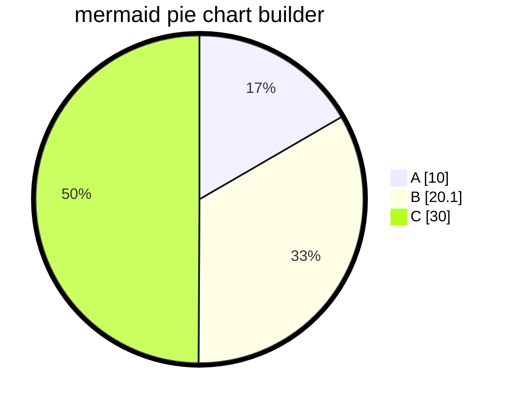
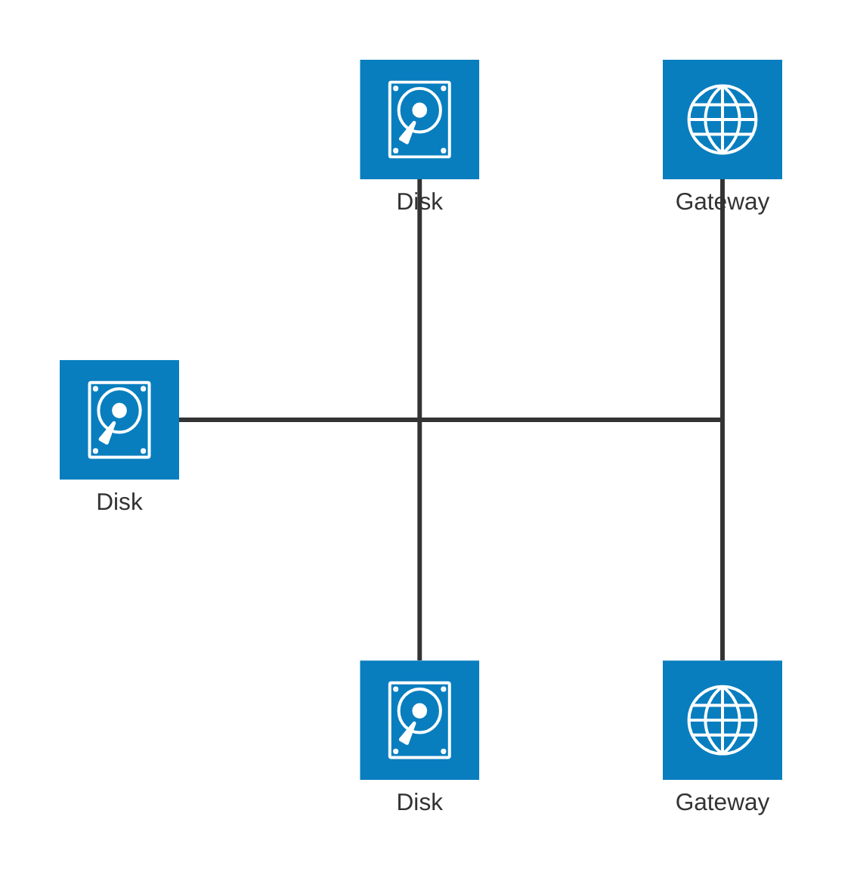
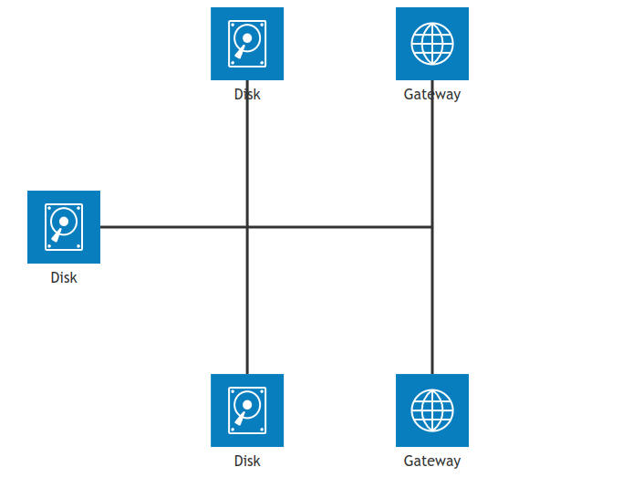

<!-- ALL-CONTRIBUTORS-BADGE:START - Do not remove or modify this section -->
[](#contributors-)
<!-- ALL-CONTRIBUTORS-BADGE:END -->
[](https://pkg.go.dev/github.com/nao1215/markdown)
[](https://github.com/nao1215/markdown/actions/workflows/unit_test.yml)
[](https://github.com/nao1215/markdown/actions/workflows/reviewdog.yml)
[](https://github.com/nao1215/markdown/actions/workflows/gosec.yml)


[English](../../README.md) | [日本語](../ja/README.md) | [Русский](../ru/README.md) | [中文](../zh-cn/README.md) | [한국어](../ko/README.md) | [Español](../es/README.md)

# Qu'est-ce que le package markdown
Le package markdown est un constructeur de markdown simple en Golang. Le package markdown assemble le Markdown en utilisant le chaînage de méthodes, n'utilise pas un moteur de modèles comme [html/template](https://pkg.go.dev/html/template). La syntaxe de Markdown suit **GitHub Markdown**.

Le package markdown a été initialement développé pour sauvegarder les résultats de tests dans [nao1215/spectest](https://github.com/nao1215/spectest). Par conséquent, le package markdown implémente les fonctionnalités requises par spectest. Par exemple, le package markdown prend en charge **les diagrammes de séquence mermaid (diagramme de relation d'entité, diagramme de séquence, organigramme, graphique en secteurs, diagramme d'architecture)**, ce qui était une fonctionnalité nécessaire dans spectest.

De plus, le code complexe qui augmente la complexité de la bibliothèque, tel que la génération de listes imbriquées, ne sera pas ajouté. Je veux garder cette bibliothèque aussi simple que possible.

## OS et version Go supportés
- OS : Linux, macOS, Windows
- Go : 1.21 ou ultérieur

## Fonctionnalités Markdown supportées
- [x] Titre ; H1, H2, H3, H4, H5, H6
- [x] Citation de bloc
- [x] Liste à puces
- [x] Liste ordonnée
- [x] Liste de cases à cocher
- [x] Blocs de code
- [x] Règle horizontale
- [x] Tableau
- [x] Formatage de texte ; gras, italique, code, barré, gras italique
- [x] Texte avec lien
- [x] Texte avec image
- [x] Texte brut
- [x] Détails
- [x] Alertes ; NOTE, TIP, IMPORTANT, CAUTION, WARNING
- [x] diagramme de séquence mermaid
- [x] diagramme de relation d'entité mermaid
- [x] organigramme mermaid
- [x] graphique en secteurs mermaid
- [x] diagramme d'architecture mermaid (fonctionnalité bêta)

### Fonctionnalités non dans la syntaxe Markdown
- Générer des badges ; RedBadge(), YellowBadge(), GreenBadge().
- Générer un index pour un répertoire plein de fichiers markdown ; GenerateIndex()

## Exemple
### Utilisation de base
```go
package main

import (
	"os"

	md "github.com/nao1215/markdown"
)

func main() {
	md.NewMarkdown(os.Stdout).
		H1("This is H1").
		PlainText("This is plain text").
		H2f("This is %s with text format", "H2").
		PlainTextf("Text formatting, such as %s and %s, %s styles.",
			md.Bold("bold"), md.Italic("italic"), md.Code("code")).
		H2("Code Block").
		CodeBlocks(md.SyntaxHighlightGo,
			`package main
import "fmt"

func main() {
	fmt.Println("Hello, World!")
}`).
		H2("List").
		BulletList("Bullet Item 1", "Bullet Item 2", "Bullet Item 3").
		OrderedList("Ordered Item 1", "Ordered Item 2", "Ordered Item 3").
		H2("CheckBox").
		CheckBox([]md.CheckBoxSet{
			{Checked: false, Text: md.Code("sample code")},
			{Checked: true, Text: md.Link("Go", "https://golang.org")},
			{Checked: false, Text: md.Strikethrough("strikethrough")},
		}).
		H2("Blockquote").
		Blockquote("If you can dream it, you can do it.").
		H3("Horizontal Rule").
		HorizontalRule().
		H2("Table").
		Table(md.TableSet{
			Header: []string{"Name", "Age", "Country"},
			Rows: [][]string{
				{"David", "23", "USA"},
				{"John", "30", "UK"},
				{"Bob", "25", "Canada"},
			},
		}).
		H2("Image").
		PlainTextf(md.Image("sample_image", "./sample.png")).
		Build()
}
```

Sortie :
````
# This is H1
This is plain text

## This is H2 with text format
Text formatting, such as **bold** and *italic*, `code` styles.

## Code Block
```go
package main
import "fmt"

func main() {
        fmt.Println("Hello, World!")
}
```

## List
- Bullet Item 1
- Bullet Item 2
- Bullet Item 3
1. Ordered Item 1
2. Ordered Item 2
3. Ordered Item 3

## CheckBox
- [ ] `sample code`
- [x] [Go](https://golang.org)
- [ ] ~~strikethrough~~

## Blockquote
> If you can dream it, you can do it.

### Horizontal Rule
---

## Table
| NAME  | AGE | COUNTRY |
|-------|-----|---------|
| David |  23 | USA     |
| John  |  30 | UK      |
| Bob   |  25 | Canada  |

## Image

````

Si vous voulez voir à quoi cela ressemble en Markdown, veuillez vous référer au lien suivant.
- [sample.md](../generated_example.md)

### Générer du Markdown en utilisant `"go generate ./..."`
Vous pouvez générer du Markdown en utilisant `go generate`. Veuillez d'abord définir le code pour générer du Markdown. Ensuite, exécutez `"go generate ./..."` pour générer du Markdown.

[Exemple de code :](../generate/main.go)
```go
package main

import (
	"os"

	md "github.com/nao1215/markdown"
)

//go:generate go run main.go

func main() {
	f, err := os.Create("generated.md")
	if err != nil {
		panic(err)
	}
	defer f.Close()

	md.NewMarkdown(f).
		H1("go generate example").
		PlainText("This markdown is generated by `go generate`").
		Build()
}
```

Exécutez la commande ci-dessous :
```shell
go generate ./...
```

[Sortie :](../generate/generated.md)
````text
# go generate example
This markdown is generated by `go generate`
````

### Syntaxe des alertes
Le package markdown peut créer des alertes. Les alertes sont utiles pour afficher des informations importantes en Markdown. Cette syntaxe est supportée par GitHub.
[Exemple de code :](../alert/main.go)
```go
	md.NewMarkdown(f).
		H1("Alert example").
		Note("This is note").LF().
		Tip("This is tip").LF().
		Important("This is important").LF().
		Warning("This is warning").LF().
		Caution("This is caution").LF().
		Build()
```

[Sortie :](../alert/generated.md)
````text
# Alert example
> [!NOTE]  
> This is note

> [!TIP]  
> This is tip

> [!IMPORTANT]  
> This is important

> [!WARNING]  
> This is warning

> [!CAUTION]  
> This is caution
````

Votre alerte ressemblera à ceci ;
> [!NOTE]  
> This is note

> [!TIP]  
> This is tip

> [!IMPORTANT]  
> This is important

> [!WARNING]  
> This is warning

> [!CAUTION]  
> This is caution

### Syntaxe des badges de statut
Le package markdown peut créer des badges de statut rouges, jaunes et verts.
[Exemple de code :](../badge/main.go)
```go
	md.NewMarkdown(os.Stdout).
		H1("badge example").
		RedBadge("red_badge").
		YellowBadge("yellow_badge").
		GreenBadge("green_badge").
		BlueBadge("blue_badge").
		Build()
```

[Sortie :](../badge/generated.md)
````text
# badge example


````

Votre badge ressemblera à ceci ;


### Syntaxe du diagramme de séquence Mermaid

```go
package main

import (
	"os"

	"github.com/nao1215/markdown"
	"github.com/nao1215/mermaid/sequence"
)

//go:generate go run main.go

func main() {
	diagram := sequence.NewDiagram(io.Discard).
		Participant("Sophia").
		Participant("David").
		Participant("Subaru").
		LF().
		SyncRequest("Sophia", "David", "Please wake up Subaru").
		SyncResponse("David", "Sophia", "OK").
		LF().
		LoopStart("until Subaru wake up").
		SyncRequest("David", "Subaru", "Wake up!").
		SyncResponse("Subaru", "David", "zzz").
		SyncRequest("David", "Subaru", "Hey!!!").
		BreakStart("if Subaru wake up").
		SyncResponse("Subaru", "David", "......").
		BreakEnd().
		LoopEnd().
		LF().
		SyncResponse("David", "Sophia", "wake up, wake up").
		String()

	markdown.NewMarkdown(os.Stdout).
		H2("Sequence Diagram").
		CodeBlocks(markdown.SyntaxHighlightMermaid, diagram).
		Build()
}
```

Sortie de texte brut : [markdown est ici](../sequence/generated.md)
````
## Sequence Diagram

````

Sortie Mermaid :


### Syntaxe du diagramme de relation d'entité

```go
package main

import (
	"os"

	"github.com/nao1215/markdown"
	"github.com/nao1215/markdown/mermaid/er"
)

//go:generate go run main.go

func main() {
	f, err := os.Create("generated.md")
	if err != nil {
		panic(err)
	}
	defer f.Close()

	teachers := er.NewEntity(
		"teachers",
		[]*er.Attribute{
			{
				Type:         "int",
				Name:         "id",
				IsPrimaryKey: true,
				IsForeignKey: false,
				IsUniqueKey:  true,
				Comment:      "Teacher ID",
			},
			{
				Type:         "string",
				Name:         "name",
				IsPrimaryKey: false,
				IsForeignKey: false,
				IsUniqueKey:  false,
				Comment:      "Teacher Name",
			},
		},
	)
	students := er.NewEntity(
		"students",
		[]*er.Attribute{
			{
				Type:         "int",
				Name:         "id",
				IsPrimaryKey: true,
				IsForeignKey: false,
				IsUniqueKey:  true,
				Comment:      "Student ID",
			},
			{
				Type:         "string",
				Name:         "name",
				IsPrimaryKey: false,
				IsForeignKey: false,
				IsUniqueKey:  false,
				Comment:      "Student Name",
			},
			{
				Type:         "int",
				Name:         "teacher_id",
				IsPrimaryKey: false,
				IsForeignKey: true,
				IsUniqueKey:  true,
				Comment:      "Teacher ID",
			},
		},
	)
	schools := er.NewEntity(
		"schools",
		[]*er.Attribute{
			{
				Type:         "int",
				Name:         "id",
				IsPrimaryKey: true,
				IsForeignKey: false,
				IsUniqueKey:  true,
				Comment:      "School ID",
			},
			{
				Type:         "string",
				Name:         "name",
				IsPrimaryKey: false,
				IsForeignKey: false,
				IsUniqueKey:  false,
				Comment:      "School Name",
			},
			{
				Type:         "int",
				Name:         "teacher_id",
				IsPrimaryKey: false,
				IsForeignKey: true,
				IsUniqueKey:  true,
				Comment:      "Teacher ID",
			},
		},
	)

	erString := er.NewDiagram(f).
		Relationship(
			teachers,
			students,
			er.ExactlyOneRelationship, // "||"
			er.ZeroToMoreRelationship, // "}o"
			er.Identifying,            // "--"
			"Teacher has many students",
		).
		Relationship(
			teachers,
			schools,
			er.OneToMoreRelationship,  // "|}"
			er.ExactlyOneRelationship, // "||"
			er.NonIdentifying,         // ".."
			"School has many teachers",
		).
		String()

	err = markdown.NewMarkdown(f).
		H2("Entity Relationship Diagram").
		CodeBlocks(markdown.SyntaxHighlightMermaid, erString).
		Build()

	if err != nil {
		panic(err)
	}
}
```

Sortie de texte brut : [markdown est ici](../er/generated.md)
````
## Entity Relationship Diagram

````

Sortie Mermaid :


### Syntaxe de l'organigramme

```go
package main

import (
	"io"
	"os"

	"github.com/nao1215/markdown"
	"github.com/nao1215/markdown/mermaid/flowchart"
)

//go:generate go run main.go

func main() {
	f, err := os.Create("generated.md")
	if err != nil {
		panic(err)
	}
	defer f.Close()

	fc := flowchart.NewFlowchart(
		io.Discard,
		flowchart.WithTitle("mermaid flowchart builder"),
		flowchart.WithOrientalTopToBottom(),
	).
		NodeWithText("A", "Node A").
		StadiumNode("B", "Node B").
		SubroutineNode("C", "Node C").
		DatabaseNode("D", "Database").
		LinkWithArrowHead("A", "B").
		LinkWithArrowHeadAndText("B", "D", "send original data").
		LinkWithArrowHead("B", "C").
		DottedLinkWithText("C", "D", "send filtered data").
		String()

	err = markdown.NewMarkdown(f).
		H2("Flowchart").
		CodeBlocks(markdown.SyntaxHighlightMermaid, fc).
		Build()

	if err != nil {
		panic(err)
	}
}
```

Sortie de texte brut : [markdown est ici](../flowchart/generated.md)
````
## Flowchart

````

Sortie Mermaid :


### Syntaxe du graphique en secteurs

```go
package main

import (
	"io"
	"os"

	"github.com/nao1215/markdown"
	"github.com/nao1215/markdown/mermaid/piechart"
)

//go:generate go run main.go

func main() {
	f, err := os.Create("generated.md")
	if err != nil {
		panic(err)
	}
	defer f.Close()

	chart := piechart.NewPieChart(
		io.Discard,
		piechart.WithTitle("mermaid pie chart builder"),
		piechart.WithShowData(true),
	).
		LabelAndIntValue("A", 10).
		LabelAndFloatValue("B", 20.1).
		LabelAndIntValue("C", 30).
		String()

	err = markdown.NewMarkdown(f).
		H2("Pie Chart").
		CodeBlocks(markdown.SyntaxHighlightMermaid, chart).
		Build()

	if err != nil {
		panic(err)
	}
}
```

Sortie de texte brut : [markdown est ici](../piechart/generated.md)
````
## Pie Chart

````

Sortie Mermaid :


### Diagrammes d'architecture (fonctionnalité bêta)

[Le mermaid fournit une fonctionnalité pour visualiser l'architecture d'infrastructure comme une version bêta](https://mermaid.js.org/syntax/architecture.html), et cette fonctionnalité a été introduite.

```go
package main

import (
	"io"
	"os"

	"github.com/nao1215/markdown"
	"github.com/nao1215/markdown/mermaid/arch"
)

//go:generate go run main.go

func main() {
	f, err := os.Create("generated.md")
	if err != nil {
		panic(err)
	}
	defer f.Close()

	diagram := arch.NewArchitecture(io.Discard).
		Service("left_disk", arch.IconDisk, "Disk").
		Service("top_disk", arch.IconDisk, "Disk").
		Service("bottom_disk", arch.IconDisk, "Disk").
		Service("top_gateway", arch.IconInternet, "Gateway").
		Service("bottom_gateway", arch.IconInternet, "Gateway").
		Junction("junctionCenter").
		Junction("junctionRight").
		LF().
		Edges(
			arch.Edge{
				ServiceID: "left_disk",
				Position:  arch.PositionRight,
				Arrow:     arch.ArrowNone,
			},
			arch.Edge{
				ServiceID: "junctionCenter",
				Position:  arch.PositionLeft,
				Arrow:     arch.ArrowNone,
			}).
		Edges(
			arch.Edge{
				ServiceID: "top_disk",
				Position:  arch.PositionBottom,
				Arrow:     arch.ArrowNone,
			},
			arch.Edge{
				ServiceID: "junctionCenter",
				Position:  arch.PositionTop,
				Arrow:     arch.ArrowNone,
			}).
		Edges(
			arch.Edge{
				ServiceID: "bottom_disk",
				Position:  arch.PositionTop,
				Arrow:     arch.ArrowNone,
			},
			arch.Edge{
				ServiceID: "junctionCenter",
				Position:  arch.PositionBottom,
				Arrow:     arch.ArrowNone,
			}).
		Edges(
			arch.Edge{
				ServiceID: "junctionCenter",
				Position:  arch.PositionRight,
				Arrow:     arch.ArrowNone,
			},
			arch.Edge{
				ServiceID: "junctionRight",
				Position:  arch.PositionLeft,
				Arrow:     arch.ArrowNone,
			}).
		Edges(
			arch.Edge{
				ServiceID: "top_gateway",
				Position:  arch.PositionBottom,
				Arrow:     arch.ArrowNone,
			},
			arch.Edge{
				ServiceID: "junctionRight",
				Position:  arch.PositionTop,
				Arrow:     arch.ArrowNone,
			}).
		Edges(
			arch.Edge{
				ServiceID: "bottom_gateway",
				Position:  arch.PositionTop,
				Arrow:     arch.ArrowNone,
			},
			arch.Edge{
				ServiceID: "junctionRight",
				Position:  arch.PositionBottom,
				Arrow:     arch.ArrowNone,
			}).String() //nolint

	err = markdown.NewMarkdown(f).
		H2("Architecture Diagram").
		CodeBlocks(markdown.SyntaxHighlightMermaid, diagram).
		Build()

	if err != nil {
		panic(err)
	}
```

Sortie de texte brut : [markdown est ici](../architecture/generated.md)
````
## Architecture Diagram

````



## Créer un index pour un répertoire plein de fichiers markdown
Le package markdown peut créer un index pour les fichiers Markdown dans le répertoire spécifié. Cette fonctionnalité a été ajoutée pour générer des index pour les documents Markdown produits par [nao1215/spectest](https://github.com/nao1215/spectest).

Par exemple, considérez la structure de répertoire suivante :

```shell
testdata
├── abc
│   ├── dummy.txt
│   ├── jkl
│   │   └── text.md
│   └── test.md
├── def
│   ├── test.md
│   └── test2.md
├── expected
│   └── index.md
├── ghi
└── test.md
```

Dans l'implémentation suivante, cela crée un fichier markdown d'index contenant des liens vers tous les fichiers markdown situés dans le répertoire testdata.

```go
		if err := GenerateIndex(
			"testdata", // répertoire cible qui contient des fichiers markdown
			WithTitle("Test Title"), // titre de l'index markdown
			WithDescription([]string{"Test Description", "Next Description"}), // description de l'index markdown
		); err != nil {
			panic(err)
		}
```

Le fichier Markdown d'index est créé sous "répertoire cible/index.md" par défaut. Si vous voulez changer ce chemin, veuillez utiliser l'option `WithWriter()`. Les noms de liens dans le fichier seront la première occurrence de H1 ou H2 dans le Markdown cible. Si ni H1 ni H2 ne sont présents, le nom du lien sera le nom de fichier de la destination.

[Sortie :](../index.md)
```markdown
## Test Title
Test Description

Next Description

### testdata
- [test.md](test.md)

### abc
- [h2 is here](abc/test.md)

### jkl
- [text.md](abc/jkl/text.md)

### def
- [h2 is first, not h1](def/test.md)
- [h1 is here](def/test2.md)

### expected
- [Test Title](expected/index.md)
```

## Licence
[MIT License](../../LICENSE)

## Contribution
Tout d'abord, merci de prendre le temps de contribuer ! Voir [CONTRIBUTING.md](../../CONTRIBUTING.md) pour plus d'informations. Les contributions ne sont pas seulement liées au développement. Par exemple, GitHub Star me motive à développer ! N'hésitez pas à contribuer à ce projet.

[](https://star-history.com/#nao1215/markdown&Date)

### Contributeurs ✨

Merci à ces personnes merveilleuses ([clé emoji](https://allcontributors.org/docs/en/emoji-key)) :

<!-- ALL-CONTRIBUTORS-LIST:START - Do not remove or modify this section -->
<!-- prettier-ignore-start -->
<!-- markdownlint-disable -->
<table>
  <tbody>
    <tr>
      <td align="center" valign="top" width="14.28%"><a href="https://debimate.jp/"><br /><sub><b>CHIKAMATSU Naohiro</b></sub></a><br /><a href="https://github.com/nao1215/markdown/commits?author=nao1215" title="Code">💻</a></td>
      <td align="center" valign="top" width="14.28%"><a href="https://github.com/varmakarthik12"><br /><sub><b>Karthik Sundari</b></sub></a><br /><a href="https://github.com/nao1215/markdown/commits?author=varmakarthik12" title="Code">💻</a></td>
      <td align="center" valign="top" width="14.28%"><a href="https://github.com/Avihuc"><br /><sub><b>Avihuc</b></sub></a><br /><a href="https://github.com/nao1215/markdown/commits?author=Avihuc" title="Code">💻</a></td>
      <td align="center" valign="top" width="14.28%"><a href="https://www.claranceliberi.me/"><br /><sub><b>Clarance Liberiste Ntwari</b></sub></a><br /><a href="https://github.com/nao1215/markdown/commits?author=claranceliberi" title="Code">💻</a></td>
      <td align="center" valign="top" width="14.28%"><a href="https://github.com/amitaifrey"><br /><sub><b>Amitai Frey</b></sub></a><br /><a href="https://github.com/nao1215/markdown/commits?author=amitaifrey" title="Code">💻</a></td>
    </tr>
  </tbody>
  <tfoot>
    <tr>
      <td align="center" size="13px" colspan="7">
        
          <a href="https://all-contributors.js.org/docs/en/bot/usage">Add your contributions</a>
        </img>
      </td>
    </tr>
  </tfoot>
</table>

<!-- markdownlint-restore -->
<!-- prettier-ignore-end -->

<!-- ALL-CONTRIBUTORS-LIST:END -->

Ce projet suit la spécification [all-contributors](https://github.com/all-contributors/all-contributors). Les contributions de tout type sont les bienvenues !
