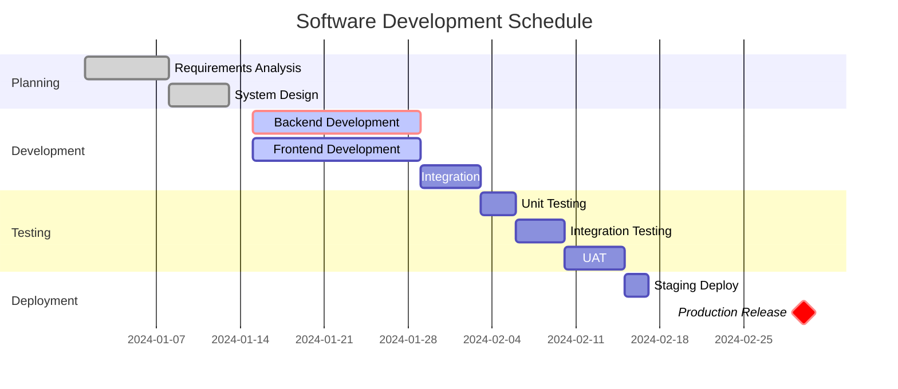

## Gantt Chart

```mermaid
gantt
    title Software Development Schedule
    dateFormat YYYY-MM-DD
    section Planning
    Requirements Analysis :done, req, 2024-01-01, 7d
    System Design :done, design, 2024-01-08, 5d

    section Development
    Backend Development :crit, active, backend, 2024-01-15, 14d
    Frontend Development :active, frontend, 2024-01-15, 14d
    Integration :integrate, after backend, 5d

    section Testing
    Unit Testing :unit, after integrate, 3d
    Integration Testing :inttest, after unit, 4d
    UAT :uat, after inttest, 5d

    section Deployment
    Staging Deploy :after uat, 2d
    Production Release :crit, milestone, 2024-03-01, 0d
```