<!-- ALL-CONTRIBUTORS-BADGE:START - Do not remove or modify this section -->
[](#contributors-)
<!-- ALL-CONTRIBUTORS-BADGE:END -->
[](https://pkg.go.dev/github.com/nao1215/markdown)
[](https://github.com/nao1215/markdown/actions/workflows/unit_test.yml)
[](https://github.com/nao1215/markdown/actions/workflows/reviewdog.yml)
[](https://github.com/nao1215/markdown/actions/workflows/gosec.yml)


[English](../../README.md) | [Русский](../ru/README.md) | [中文](../zh-cn/README.md) | [한국어](../ko/README.md) | [Español](../es/README.md) | [Français](../fr/README.md)

# markdown パッケージとは
markdown パッケージは、Golangでのシンプルなマークダウンビルダーです。markdown パッケージは、[html/template](https://pkg.go.dev/html/template) のようなテンプレートエンジンを使用せず、メソッドチェーンを使用してMarkdownを組み立てます。Markdownの構文は**GitHub Markdown**に従います。

markdown パッケージは、[nao1215/spectest](https://github.com/nao1215/spectest) でテスト結果を保存するために最初に開発されました。そのため、markdown パッケージは spectest で必要な機能を実装しています。例えば、markdown パッケージは、spectest で必要な機能である**mermaid 図（実体関係図、シーケンス図、ユーザージャーニー図、Git Graph 図、フローチャート、パイチャート、四象限図、状態遷移図、クラス図、ガントチャート、アーキテクチャ図）**をサポートしています。

また、ネストしたリストの生成などのライブラリの複雑性を増加させる複雑なコードは追加されません。このライブラリをできる限りシンプルに保ちたいと考えています。

## サポートしているOSとGoバージョン
- OS: Linux、macOS、Windows
- Go: 1.21以降

## サポートしているMarkdown機能
- [x] 見出し; H1、H2、H3、H4、H5、H6
- [x] ブロック引用 
- [x] 箇条書きリスト
- [x] 番号付きリスト
- [x] チェックボックスリスト 
- [x] コードブロック
- [x] 水平線 
- [x] テーブル
- [x] テキストフォーマット; 太字、斜体、コード、取り消し線、太字斜体
- [x] リンク付きテキスト
- [x] 画像付きテキスト
- [x] プレーンテキスト
- [x] 詳細 
- [x] アラート; NOTE、TIP、IMPORTANT、CAUTION、WARNING
- [x] mermaid シーケンス図
- [x] mermaid ユーザージャーニー図
- [x] mermaid Git Graph 図
- [x] mermaid 実体関係図
- [x] mermaid フローチャート 
- [x] mermaid パイチャート
- [x] mermaid 四象限図
- [x] mermaid 状態遷移図
- [x] mermaid クラス図
- [x] mermaid ガントチャート
- [x] mermaid アーキテクチャ図（ベータ機能） 

### Markdown構文にない機能
- バッジ生成; RedBadge()、YellowBadge()、GreenBadge()
- Markdownファイルが格納されたディレクトリのインデックス生成; GenerateIndex()

## 例
### 基本的な使用法
```go
package main

import (
	"os"

	md "github.com/nao1215/markdown"
)

func main() {
	md.NewMarkdown(os.Stdout).
		H1("This is H1").
		PlainText("This is plain text").
		H2f("This is %s with text format", "H2").
		PlainTextf("Text formatting, such as %s and %s, %s styles.",
			md.Bold("bold"), md.Italic("italic"), md.Code("code")).
		H2("Code Block").
		CodeBlocks(md.SyntaxHighlightGo,
			`package main
import "fmt"

func main() {
	fmt.Println("Hello, World!")
}`).
		H2("List").
		BulletList("Bullet Item 1", "Bullet Item 2", "Bullet Item 3").
		OrderedList("Ordered Item 1", "Ordered Item 2", "Ordered Item 3").
		H2("CheckBox").
		CheckBox([]md.CheckBoxSet{
			{Checked: false, Text: md.Code("sample code")},
			{Checked: true, Text: md.Link("Go", "https://golang.org")},
			{Checked: false, Text: md.Strikethrough("strikethrough")},
		}).
		H2("Blockquote").
		Blockquote("If you can dream it, you can do it.").
		H3("Horizontal Rule").
		HorizontalRule().
		H2("Table").
		Table(md.TableSet{
			Header: []string{"Name", "Age", "Country"},
			Rows: [][]string{
				{"David", "23", "USA"},
				{"John", "30", "UK"},
				{"Bob", "25", "Canada"},
			},
		}).
		H2("Image").
		PlainTextf(md.Image("sample_image", "./sample.png")).
		Build()
}
```

出力:
````
# This is H1
This is plain text

## This is H2 with text format
Text formatting, such as **bold** and *italic*, `code` styles.

## Code Block
```go
package main
import "fmt"

func main() {
        fmt.Println("Hello, World!")
}
```

## List
- Bullet Item 1
- Bullet Item 2
- Bullet Item 3
1. Ordered Item 1
2. Ordered Item 2
3. Ordered Item 3

## CheckBox
- [ ] `sample code`
- [x] [Go](https://golang.org)
- [ ] ~~strikethrough~~

## Blockquote
> If you can dream it, you can do it.

### Horizontal Rule
---

## Table
| NAME  | AGE | COUNTRY |
|-------|-----|---------|
| David |  23 | USA     |
| John  |  30 | UK      |
| Bob   |  25 | Canada  |

## Image

````

Markdownでどのように見えるかを確認したい場合は、以下のリンクを参照してください。
- [sample.md](../generated_example.md)

### `"go generate ./..."` を使用してMarkdownを生成
`go generate` を使用してMarkdownを生成することができます。まず、Markdownを生成するコードを定義してください。次に、`"go generate ./..."` を実行してMarkdownを生成します。

[コード例:](../generate/main.go)
```go
package main

import (
	"os"

	md "github.com/nao1215/markdown"
)

//go:generate go run main.go

func main() {
	f, err := os.Create("generated.md")
	if err != nil {
		panic(err)
	}
	defer f.Close()

	md.NewMarkdown(f).
		H1("go generate example").
		PlainText("This markdown is generated by `go generate`").
		Build()
}
```

以下のコマンドを実行:
```shell
go generate ./...
```

[出力:](../generate/generated.md)
````text
# go generate example
This markdown is generated by `go generate`
````

### アラート構文
markdownパッケージはアラートを作成できます。アラートは、Markdownで重要な情報を表示するのに役立ちます。この構文はGitHubでサポートされています。
[コード例:](../alert/main.go)
```go
	md.NewMarkdown(f).
		H1("Alert example").
		Note("This is note").LF().
		Tip("This is tip").LF().
		Important("This is important").LF().
		Warning("This is warning").LF().
		Caution("This is caution").LF().
		Build()
```

[出力:](../alert/generated.md)
````text
# Alert example
> [!NOTE]  
> This is note

> [!TIP]  
> This is tip

> [!IMPORTANT]  
> This is important

> [!WARNING]  
> This is warning

> [!CAUTION]  
> This is caution
````

アラートは次のように表示されます：
> [!NOTE]  
> This is note

> [!TIP]  
> This is tip

> [!IMPORTANT]  
> This is important

> [!WARNING]  
> This is warning

> [!CAUTION]  
> This is caution

### ステータスバッジ構文
markdownパッケージは、赤、黄、緑のステータスバッジを作成できます。
[コード例:](../badge/main.go)
```go
	md.NewMarkdown(os.Stdout).
		H1("badge example").
		RedBadge("red_badge").
		YellowBadge("yellow_badge").
		GreenBadge("green_badge").
		BlueBadge("blue_badge").
		Build()
```

[出力:](../badge/generated.md)
````text
# badge example


````

バッジは次のように表示されます：


### Mermaid シーケンス図構文

```go
package main

import (
	"os"

	"github.com/nao1215/markdown"
	"github.com/nao1215/markdown/mermaid/sequence"
)

//go:generate go run main.go

func main() {
	diagram := sequence.NewDiagram(io.Discard).
		Participant("Sophia").
		Participant("David").
		Participant("Subaru").
		LF().
		SyncRequest("Sophia", "David", "Please wake up Subaru").
		SyncResponse("David", "Sophia", "OK").
		LF().
		LoopStart("until Subaru wake up").
		SyncRequest("David", "Subaru", "Wake up!").
		SyncResponse("Subaru", "David", "zzz").
		SyncRequest("David", "Subaru", "Hey!!!").
		BreakStart("if Subaru wake up").
		SyncResponse("Subaru", "David", "......").
		BreakEnd().
		LoopEnd().
		LF().
		SyncResponse("David", "Sophia", "wake up, wake up").
		String()

	markdown.NewMarkdown(os.Stdout).
		H2("Sequence Diagram").
		CodeBlocks(markdown.SyntaxHighlightMermaid, diagram).
		Build()
}
```

プレーンテキスト出力: [markdown はこちら](../sequence/generated.md)
````
## Sequence Diagram
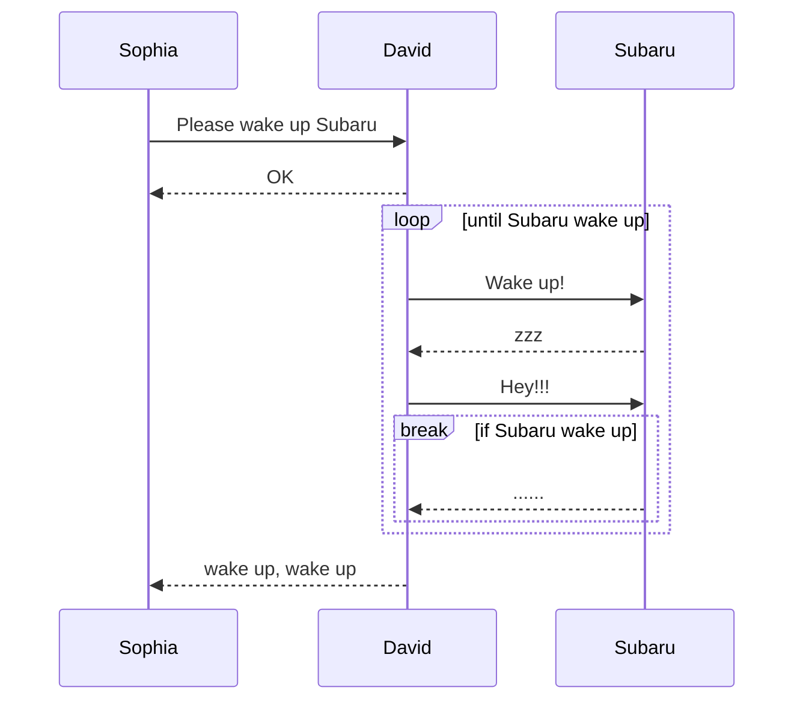
```mermaid
sequenceDiagram
    participant Sophia
    participant David
    participant Subaru

    Sophia->>David: Please wake up Subaru
    David-->>Sophia: OK

    loop until Subaru wake up
    David->>Subaru: Wake up!
    Subaru-->>David: zzz
    David->>Subaru: Hey!!!
    break if Subaru wake up
    Subaru-->>David: ......
    end
    end

    David-->>Sophia: wake up, wake up
```
````

Mermaid出力:

```mermaid
sequenceDiagram
    participant Sophia
    participant David
    participant Subaru

    Sophia->>David: Please wake up Subaru
    David-->>Sophia: OK

    loop until Subaru wake up
    David->>Subaru: Wake up!
    Subaru-->>David: zzz
    David->>Subaru: Hey!!!
    break if Subaru wake up
    Subaru-->>David: ......
    end
    end

    David-->>Sophia: wake up, wake up
```

### Mermaid ユーザージャーニー図構文

```go
package main

import (
	"io"
	"os"

	"github.com/nao1215/markdown"
	"github.com/nao1215/markdown/mermaid/userjourney"
)

//go:generate go run main.go

func main() {
	diagram := userjourney.NewDiagram(
		io.Discard,
		userjourney.WithTitle("Checkout Journey"),
	).
		Section("Discover").
		Task("Browse products", userjourney.ScoreVerySatisfied, "Customer").
		Task("Add item to cart", userjourney.ScoreSatisfied, "Customer").
		LF().
		Section("Checkout").
		Task("Enter shipping details", userjourney.ScoreNeutral, "Customer").
		Task("Complete payment", userjourney.ScoreSatisfied, "Customer", "Payment Service").
		String()

	if err := markdown.NewMarkdown(os.Stdout).
		H2("User Journey Diagram").
		CodeBlocks(markdown.SyntaxHighlightMermaid, diagram).
		Build(); err != nil {
		panic(err)
	}
}
```

プレーンテキスト出力: [markdownはこちら](../userjourney/generated.md)
````text
## User Journey Diagram
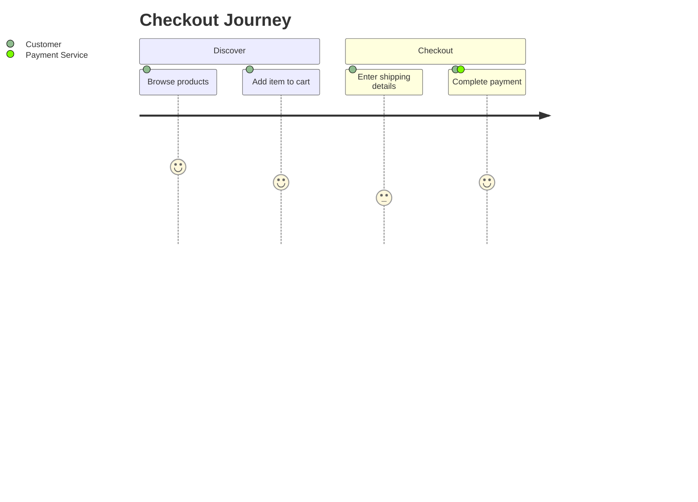
```mermaid
journey
    title Checkout Journey
    section Discover
        Browse products: 5: Customer
        Add item to cart: 4: Customer

    section Checkout
        Enter shipping details: 3: Customer
        Complete payment: 4: Customer, Payment Service
```
````

Mermaid出力:

```mermaid
journey
    title Checkout Journey
    section Discover
        Browse products: 5: Customer
        Add item to cart: 4: Customer

    section Checkout
        Enter shipping details: 3: Customer
        Complete payment: 4: Customer, Payment Service
```

### Mermaid Git Graph 構文

```go
package main

import (
	"io"
	"os"

	"github.com/nao1215/markdown"
	"github.com/nao1215/markdown/mermaid/gitgraph"
)

//go:generate go run main.go

func main() {
	diagram := gitgraph.NewDiagram(
		io.Discard,
		gitgraph.WithTitle("Release Flow"),
	).
		Commit(gitgraph.WithCommitID("init"), gitgraph.WithCommitTag("v0.1.0")).
		Branch("develop", gitgraph.WithBranchOrder(2)).
		Checkout("develop").
		Commit(gitgraph.WithCommitType(gitgraph.CommitTypeHighlight)).
		Checkout("main").
		Merge("develop", gitgraph.WithCommitTag("v1.0.0")).
		String()

	if err := markdown.NewMarkdown(os.Stdout).
		H2("Git Graph").
		CodeBlocks(markdown.SyntaxHighlightMermaid, diagram).
		Build(); err != nil {
		panic(err)
	}
}
```

プレーンテキスト出力: [markdownはこちら](../gitgraph/generated.md)
````text
## Git Graph

```mermaid
---
title: Release Flow
---
gitGraph
    commit id: "init" tag: "v0.1.0"
    branch develop order: 2
    checkout develop
    commit type: HIGHLIGHT
    checkout main
    merge develop tag: "v1.0.0"
```
````

Mermaid出力:
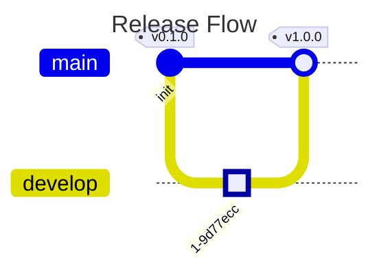
```mermaid
---
title: Release Flow
---
gitGraph
    commit id: "init" tag: "v0.1.0"
    branch develop order: 2
    checkout develop
    commit type: HIGHLIGHT
    checkout main
    merge develop tag: "v1.0.0"
```

### 実体関係図構文

```go
package main

import (
	"os"

	"github.com/nao1215/markdown"
	"github.com/nao1215/markdown/mermaid/er"
)

//go:generate go run main.go

func main() {
	f, err := os.Create("generated.md")
	if err != nil {
		panic(err)
	}
	defer f.Close()

	teachers := er.NewEntity(
		"teachers",
		[]*er.Attribute{
			{
				Type:         "int",
				Name:         "id",
				IsPrimaryKey: true,
				IsForeignKey: false,
				IsUniqueKey:  true,
				Comment:      "Teacher ID",
			},
			{
				Type:         "string",
				Name:         "name",
				IsPrimaryKey: false,
				IsForeignKey: false,
				IsUniqueKey:  false,
				Comment:      "Teacher Name",
			},
		},
	)
	students := er.NewEntity(
		"students",
		[]*er.Attribute{
			{
				Type:         "int",
				Name:         "id",
				IsPrimaryKey: true,
				IsForeignKey: false,
				IsUniqueKey:  true,
				Comment:      "Student ID",
			},
			{
				Type:         "string",
				Name:         "name",
				IsPrimaryKey: false,
				IsForeignKey: false,
				IsUniqueKey:  false,
				Comment:      "Student Name",
			},
			{
				Type:         "int",
				Name:         "teacher_id",
				IsPrimaryKey: false,
				IsForeignKey: true,
				IsUniqueKey:  true,
				Comment:      "Teacher ID",
			},
		},
	)
	schools := er.NewEntity(
		"schools",
		[]*er.Attribute{
			{
				Type:         "int",
				Name:         "id",
				IsPrimaryKey: true,
				IsForeignKey: false,
				IsUniqueKey:  true,
				Comment:      "School ID",
			},
			{
				Type:         "string",
				Name:         "name",
				IsPrimaryKey: false,
				IsForeignKey: false,
				IsUniqueKey:  false,
				Comment:      "School Name",
			},
			{
				Type:         "int",
				Name:         "teacher_id",
				IsPrimaryKey: false,
				IsForeignKey: true,
				IsUniqueKey:  true,
				Comment:      "Teacher ID",
			},
		},
	)

	erString := er.NewDiagram(f).
		Relationship(
			teachers,
			students,
			er.ExactlyOneRelationship, // "||"
			er.ZeroToMoreRelationship, // "}o"
			er.Identifying,            // "--"
			"Teacher has many students",
		).
		Relationship(
			teachers,
			schools,
			er.OneToMoreRelationship,  // "|}"
			er.ExactlyOneRelationship, // "||"
			er.NonIdentifying,         // ".."
			"School has many teachers",
		).
		String()

	err = markdown.NewMarkdown(f).
		H2("Entity Relationship Diagram").
		CodeBlocks(markdown.SyntaxHighlightMermaid, erString).
		Build()

	if err != nil {
		panic(err)
	}
}
```

プレーンテキスト出力: [markdown はこちら](../er/generated.md)
````
## Entity Relationship Diagram
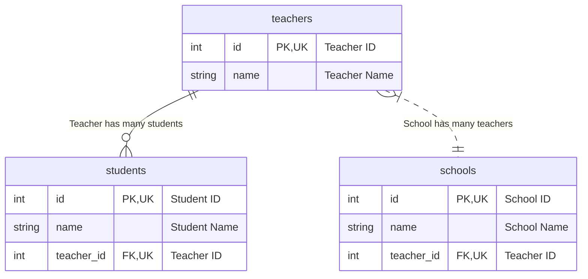
```mermaid
erDiagram
	teachers ||--o{ students : "Teacher has many students"
	teachers }|..|| schools : "School has many teachers"
	schools {
		int id PK,UK "School ID"
		string name  "School Name"
		int teacher_id FK,UK "Teacher ID"
	}
	students {
		int id PK,UK "Student ID"
		string name  "Student Name"
		int teacher_id FK,UK "Teacher ID"
	}
	teachers {
		int id PK,UK "Teacher ID"
		string name  "Teacher Name"
	}

```
````

Mermaid出力:

```mermaid
erDiagram
	teachers ||--o{ students : "Teacher has many students"
	teachers }|..|| schools : "School has many teachers"
	schools {
		int id PK,UK "School ID"
		string name  "School Name"
		int teacher_id FK,UK "Teacher ID"
	}
	students {
		int id PK,UK "Student ID"
		string name  "Student Name"
		int teacher_id FK,UK "Teacher ID"
	}
	teachers {
		int id PK,UK "Teacher ID"
		string name  "Teacher Name"
	}
```

### フローチャート構文

```go
package main

import (
	"io"
	"os"

	"github.com/nao1215/markdown"
	"github.com/nao1215/markdown/mermaid/flowchart"
)

//go:generate go run main.go

func main() {
	f, err := os.Create("generated.md")
	if err != nil {
		panic(err)
	}
	defer f.Close()

	fc := flowchart.NewFlowchart(
		io.Discard,
		flowchart.WithTitle("mermaid flowchart builder"),
		flowchart.WithOrientalTopToBottom(),
	).
		NodeWithText("A", "Node A").
		StadiumNode("B", "Node B").
		SubroutineNode("C", "Node C").
		DatabaseNode("D", "Database").
		LinkWithArrowHead("A", "B").
		LinkWithArrowHeadAndText("B", "D", "send original data").
		LinkWithArrowHead("B", "C").
		DottedLinkWithText("C", "D", "send filtered data").
		String()

	err = markdown.NewMarkdown(f).
		H2("Flowchart").
		CodeBlocks(markdown.SyntaxHighlightMermaid, fc).
		Build()

	if err != nil {
		panic(err)
	}
}
```

プレーンテキスト出力: [markdown はこちら](../flowchart/generated.md)
````
## Flowchart
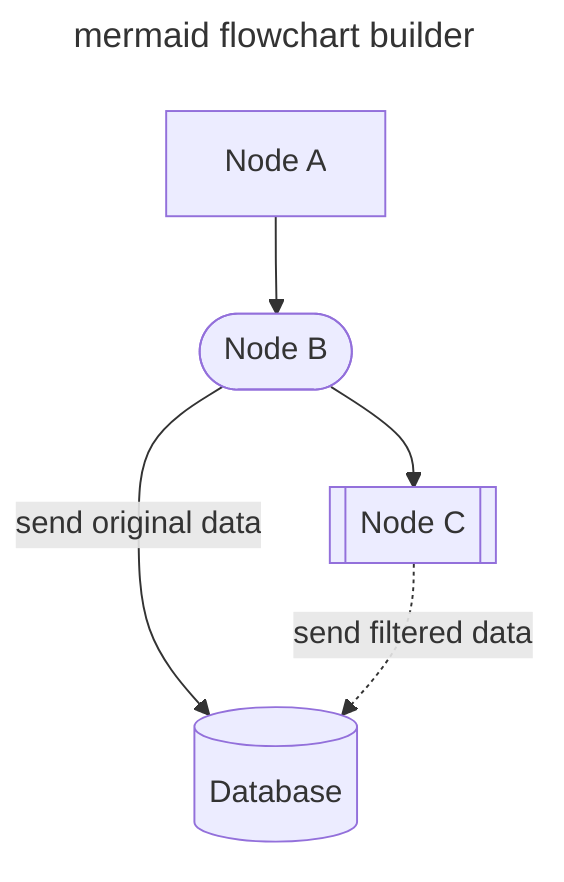
```mermaid
---
title: mermaid flowchart builder
---
flowchart TB
	A["Node A"]
	B(["Node B"])
	C[["Node C"]]
	D[("Database")]
	A-->B
	B-->|"send original data"|D
	B-->C
	C-. "send filtered data" .-> D
```
````

Mermaid出力:
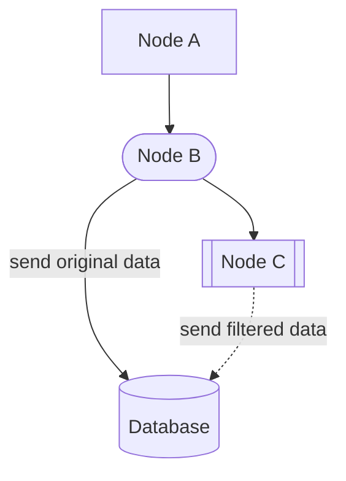
```mermaid
flowchart TB
	A["Node A"]
	B(["Node B"])
	C[["Node C"]]
	D[("Database")]
	A-->B
	B-->|"send original data"|D
	B-->C
	C-. "send filtered data" .-> D
```

### パイチャート構文

```go
package main

import (
	"io"
	"os"

	"github.com/nao1215/markdown"
	"github.com/nao1215/markdown/mermaid/piechart"
)

//go:generate go run main.go

func main() {
	f, err := os.Create("generated.md")
	if err != nil {
		panic(err)
	}
	defer f.Close()

	chart := piechart.NewPieChart(
		io.Discard,
		piechart.WithTitle("mermaid pie chart builder"),
		piechart.WithShowData(true),
	).
		LabelAndIntValue("A", 10).
		LabelAndFloatValue("B", 20.1).
		LabelAndIntValue("C", 30).
		String()

	err = markdown.NewMarkdown(f).
		H2("Pie Chart").
		CodeBlocks(markdown.SyntaxHighlightMermaid, chart).
		Build()

	if err != nil {
		panic(err)
	}
}
```

プレーンテキスト出力: [markdown はこちら](../piechart/generated.md)
````
## Pie Chart
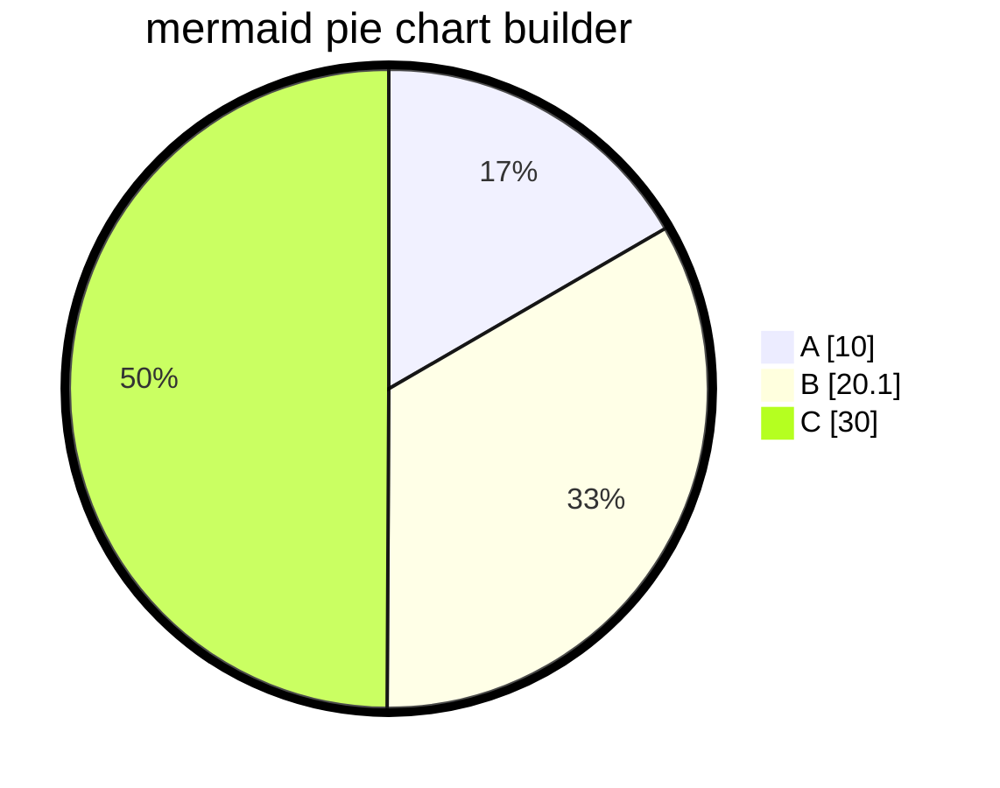
```mermaid
%%{init: {"pie": {"textPosition": 0.75}, "themeVariables": {"pieOuterStrokeWidth": "5px"}} }%%
pie showData
    title mermaid pie chart builder
    "A" : 10
    "B" : 20.100000
    "C" : 30
```
````

Mermaid出力:

```mermaid
%%{init: {"pie": {"textPosition": 0.75}, "themeVariables": {"pieOuterStrokeWidth": "5px"}} }%%
pie showData
    title mermaid pie chart builder
    "A" : 10
    "B" : 20.100000
    "C" : 30
```

### アーキテクチャ図（ベータ機能）

[mermaidは、ベータ版としてインフラアーキテクチャを視覚化する機能を提供しており](https://mermaid.js.org/syntax/architecture.html)、その機能が導入されています。

```go
package main

import (
	"io"
	"os"

	"github.com/nao1215/markdown"
	"github.com/nao1215/markdown/mermaid/arch"
)

//go:generate go run main.go

func main() {
	f, err := os.Create("generated.md")
	if err != nil {
		panic(err)
	}
	defer f.Close()

	diagram := arch.NewArchitecture(io.Discard).
		Service("left_disk", arch.IconDisk, "Disk").
		Service("top_disk", arch.IconDisk, "Disk").
		Service("bottom_disk", arch.IconDisk, "Disk").
		Service("top_gateway", arch.IconInternet, "Gateway").
		Service("bottom_gateway", arch.IconInternet, "Gateway").
		Junction("junctionCenter").
		Junction("junctionRight").
		LF().
		Edges(
			arch.Edge{
				ServiceID: "left_disk",
				Position:  arch.PositionRight,
				Arrow:     arch.ArrowNone,
			},
			arch.Edge{
				ServiceID: "junctionCenter",
				Position:  arch.PositionLeft,
				Arrow:     arch.ArrowNone,
			}).
		Edges(
			arch.Edge{
				ServiceID: "top_disk",
				Position:  arch.PositionBottom,
				Arrow:     arch.ArrowNone,
			},
			arch.Edge{
				ServiceID: "junctionCenter",
				Position:  arch.PositionTop,
				Arrow:     arch.ArrowNone,
			}).
		Edges(
			arch.Edge{
				ServiceID: "bottom_disk",
				Position:  arch.PositionTop,
				Arrow:     arch.ArrowNone,
			},
			arch.Edge{
				ServiceID: "junctionCenter",
				Position:  arch.PositionBottom,
				Arrow:     arch.ArrowNone,
			}).
		Edges(
			arch.Edge{
				ServiceID: "junctionCenter",
				Position:  arch.PositionRight,
				Arrow:     arch.ArrowNone,
			},
			arch.Edge{
				ServiceID: "junctionRight",
				Position:  arch.PositionLeft,
				Arrow:     arch.ArrowNone,
			}).
		Edges(
			arch.Edge{
				ServiceID: "top_gateway",
				Position:  arch.PositionBottom,
				Arrow:     arch.ArrowNone,
			},
			arch.Edge{
				ServiceID: "junctionRight",
				Position:  arch.PositionTop,
				Arrow:     arch.ArrowNone,
			}).
		Edges(
			arch.Edge{
				ServiceID: "bottom_gateway",
				Position:  arch.PositionTop,
				Arrow:     arch.ArrowNone,
			},
			arch.Edge{
				ServiceID: "junctionRight",
				Position:  arch.PositionBottom,
				Arrow:     arch.ArrowNone,
			}).String() //nolint

	err = markdown.NewMarkdown(f).
		H2("Architecture Diagram").
		CodeBlocks(markdown.SyntaxHighlightMermaid, diagram).
		Build()

	if err != nil {
		panic(err)
	}
```

プレーンテキスト出力: [markdown はこちら](../architecture/generated.md)
````
## Architecture Diagram
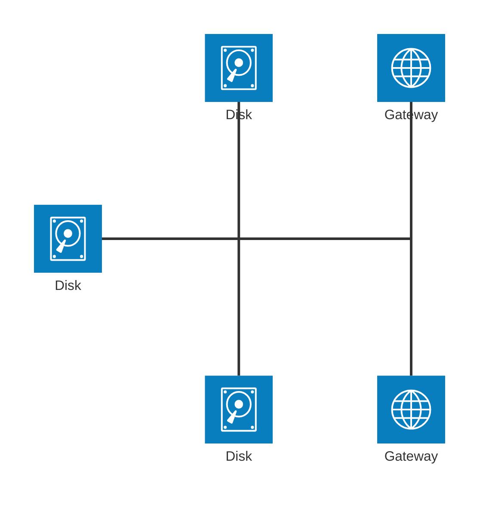
```mermaid
architecture-beta
    service left_disk(disk)[Disk]
    service top_disk(disk)[Disk]
    service bottom_disk(disk)[Disk]
    service top_gateway(internet)[Gateway]
    service bottom_gateway(internet)[Gateway]
    junction junctionCenter
    junction junctionRight

    left_disk:R -- L:junctionCenter
    top_disk:B -- T:junctionCenter
    bottom_disk:T -- B:junctionCenter
    junctionCenter:R -- L:junctionRight
    top_gateway:B -- T:junctionRight
    bottom_gateway:T -- B:junctionRight
```
````


### 状態遷移図の構文

```go
package main

import (
	"io"
	"os"

	"github.com/nao1215/markdown"
	"github.com/nao1215/markdown/mermaid/state"
)

//go:generate go run main.go

func main() {
	f, err := os.Create("generated.md")
	if err != nil {
		panic(err)
	}
	defer f.Close()

	diagram := state.NewDiagram(io.Discard, state.WithTitle("Order State Machine")).
		StartTransition("Pending").
		State("Pending", "Order received").
		State("Processing", "Preparing order").
		State("Shipped", "Order in transit").
		State("Delivered", "Order completed").
		LF().
		TransitionWithNote("Pending", "Processing", "payment confirmed").
		TransitionWithNote("Processing", "Shipped", "items packed").
		TransitionWithNote("Shipped", "Delivered", "customer received").
		LF().
		NoteRight("Pending", "Waiting for payment").
		NoteRight("Processing", "Preparing items").
		LF().
		EndTransition("Delivered").
		String()

	err = markdown.NewMarkdown(f).
		H2("State Diagram").
		CodeBlocks(markdown.SyntaxHighlightMermaid, diagram).
		Build()

	if err != nil {
		panic(err)
	}
}
```

プレーンテキスト出力: [markdownはこちら](../state/generated.md)
````
## State Diagram
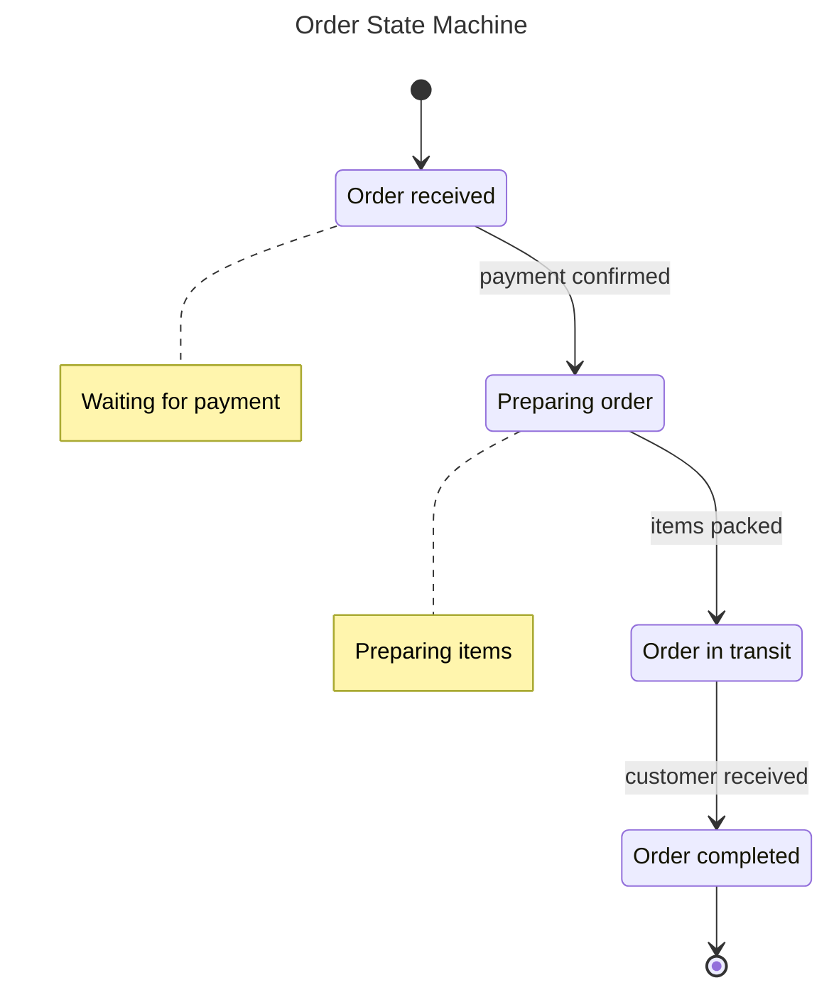
```mermaid
---
title: Order State Machine
---
stateDiagram-v2
    [*] --> Pending
    Pending : Order received
    Processing : Preparing order
    Shipped : Order in transit
    Delivered : Order completed

    Pending --> Processing : payment confirmed
    Processing --> Shipped : items packed
    Shipped --> Delivered : customer received

    note right of Pending : Waiting for payment
    note right of Processing : Preparing items

    Delivered --> [*]
```
````

Mermaid出力:

```mermaid
---
title: Order State Machine
---
stateDiagram-v2
    [*] --> Pending
    Pending : Order received
    Processing : Preparing order
    Shipped : Order in transit
    Delivered : Order completed

    Pending --> Processing : payment confirmed
    Processing --> Shipped : items packed
    Shipped --> Delivered : customer received

    note right of Pending : Waiting for payment
    note right of Processing : Preparing items

    Delivered --> [*]
```

### クラス図の構文

```go
package main

import (
	"io"
	"os"

	"github.com/nao1215/markdown"
	"github.com/nao1215/markdown/mermaid/class"
)

//go:generate go run main.go

func main() {
	f, err := os.Create("generated.md")
	if err != nil {
		panic(err)
	}
	defer f.Close()

	diagram := class.NewDiagram(
		io.Discard,
		class.WithTitle("Checkout Domain"),
	).
		SetDirection(class.DirectionLR).
		Class(
			"Order",
			class.WithPublicField("string", "id"),
			class.WithPublicMethod("Create", "error", "items []LineItem"),
			class.WithPublicMethod("Pay", "error"),
		).
		Class(
			"LineItem",
			class.WithPublicField("string", "sku"),
			class.WithPublicField("int", "quantity"),
			class.WithPublicMethod("Subtotal", "int"),
		).
		Interface("PaymentGateway")

	diagram.From("Order").
		Composition("LineItem", class.WithOneToMany(), class.WithRelationLabel("contains")).
		Association("PaymentGateway", class.WithRelationLabel("uses"))

	diagramString := diagram.
		NoteFor("Order", "Aggregate Root").
		String()

	err = markdown.NewMarkdown(f).
		H2("Class Diagram").
		CodeBlocks(markdown.SyntaxHighlightMermaid, diagramString).
		Build()

	if err != nil {
		panic(err)
	}
}
```

プレーンテキスト出力: [markdownはこちら](../class/generated.md)
````text
## Class Diagram
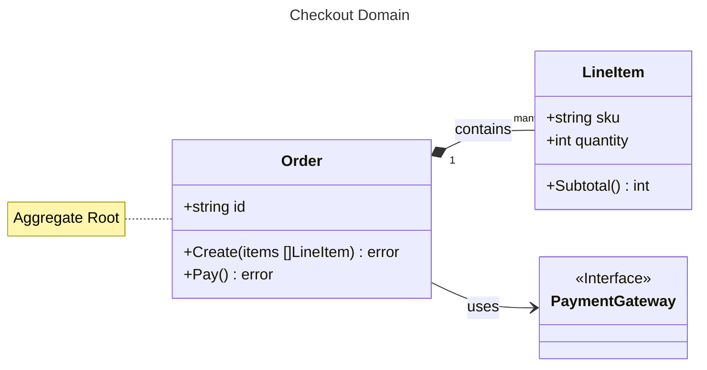
```mermaid
---
title: Checkout Domain
---
classDiagram
    direction LR
    class Order {
        +string id
        +Create(items []LineItem) error
        +Pay() error
    }
    class LineItem {
        +string sku
        +int quantity
        +Subtotal() int
    }
    class PaymentGateway
    <<Interface>> PaymentGateway
    Order "1" *-- "many" LineItem : contains
    Order --> PaymentGateway : uses
    note for Order "Aggregate Root"
```
````

Mermaid出力:

```mermaid
---
title: Checkout Domain
---
classDiagram
    direction LR
    class Order {
        +string id
        +Create(items []LineItem) error
        +Pay() error
    }
    class LineItem {
        +string sku
        +int quantity
        +Subtotal() int
    }
    class PaymentGateway
    <<Interface>> PaymentGateway
    Order "1" *-- "many" LineItem : contains
    Order --> PaymentGateway : uses
    note for Order "Aggregate Root"
```

### 四象限図の構文

```go
package main

import (
	"io"
	"os"

	"github.com/nao1215/markdown"
	"github.com/nao1215/markdown/mermaid/quadrant"
)

//go:generate go run main.go

func main() {
	f, err := os.Create("generated.md")
	if err != nil {
		panic(err)
	}
	defer f.Close()

	chart := quadrant.NewChart(io.Discard, quadrant.WithTitle("Product Prioritization")).
		XAxis("Low Effort", "High Effort").
		YAxis("Low Value", "High Value").
		LF().
		Quadrant1("Quick Wins").
		Quadrant2("Major Projects").
		Quadrant3("Fill Ins").
		Quadrant4("Thankless Tasks").
		LF().
		Point("Feature A", 0.9, 0.85).
		Point("Feature B", 0.25, 0.75).
		Point("Feature C", 0.15, 0.20).
		Point("Feature D", 0.80, 0.15).
		String()

	err = markdown.NewMarkdown(f).
		H2("Quadrant Chart").
		CodeBlocks(markdown.SyntaxHighlightMermaid, chart).
		Build()

	if err != nil {
		panic(err)
	}
}
```

プレーンテキスト出力: [markdownはこちら](../quadrant/generated.md)
````
## Quadrant Chart
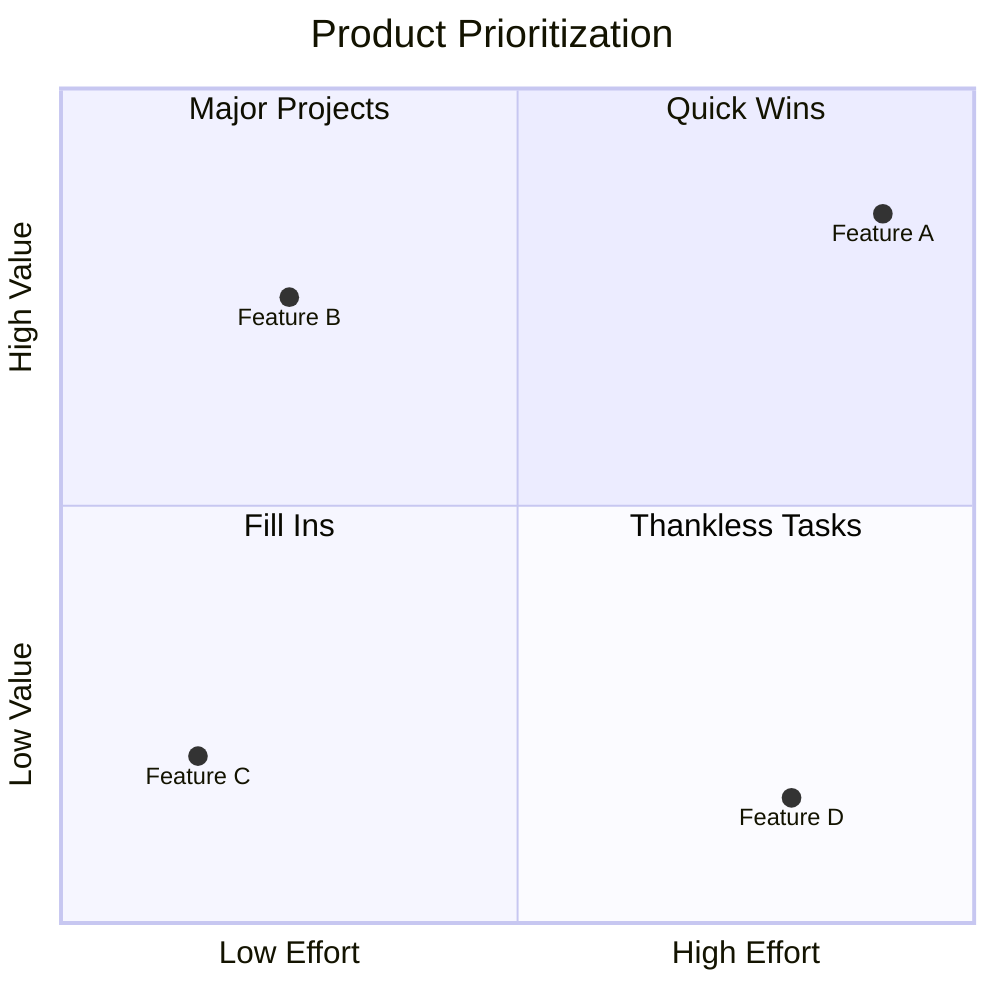
```mermaid
quadrantChart
    title Product Prioritization
    x-axis Low Effort --> High Effort
    y-axis Low Value --> High Value

    quadrant-1 Quick Wins
    quadrant-2 Major Projects
    quadrant-3 Fill Ins
    quadrant-4 Thankless Tasks

    Feature A: [0.90, 0.85]
    Feature B: [0.25, 0.75]
    Feature C: [0.15, 0.20]
    Feature D: [0.80, 0.15]
```
````

Mermaid出力:

```mermaid
quadrantChart
    title Product Prioritization
    x-axis Low Effort --> High Effort
    y-axis Low Value --> High Value

    quadrant-1 Quick Wins
    quadrant-2 Major Projects
    quadrant-3 Fill Ins
    quadrant-4 Thankless Tasks

    Feature A: [0.90, 0.85]
    Feature B: [0.25, 0.75]
    Feature C: [0.15, 0.20]
    Feature D: [0.80, 0.15]
```

### ガントチャートの構文

```go
package main

import (
	"io"
	"os"

	"github.com/nao1215/markdown"
	"github.com/nao1215/markdown/mermaid/gantt"
)

//go:generate go run main.go

func main() {
	f, err := os.Create("generated.md")
	if err != nil {
		panic(err)
	}
	defer f.Close()

	chart := gantt.NewChart(
		io.Discard,
		gantt.WithTitle("Project Schedule"),
		gantt.WithDateFormat("YYYY-MM-DD"),
	).
		Section("Planning").
		DoneTaskWithID("Requirements", "req", "2024-01-01", "5d").
		DoneTaskWithID("Design", "design", "2024-01-08", "3d").
		Section("Development").
		CriticalActiveTaskWithID("Coding", "code", "2024-01-12", "10d").
		TaskAfterWithID("Review", "review", "code", "2d").
		Section("Release").
		MilestoneWithID("Launch", "launch", "2024-01-26").
		String()

	err = markdown.NewMarkdown(f).
		H2("Gantt Chart").
		CodeBlocks(markdown.SyntaxHighlightMermaid, chart).
		Build()

	if err != nil {
		panic(err)
	}
}
```

プレーンテキスト出力: [markdownはこちら](../gantt/generated.md)
````
## Gantt Chart
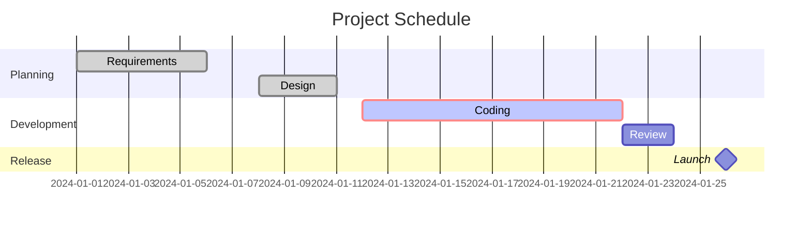
```mermaid
gantt
    title Project Schedule
    dateFormat YYYY-MM-DD
    section Planning
    Requirements :done, req, 2024-01-01, 5d
    Design :done, design, 2024-01-08, 3d
    section Development
    Coding :crit, active, code, 2024-01-12, 10d
    Review :review, after code, 2d
    section Release
    Launch :milestone, launch, 2024-01-26, 0d
```
````

Mermaid出力:
```mermaid
gantt
    title Project Schedule
    dateFormat YYYY-MM-DD
    section Planning
    Requirements :done, req, 2024-01-01, 5d
    Design :done, design, 2024-01-08, 3d
    section Development
    Coding :crit, active, code, 2024-01-12, 10d
    Review :review, after code, 2d
    section Release
    Launch :milestone, launch, 2024-01-26, 0d
```

## Markdownファイルが格納されたディレクトリのインデックス作成
markdownパッケージは、指定されたディレクトリ内のMarkdownファイルのインデックスを作成できます。この機能は、[nao1215/spectest](https://github.com/nao1215/spectest)によって生成されるMarkdownドキュメントのインデックスを生成するために追加されました。

例えば、以下のディレクトリ構造を考えてみましょう：

```shell
testdata
├── abc
│   ├── dummy.txt
│   ├── jkl
│   │   └── text.md
│   └── test.md
├── def
│   ├── test.md
│   └── test2.md
├── expected
│   └── index.md
├── ghi
└── test.md
```

以下の実装では、testdataディレクトリ内にあるすべてのMarkdownファイルへのリンクを含むインデックスMarkdownファイルを作成します。

```go
		if err := GenerateIndex(
			"testdata", // Markdownファイルが含まれるターゲットディレクトリ
			WithTitle("Test Title"), // インデックスMarkdownのタイトル
			WithDescription([]string{"Test Description", "Next Description"}), // インデックスMarkdownの説明
		); err != nil {
			panic(err)
		}
```

インデックスMarkdownファイルは、デフォルトで「ターゲットディレクトリ/index.md」の下に作成されます。このパスを変更したい場合は、`WithWriter()`オプションを使用してください。ファイル内のリンク名は、ターゲットMarkdown内で最初に出現するH1またはH2になります。H1もH2も存在しない場合、リンク名は対象のファイル名になります。

[出力:](../index.md)
```markdown
## Test Title
Test Description

Next Description

### testdata
- [test.md](test.md)

### abc
- [h2 is here](abc/test.md)

### jkl
- [text.md](abc/jkl/text.md)

### def
- [h2 is first, not h1](def/test.md)
- [h1 is here](def/test2.md)

### expected
- [Test Title](expected/index.md)
```

## ライセンス
[MIT License](../../LICENSE)

## 貢献
まず、貢献していただき、ありがとうございます！詳細については[CONTRIBUTING.md](../../CONTRIBUTING.md)をご覧ください。貢献は開発に関するものだけではありません。例えば、GitHub Starは私の開発意欲を高めてくれます！気軽にこのプロジェクトに貢献してください。

[](https://star-history.com/#nao1215/markdown&Date)

### 貢献者 ✨

素晴らしい人々に感謝します（[emoji key](https://allcontributors.org/docs/en/emoji-key)）：

<!-- ALL-CONTRIBUTORS-LIST:START - Do not remove or modify this section -->
<!-- prettier-ignore-start -->
<!-- markdownlint-disable -->
<table>
  <tbody>
    <tr>
      <td align="center" valign="top" width="14.28%"><a href="https://debimate.jp/"><br /><sub><b>CHIKAMATSU Naohiro</b></sub></a><br /><a href="https://github.com/nao1215/markdown/commits?author=nao1215" title="Code">💻</a></td>
      <td align="center" valign="top" width="14.28%"><a href="https://github.com/varmakarthik12"><br /><sub><b>Karthik Sundari</b></sub></a><br /><a href="https://github.com/nao1215/markdown/commits?author=varmakarthik12" title="Code">💻</a></td>
      <td align="center" valign="top" width="14.28%"><a href="https://github.com/Avihuc"><br /><sub><b>Avihuc</b></sub></a><br /><a href="https://github.com/nao1215/markdown/commits?author=Avihuc" title="Code">💻</a></td>
      <td align="center" valign="top" width="14.28%"><a href="https://www.claranceliberi.me/"><br /><sub><b>Clarance Liberiste Ntwari</b></sub></a><br /><a href="https://github.com/nao1215/markdown/commits?author=claranceliberi" title="Code">💻</a></td>
      <td align="center" valign="top" width="14.28%"><a href="https://github.com/amitaifrey"><br /><sub><b>Amitai Frey</b></sub></a><br /><a href="https://github.com/nao1215/markdown/commits?author=amitaifrey" title="Code">💻</a></td>
    </tr>
  </tbody>
  <tfoot>
    <tr>
      <td align="center" size="13px" colspan="7">
        
          <a href="https://all-contributors.js.org/docs/en/bot/usage">Add your contributions</a>
        </img>
      </td>
    </tr>
  </tfoot>
</table>

<!-- markdownlint-restore -->
<!-- prettier-ignore-end -->

<!-- ALL-CONTRIBUTORS-LIST:END -->

このプロジェクトは[all-contributors](https://github.com/all-contributors/all-contributors)仕様に従います。どのような種類の貢献でも歓迎です！
