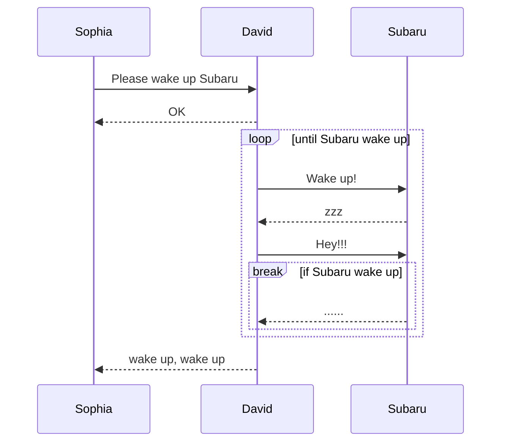
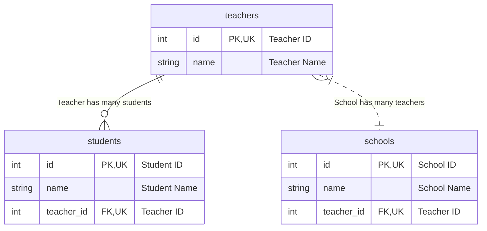
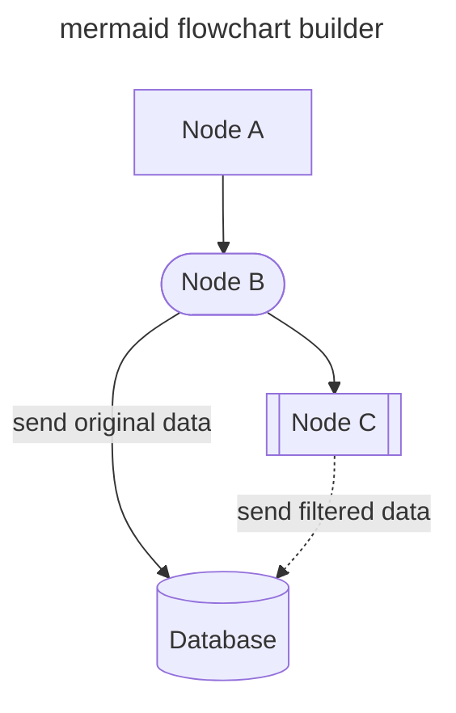
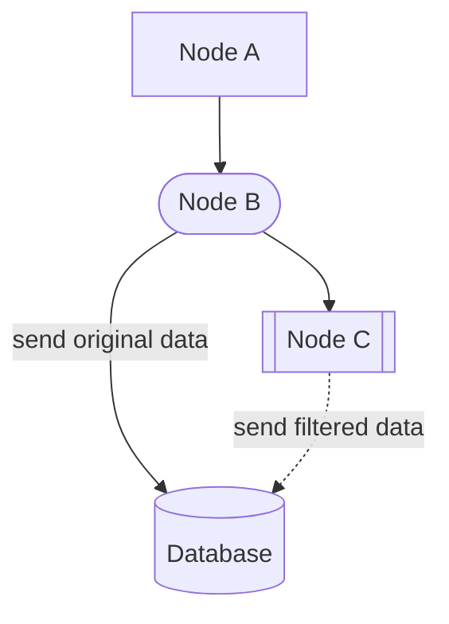
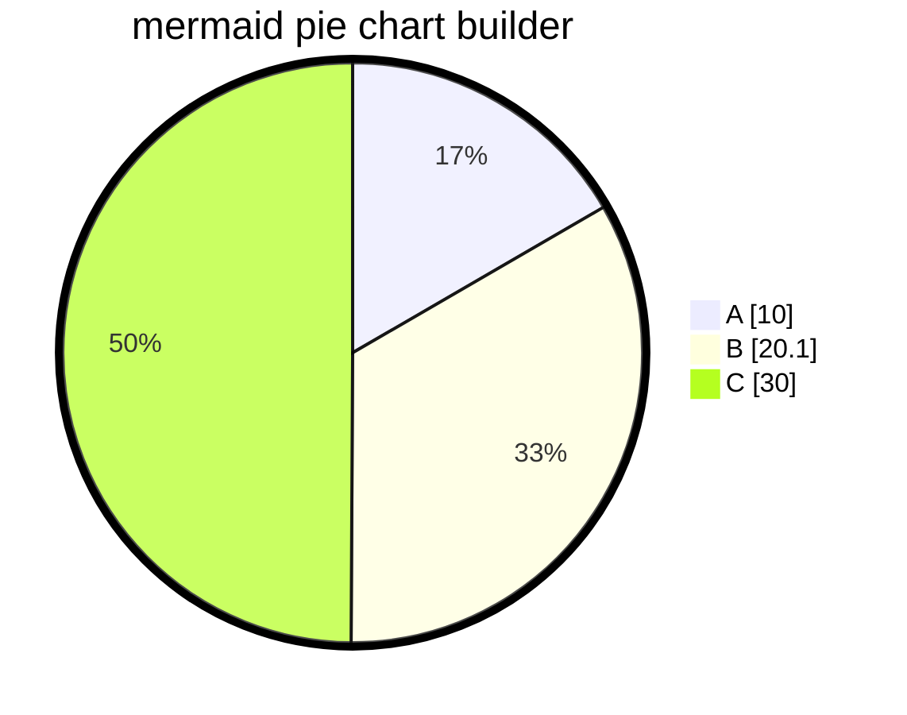
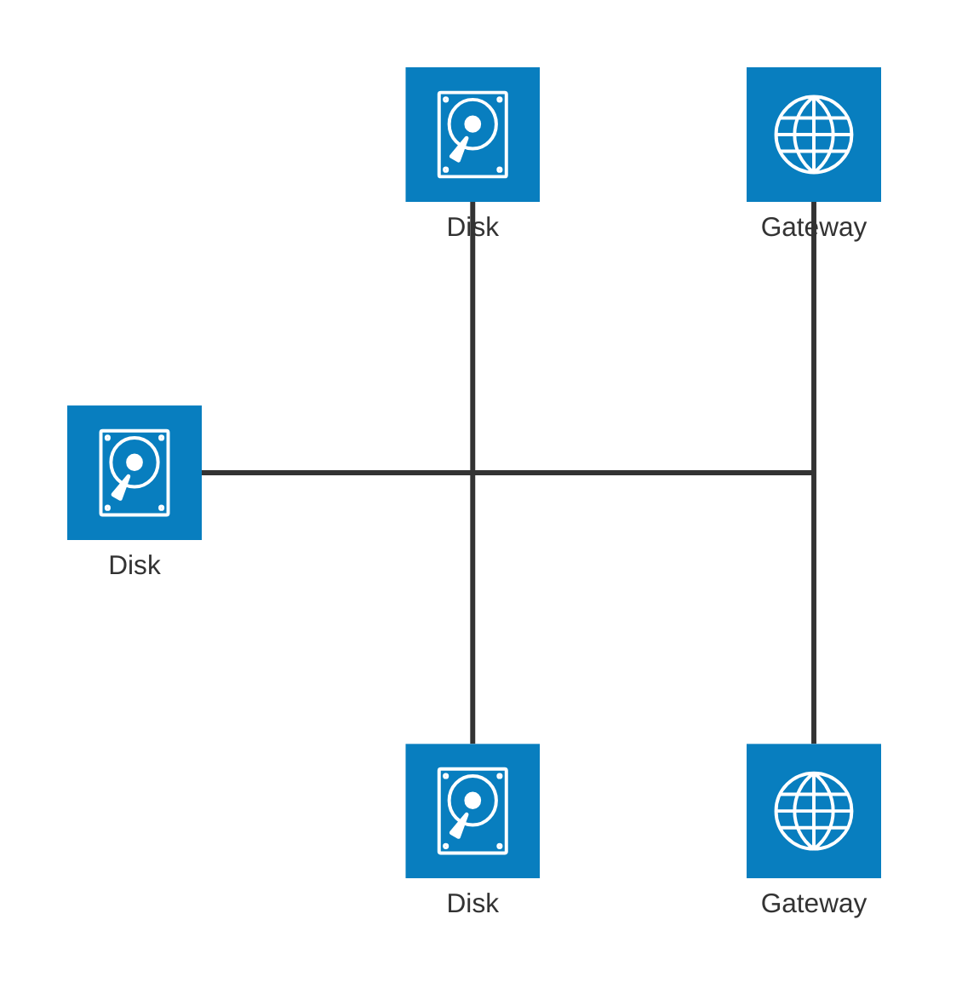

<!-- ALL-CONTRIBUTORS-BADGE:START - Do not remove or modify this section -->
[](#contributors-)
<!-- ALL-CONTRIBUTORS-BADGE:END -->
[](https://pkg.go.dev/github.com/nao1215/markdown)
[](https://github.com/nao1215/markdown/actions/workflows/unit_test.yml)
[](https://github.com/nao1215/markdown/actions/workflows/reviewdog.yml)
[](https://github.com/nao1215/markdown/actions/workflows/gosec.yml)


[English](../../README.md) | [Русский](../ru/README.md) | [中文](../zh-cn/README.md) | [한국어](../ko/README.md) | [Español](../es/README.md) | [Français](../fr/README.md)

# markdown パッケージとは
markdown パッケージは、Golangでのシンプルなマークダウンビルダーです。markdown パッケージは、[html/template](https://pkg.go.dev/html/template) のようなテンプレートエンジンを使用せず、メソッドチェーンを使用してMarkdownを組み立てます。Markdownの構文は**GitHub Markdown**に従います。

markdown パッケージは、[nao1215/spectest](https://github.com/nao1215/spectest) でテスト結果を保存するために最初に開発されました。そのため、markdown パッケージは spectest で必要な機能を実装しています。例えば、markdown パッケージは、spectest で必要な機能である**mermaid シーケンス図（実体関係図、シーケンス図、フローチャート、パイチャート、アーキテクチャ図）**をサポートしています。

また、ネストしたリストの生成などのライブラリの複雑性を増加させる複雑なコードは追加されません。このライブラリをできる限りシンプルに保ちたいと考えています。

## サポートしているOSとGoバージョン
- OS: Linux、macOS、Windows
- Go: 1.21以降

## サポートしているMarkdown機能
- [x] 見出し; H1、H2、H3、H4、H5、H6
- [x] ブロック引用 
- [x] 箇条書きリスト
- [x] 番号付きリスト
- [x] チェックボックスリスト 
- [x] コードブロック
- [x] 水平線 
- [x] テーブル
- [x] テキストフォーマット; 太字、斜体、コード、取り消し線、太字斜体
- [x] リンク付きテキスト
- [x] 画像付きテキスト
- [x] プレーンテキスト
- [x] 詳細 
- [x] アラート; NOTE、TIP、IMPORTANT、CAUTION、WARNING
- [x] mermaid シーケンス図
- [x] mermaid 実体関係図
- [x] mermaid フローチャート 
- [x] mermaid パイチャート
- [x] mermaid アーキテクチャ図（ベータ機能） 

### Markdown構文にない機能
- バッジ生成; RedBadge()、YellowBadge()、GreenBadge()
- Markdownファイルが格納されたディレクトリのインデックス生成; GenerateIndex()

## 例
### 基本的な使用法
```go
package main

import (
	"os"

	md "github.com/nao1215/markdown"
)

func main() {
	md.NewMarkdown(os.Stdout).
		H1("This is H1").
		PlainText("This is plain text").
		H2f("This is %s with text format", "H2").
		PlainTextf("Text formatting, such as %s and %s, %s styles.",
			md.Bold("bold"), md.Italic("italic"), md.Code("code")).
		H2("Code Block").
		CodeBlocks(md.SyntaxHighlightGo,
			`package main
import "fmt"

func main() {
	fmt.Println("Hello, World!")
}`).
		H2("List").
		BulletList("Bullet Item 1", "Bullet Item 2", "Bullet Item 3").
		OrderedList("Ordered Item 1", "Ordered Item 2", "Ordered Item 3").
		H2("CheckBox").
		CheckBox([]md.CheckBoxSet{
			{Checked: false, Text: md.Code("sample code")},
			{Checked: true, Text: md.Link("Go", "https://golang.org")},
			{Checked: false, Text: md.Strikethrough("strikethrough")},
		}).
		H2("Blockquote").
		Blockquote("If you can dream it, you can do it.").
		H3("Horizontal Rule").
		HorizontalRule().
		H2("Table").
		Table(md.TableSet{
			Header: []string{"Name", "Age", "Country"},
			Rows: [][]string{
				{"David", "23", "USA"},
				{"John", "30", "UK"},
				{"Bob", "25", "Canada"},
			},
		}).
		H2("Image").
		PlainTextf(md.Image("sample_image", "./sample.png")).
		Build()
}
```

出力:
````
# This is H1
This is plain text

## This is H2 with text format
Text formatting, such as **bold** and *italic*, `code` styles.

## Code Block
```go
package main
import "fmt"

func main() {
        fmt.Println("Hello, World!")
}
```

## List
- Bullet Item 1
- Bullet Item 2
- Bullet Item 3
1. Ordered Item 1
2. Ordered Item 2
3. Ordered Item 3

## CheckBox
- [ ] `sample code`
- [x] [Go](https://golang.org)
- [ ] ~~strikethrough~~

## Blockquote
> If you can dream it, you can do it.

### Horizontal Rule
---

## Table
| NAME  | AGE | COUNTRY |
|-------|-----|---------|
| David |  23 | USA     |
| John  |  30 | UK      |
| Bob   |  25 | Canada  |

## Image

````

Markdownでどのように見えるかを確認したい場合は、以下のリンクを参照してください。
- [sample.md](../generated_example.md)

### `"go generate ./..."` を使用してMarkdownを生成
`go generate` を使用してMarkdownを生成することができます。まず、Markdownを生成するコードを定義してください。次に、`"go generate ./..."` を実行してMarkdownを生成します。

[コード例:](../generate/main.go)
```go
package main

import (
	"os"

	md "github.com/nao1215/markdown"
)

//go:generate go run main.go

func main() {
	f, err := os.Create("generated.md")
	if err != nil {
		panic(err)
	}
	defer f.Close()

	md.NewMarkdown(f).
		H1("go generate example").
		PlainText("This markdown is generated by `go generate`").
		Build()
}
```

以下のコマンドを実行:
```shell
go generate ./...
```

[出力:](../generate/generated.md)
````text
# go generate example
This markdown is generated by `go generate`
````

### アラート構文
markdownパッケージはアラートを作成できます。アラートは、Markdownで重要な情報を表示するのに役立ちます。この構文はGitHubでサポートされています。
[コード例:](../alert/main.go)
```go
	md.NewMarkdown(f).
		H1("Alert example").
		Note("This is note").LF().
		Tip("This is tip").LF().
		Important("This is important").LF().
		Warning("This is warning").LF().
		Caution("This is caution").LF().
		Build()
```

[出力:](../alert/generated.md)
````text
# Alert example
> [!NOTE]  
> This is note

> [!TIP]  
> This is tip

> [!IMPORTANT]  
> This is important

> [!WARNING]  
> This is warning

> [!CAUTION]  
> This is caution
````

アラートは次のように表示されます：
> [!NOTE]  
> This is note

> [!TIP]  
> This is tip

> [!IMPORTANT]  
> This is important

> [!WARNING]  
> This is warning

> [!CAUTION]  
> This is caution

### ステータスバッジ構文
markdownパッケージは、赤、黄、緑のステータスバッジを作成できます。
[コード例:](../badge/main.go)
```go
	md.NewMarkdown(os.Stdout).
		H1("badge example").
		RedBadge("red_badge").
		YellowBadge("yellow_badge").
		GreenBadge("green_badge").
		BlueBadge("blue_badge").
		Build()
```

[出力:](../badge/generated.md)
````text
# badge example


````

バッジは次のように表示されます：


### Mermaid シーケンス図構文

```go
package main

import (
	"os"

	"github.com/nao1215/markdown"
	"github.com/nao1215/mermaid/sequence"
)

//go:generate go run main.go

func main() {
	diagram := sequence.NewDiagram(io.Discard).
		Participant("Sophia").
		Participant("David").
		Participant("Subaru").
		LF().
		SyncRequest("Sophia", "David", "Please wake up Subaru").
		SyncResponse("David", "Sophia", "OK").
		LF().
		LoopStart("until Subaru wake up").
		SyncRequest("David", "Subaru", "Wake up!").
		SyncResponse("Subaru", "David", "zzz").
		SyncRequest("David", "Subaru", "Hey!!!").
		BreakStart("if Subaru wake up").
		SyncResponse("Subaru", "David", "......").
		BreakEnd().
		LoopEnd().
		LF().
		SyncResponse("David", "Sophia", "wake up, wake up").
		String()

	markdown.NewMarkdown(os.Stdout).
		H2("Sequence Diagram").
		CodeBlocks(markdown.SyntaxHighlightMermaid, diagram).
		Build()
}
```

プレーンテキスト出力: [markdown はこちら](../sequence/generated.md)
````
## Sequence Diagram

````

Mermaid出力:


### 実体関係図構文

```go
package main

import (
	"os"

	"github.com/nao1215/markdown"
	"github.com/nao1215/markdown/mermaid/er"
)

//go:generate go run main.go

func main() {
	f, err := os.Create("generated.md")
	if err != nil {
		panic(err)
	}
	defer f.Close()

	teachers := er.NewEntity(
		"teachers",
		[]*er.Attribute{
			{
				Type:         "int",
				Name:         "id",
				IsPrimaryKey: true,
				IsForeignKey: false,
				IsUniqueKey:  true,
				Comment:      "Teacher ID",
			},
			{
				Type:         "string",
				Name:         "name",
				IsPrimaryKey: false,
				IsForeignKey: false,
				IsUniqueKey:  false,
				Comment:      "Teacher Name",
			},
		},
	)
	students := er.NewEntity(
		"students",
		[]*er.Attribute{
			{
				Type:         "int",
				Name:         "id",
				IsPrimaryKey: true,
				IsForeignKey: false,
				IsUniqueKey:  true,
				Comment:      "Student ID",
			},
			{
				Type:         "string",
				Name:         "name",
				IsPrimaryKey: false,
				IsForeignKey: false,
				IsUniqueKey:  false,
				Comment:      "Student Name",
			},
			{
				Type:         "int",
				Name:         "teacher_id",
				IsPrimaryKey: false,
				IsForeignKey: true,
				IsUniqueKey:  true,
				Comment:      "Teacher ID",
			},
		},
	)
	schools := er.NewEntity(
		"schools",
		[]*er.Attribute{
			{
				Type:         "int",
				Name:         "id",
				IsPrimaryKey: true,
				IsForeignKey: false,
				IsUniqueKey:  true,
				Comment:      "School ID",
			},
			{
				Type:         "string",
				Name:         "name",
				IsPrimaryKey: false,
				IsForeignKey: false,
				IsUniqueKey:  false,
				Comment:      "School Name",
			},
			{
				Type:         "int",
				Name:         "teacher_id",
				IsPrimaryKey: false,
				IsForeignKey: true,
				IsUniqueKey:  true,
				Comment:      "Teacher ID",
			},
		},
	)

	erString := er.NewDiagram(f).
		Relationship(
			teachers,
			students,
			er.ExactlyOneRelationship, // "||"
			er.ZeroToMoreRelationship, // "}o"
			er.Identifying,            // "--"
			"Teacher has many students",
		).
		Relationship(
			teachers,
			schools,
			er.OneToMoreRelationship,  // "|}"
			er.ExactlyOneRelationship, // "||"
			er.NonIdentifying,         // ".."
			"School has many teachers",
		).
		String()

	err = markdown.NewMarkdown(f).
		H2("Entity Relationship Diagram").
		CodeBlocks(markdown.SyntaxHighlightMermaid, erString).
		Build()

	if err != nil {
		panic(err)
	}
}
```

プレーンテキスト出力: [markdown はこちら](../er/generated.md)
````
## Entity Relationship Diagram

````

Mermaid出力:


### フローチャート構文

```go
package main

import (
	"io"
	"os"

	"github.com/nao1215/markdown"
	"github.com/nao1215/markdown/mermaid/flowchart"
)

//go:generate go run main.go

func main() {
	f, err := os.Create("generated.md")
	if err != nil {
		panic(err)
	}
	defer f.Close()

	fc := flowchart.NewFlowchart(
		io.Discard,
		flowchart.WithTitle("mermaid flowchart builder"),
		flowchart.WithOrientalTopToBottom(),
	).
		NodeWithText("A", "Node A").
		StadiumNode("B", "Node B").
		SubroutineNode("C", "Node C").
		DatabaseNode("D", "Database").
		LinkWithArrowHead("A", "B").
		LinkWithArrowHeadAndText("B", "D", "send original data").
		LinkWithArrowHead("B", "C").
		DottedLinkWithText("C", "D", "send filtered data").
		String()

	err = markdown.NewMarkdown(f).
		H2("Flowchart").
		CodeBlocks(markdown.SyntaxHighlightMermaid, fc).
		Build()

	if err != nil {
		panic(err)
	}
}
```

プレーンテキスト出力: [markdown はこちら](../flowchart/generated.md)
````
## Flowchart

````

Mermaid出力:


### パイチャート構文

```go
package main

import (
	"io"
	"os"

	"github.com/nao1215/markdown"
	"github.com/nao1215/markdown/mermaid/piechart"
)

//go:generate go run main.go

func main() {
	f, err := os.Create("generated.md")
	if err != nil {
		panic(err)
	}
	defer f.Close()

	chart := piechart.NewPieChart(
		io.Discard,
		piechart.WithTitle("mermaid pie chart builder"),
		piechart.WithShowData(true),
	).
		LabelAndIntValue("A", 10).
		LabelAndFloatValue("B", 20.1).
		LabelAndIntValue("C", 30).
		String()

	err = markdown.NewMarkdown(f).
		H2("Pie Chart").
		CodeBlocks(markdown.SyntaxHighlightMermaid, chart).
		Build()

	if err != nil {
		panic(err)
	}
}
```

プレーンテキスト出力: [markdown はこちら](../piechart/generated.md)
````
## Pie Chart

````

Mermaid出力:


### アーキテクチャ図（ベータ機能）

[mermaidは、ベータ版としてインフラアーキテクチャを視覚化する機能を提供しており](https://mermaid.js.org/syntax/architecture.html)、その機能が導入されています。

```go
package main

import (
	"io"
	"os"

	"github.com/nao1215/markdown"
	"github.com/nao1215/markdown/mermaid/arch"
)

//go:generate go run main.go

func main() {
	f, err := os.Create("generated.md")
	if err != nil {
		panic(err)
	}
	defer f.Close()

	diagram := arch.NewArchitecture(io.Discard).
		Service("left_disk", arch.IconDisk, "Disk").
		Service("top_disk", arch.IconDisk, "Disk").
		Service("bottom_disk", arch.IconDisk, "Disk").
		Service("top_gateway", arch.IconInternet, "Gateway").
		Service("bottom_gateway", arch.IconInternet, "Gateway").
		Junction("junctionCenter").
		Junction("junctionRight").
		LF().
		Edges(
			arch.Edge{
				ServiceID: "left_disk",
				Position:  arch.PositionRight,
				Arrow:     arch.ArrowNone,
			},
			arch.Edge{
				ServiceID: "junctionCenter",
				Position:  arch.PositionLeft,
				Arrow:     arch.ArrowNone,
			}).
		Edges(
			arch.Edge{
				ServiceID: "top_disk",
				Position:  arch.PositionBottom,
				Arrow:     arch.ArrowNone,
			},
			arch.Edge{
				ServiceID: "junctionCenter",
				Position:  arch.PositionTop,
				Arrow:     arch.ArrowNone,
			}).
		Edges(
			arch.Edge{
				ServiceID: "bottom_disk",
				Position:  arch.PositionTop,
				Arrow:     arch.ArrowNone,
			},
			arch.Edge{
				ServiceID: "junctionCenter",
				Position:  arch.PositionBottom,
				Arrow:     arch.ArrowNone,
			}).
		Edges(
			arch.Edge{
				ServiceID: "junctionCenter",
				Position:  arch.PositionRight,
				Arrow:     arch.ArrowNone,
			},
			arch.Edge{
				ServiceID: "junctionRight",
				Position:  arch.PositionLeft,
				Arrow:     arch.ArrowNone,
			}).
		Edges(
			arch.Edge{
				ServiceID: "top_gateway",
				Position:  arch.PositionBottom,
				Arrow:     arch.ArrowNone,
			},
			arch.Edge{
				ServiceID: "junctionRight",
				Position:  arch.PositionTop,
				Arrow:     arch.ArrowNone,
			}).
		Edges(
			arch.Edge{
				ServiceID: "bottom_gateway",
				Position:  arch.PositionTop,
				Arrow:     arch.ArrowNone,
			},
			arch.Edge{
				ServiceID: "junctionRight",
				Position:  arch.PositionBottom,
				Arrow:     arch.ArrowNone,
			}).String() //nolint

	err = markdown.NewMarkdown(f).
		H2("Architecture Diagram").
		CodeBlocks(markdown.SyntaxHighlightMermaid, diagram).
		Build()

	if err != nil {
		panic(err)
	}
```

プレーンテキスト出力: [markdown はこちら](../architecture/generated.md)
````
## Architecture Diagram

````


## Markdownファイルが格納されたディレクトリのインデックス作成
markdownパッケージは、指定されたディレクトリ内のMarkdownファイルのインデックスを作成できます。この機能は、[nao1215/spectest](https://github.com/nao1215/spectest)によって生成されるMarkdownドキュメントのインデックスを生成するために追加されました。

例えば、以下のディレクトリ構造を考えてみましょう：

```shell
testdata
├── abc
│   ├── dummy.txt
│   ├── jkl
│   │   └── text.md
│   └── test.md
├── def
│   ├── test.md
│   └── test2.md
├── expected
│   └── index.md
├── ghi
└── test.md
```

以下の実装では、testdataディレクトリ内にあるすべてのMarkdownファイルへのリンクを含むインデックスMarkdownファイルを作成します。

```go
		if err := GenerateIndex(
			"testdata", // Markdownファイルが含まれるターゲットディレクトリ
			WithTitle("Test Title"), // インデックスMarkdownのタイトル
			WithDescription([]string{"Test Description", "Next Description"}), // インデックスMarkdownの説明
		); err != nil {
			panic(err)
		}
```

インデックスMarkdownファイルは、デフォルトで「ターゲットディレクトリ/index.md」の下に作成されます。このパスを変更したい場合は、`WithWriter()`オプションを使用してください。ファイル内のリンク名は、ターゲットMarkdown内で最初に出現するH1またはH2になります。H1もH2も存在しない場合、リンク名は対象のファイル名になります。

[出力:](../index.md)
```markdown
## Test Title
Test Description

Next Description

### testdata
- [test.md](test.md)

### abc
- [h2 is here](abc/test.md)

### jkl
- [text.md](abc/jkl/text.md)

### def
- [h2 is first, not h1](def/test.md)
- [h1 is here](def/test2.md)

### expected
- [Test Title](expected/index.md)
```

## ライセンス
[MIT License](../../LICENSE)

## 貢献
まず、貢献していただき、ありがとうございます！詳細については[CONTRIBUTING.md](../../CONTRIBUTING.md)をご覧ください。貢献は開発に関するものだけではありません。例えば、GitHub Starは私の開発意欲を高めてくれます！気軽にこのプロジェクトに貢献してください。

[](https://star-history.com/#nao1215/markdown&Date)

### 貢献者 ✨

素晴らしい人々に感謝します（[emoji key](https://allcontributors.org/docs/en/emoji-key)）：

<!-- ALL-CONTRIBUTORS-LIST:START - Do not remove or modify this section -->
<!-- prettier-ignore-start -->
<!-- markdownlint-disable -->
<table>
  <tbody>
    <tr>
      <td align="center" valign="top" width="14.28%"><a href="https://debimate.jp/"><br /><sub><b>CHIKAMATSU Naohiro</b></sub></a><br /><a href="https://github.com/nao1215/markdown/commits?author=nao1215" title="Code">💻</a></td>
      <td align="center" valign="top" width="14.28%"><a href="https://github.com/varmakarthik12"><br /><sub><b>Karthik Sundari</b></sub></a><br /><a href="https://github.com/nao1215/markdown/commits?author=varmakarthik12" title="Code">💻</a></td>
      <td align="center" valign="top" width="14.28%"><a href="https://github.com/Avihuc"><br /><sub><b>Avihuc</b></sub></a><br /><a href="https://github.com/nao1215/markdown/commits?author=Avihuc" title="Code">💻</a></td>
      <td align="center" valign="top" width="14.28%"><a href="https://www.claranceliberi.me/"><br /><sub><b>Clarance Liberiste Ntwari</b></sub></a><br /><a href="https://github.com/nao1215/markdown/commits?author=claranceliberi" title="Code">💻</a></td>
      <td align="center" valign="top" width="14.28%"><a href="https://github.com/amitaifrey"><br /><sub><b>Amitai Frey</b></sub></a><br /><a href="https://github.com/nao1215/markdown/commits?author=amitaifrey" title="Code">💻</a></td>
    </tr>
  </tbody>
  <tfoot>
    <tr>
      <td align="center" size="13px" colspan="7">
        
          <a href="https://all-contributors.js.org/docs/en/bot/usage">Add your contributions</a>
        </img>
      </td>
    </tr>
  </tfoot>
</table>

<!-- markdownlint-restore -->
<!-- prettier-ignore-end -->

<!-- ALL-CONTRIBUTORS-LIST:END -->

このプロジェクトは[all-contributors](https://github.com/all-contributors/all-contributors)仕様に従います。どのような種類の貢献でも歓迎です！
