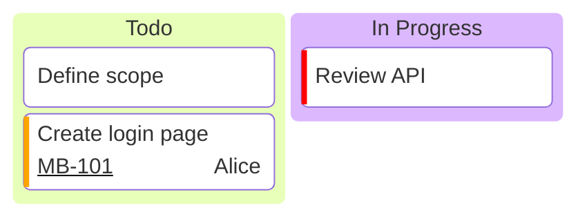

## Kanban Diagram

```mermaid
---
title: Sprint Board
config:
  kanban:
    ticketBaseUrl: 'https://example.com/tickets/'
---
kanban
    [Todo]
        [Define scope]
        [Create login page]@{ ticket: 'MB-101', assigned: 'Alice', priority: 'High' }
    [In Progress]
        [Review API]@{ priority: 'Very High' }
```