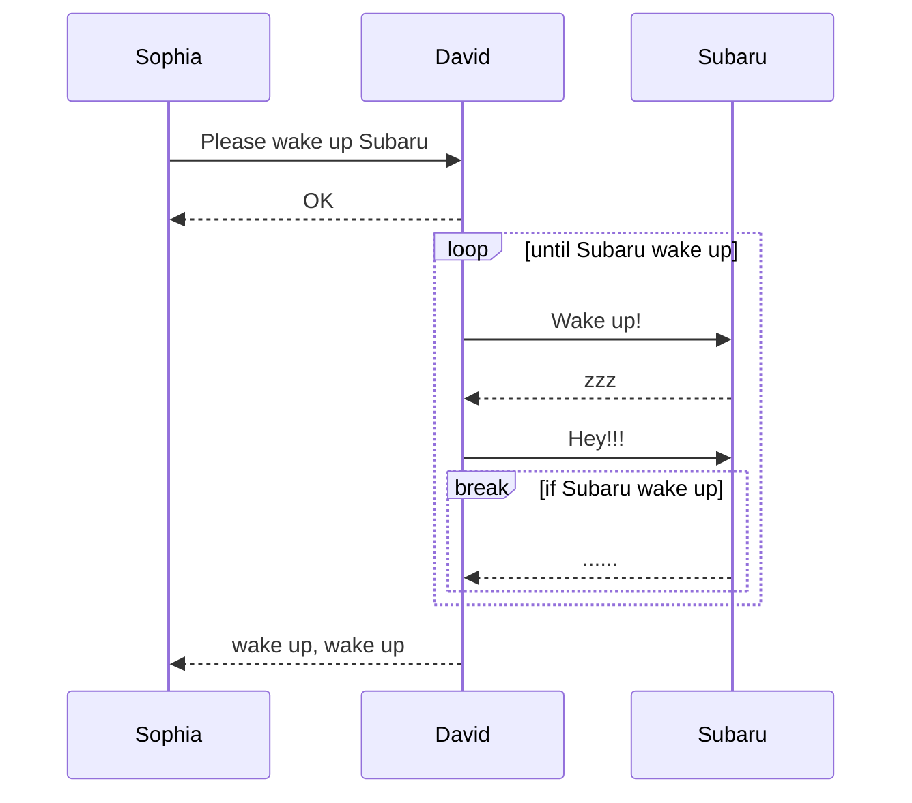
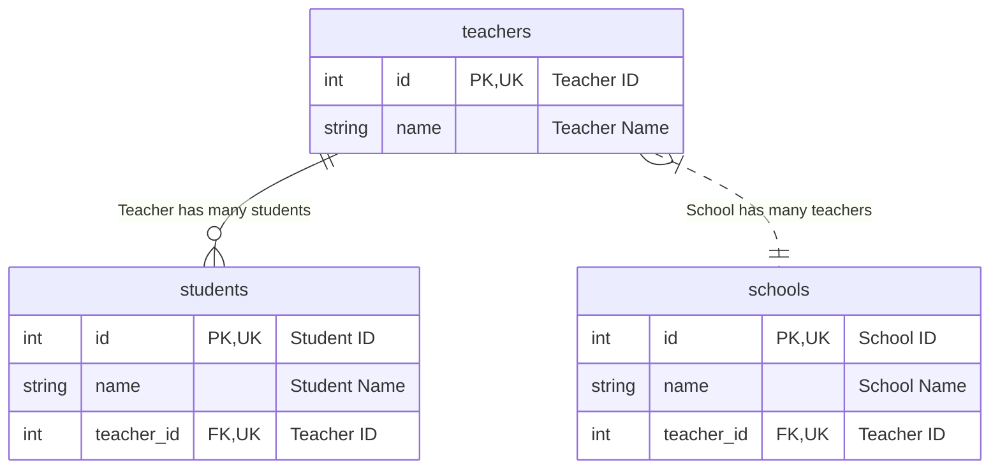
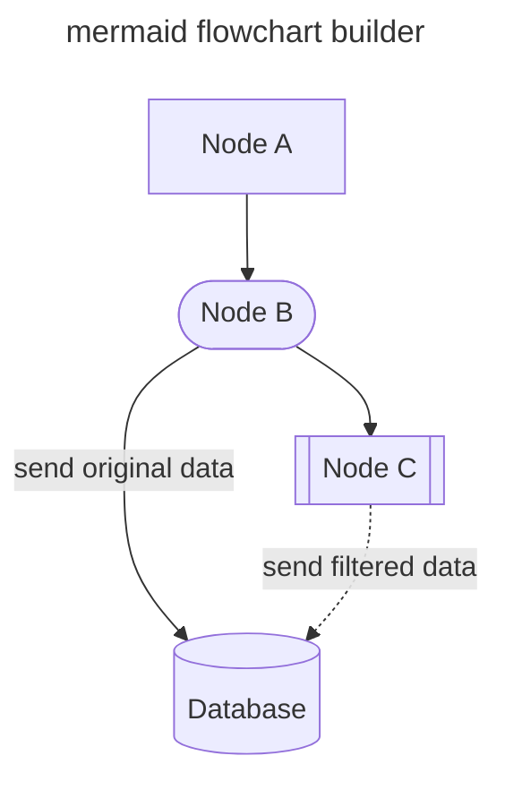
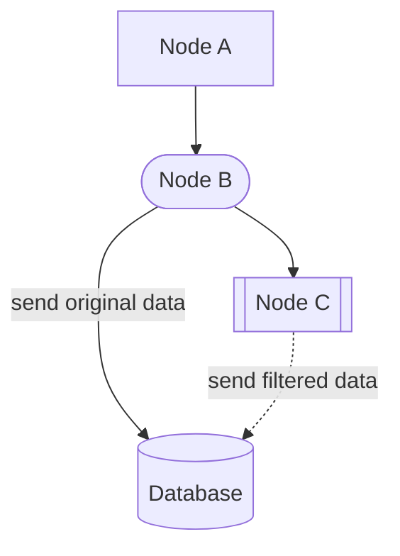
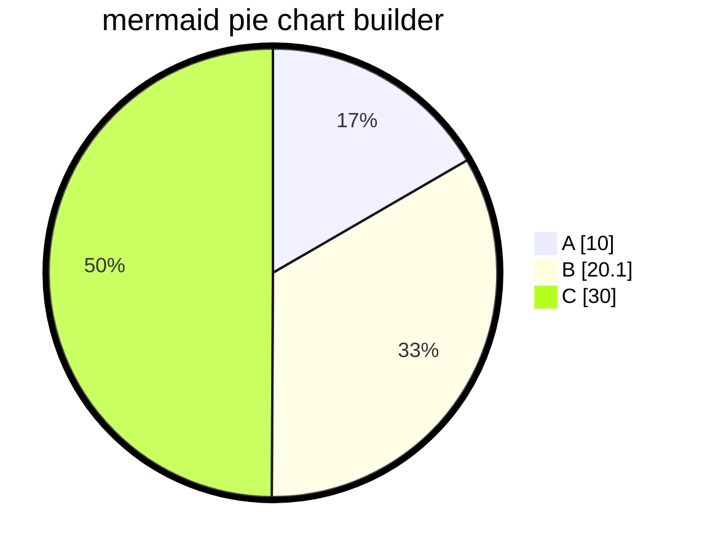
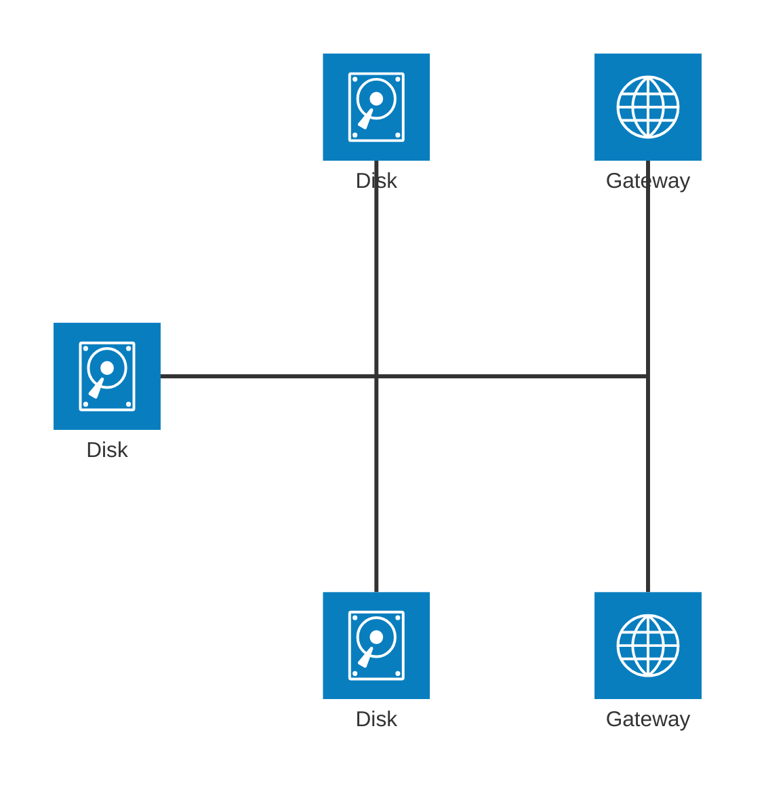

<!-- ALL-CONTRIBUTORS-BADGE:START - Do not remove or modify this section -->
[](#contributors-)
<!-- ALL-CONTRIBUTORS-BADGE:END -->
[](https://pkg.go.dev/github.com/nao1215/markdown)
[](https://github.com/nao1215/markdown/actions/workflows/unit_test.yml)
[](https://github.com/nao1215/markdown/actions/workflows/reviewdog.yml)
[](https://github.com/nao1215/markdown/actions/workflows/gosec.yml)

[English](../../README.md) | [日本語](../ja/README.md) | [Русский](../ru/README.md) | [中文](../zh-cn/README.md) | [Español](../es/README.md) | [Français](../fr/README.md)

# markdown 패키지란 무엇인가
markdown 패키지는 Golang으로 작성된 간단한 마크다운 빌더입니다. markdown 패키지는 [html/template](https://pkg.go.dev/html/template)과 같은 템플릿 엔진을 사용하지 않고 메서드 체이닝을 사용하여 Markdown을 조립합니다. Markdown의 구문은 **GitHub Markdown**을 따릅니다.

markdown 패키지는 원래 [nao1215/spectest](https://github.com/nao1215/spectest)에서 테스트 결과를 저장하기 위해 개발되었습니다. 따라서 markdown 패키지는 spectest에 필요한 기능을 구현합니다. 예를 들어, markdown 패키지는 spectest에서 필요한 기능이었던 **mermaid 시퀀스 다이어그램(개체 관계 다이어그램, 시퀀스 다이어그램, 플로우차트, 파이 차트, 아키텍처 다이어그램)**을 지원합니다.

또한 중첩된 목록 생성과 같은 라이브러리의 복잡성을 증가시키는 복잡한 코드는 추가되지 않을 것입니다. 이 라이브러리를 가능한 한 단순하게 유지하고 싶습니다.

## 지원하는 OS 및 Go 버전
- OS: Linux, macOS, Windows
- Go: 1.21 이상

## 지원하는 Markdown 기능
- [x] 제목; H1, H2, H3, H4, H5, H6
- [x] 블록 인용
- [x] 불릿 리스트
- [x] 순서 있는 리스트
- [x] 체크박스 리스트
- [x] 코드 블록
- [x] 수평선
- [x] 테이블
- [x] 텍스트 포맷; 볼드, 이탤릭, 코드, 취소선, 볼드 이탤릭
- [x] 링크가 있는 텍스트
- [x] 이미지가 있는 텍스트
- [x] 평문
- [x] 세부사항
- [x] 알림; NOTE, TIP, IMPORTANT, CAUTION, WARNING
- [x] mermaid 시퀀스 다이어그램
- [x] mermaid 개체 관계 다이어그램
- [x] mermaid 플로우차트
- [x] mermaid 파이 차트
- [x] mermaid 아키텍처 다이어그램 (베타 기능)

### Markdown 구문에 없는 기능
- 배지 생성; RedBadge(), YellowBadge(), GreenBadge()
- 마크다운 파일로 가득 찬 디렉터리의 인덱스 생성; GenerateIndex()

## 예제
### 기본 사용법
```go
package main

import (
	"os"

	md "github.com/nao1215/markdown"
)

func main() {
	md.NewMarkdown(os.Stdout).
		H1("This is H1").
		PlainText("This is plain text").
		H2f("This is %s with text format", "H2").
		PlainTextf("Text formatting, such as %s and %s, %s styles.",
			md.Bold("bold"), md.Italic("italic"), md.Code("code")).
		H2("Code Block").
		CodeBlocks(md.SyntaxHighlightGo,
			`package main
import "fmt"

func main() {
	fmt.Println("Hello, World!")
}`).
		H2("List").
		BulletList("Bullet Item 1", "Bullet Item 2", "Bullet Item 3").
		OrderedList("Ordered Item 1", "Ordered Item 2", "Ordered Item 3").
		H2("CheckBox").
		CheckBox([]md.CheckBoxSet{
			{Checked: false, Text: md.Code("sample code")},
			{Checked: true, Text: md.Link("Go", "https://golang.org")},
			{Checked: false, Text: md.Strikethrough("strikethrough")},
		}).
		H2("Blockquote").
		Blockquote("If you can dream it, you can do it.").
		H3("Horizontal Rule").
		HorizontalRule().
		H2("Table").
		Table(md.TableSet{
			Header: []string{"Name", "Age", "Country"},
			Rows: [][]string{
				{"David", "23", "USA"},
				{"John", "30", "UK"},
				{"Bob", "25", "Canada"},
			},
		}).
		H2("Image").
		PlainTextf(md.Image("sample_image", "./sample.png")).
		Build()
}
```

출력:
````
# This is H1
This is plain text

## This is H2 with text format
Text formatting, such as **bold** and *italic*, `code` styles.

## Code Block
```go
package main
import "fmt"

func main() {
        fmt.Println("Hello, World!")
}
```

## List
- Bullet Item 1
- Bullet Item 2
- Bullet Item 3
1. Ordered Item 1
2. Ordered Item 2
3. Ordered Item 3

## CheckBox
- [ ] `sample code`
- [x] [Go](https://golang.org)
- [ ] ~~strikethrough~~

## Blockquote
> If you can dream it, you can do it.

### Horizontal Rule
---

## Table
| NAME  | AGE | COUNTRY |
|-------|-----|---------|
| David |  23 | USA     |
| John  |  30 | UK      |
| Bob   |  25 | Canada  |

## Image

````

Markdown에서 어떻게 보이는지 확인하려면 다음 링크를 참조하세요.
- [sample.md](../generated_example.md)

### `"go generate ./..."` 사용하여 Markdown 생성
`go generate`를 사용하여 Markdown을 생성할 수 있습니다. 먼저 Markdown을 생성하는 코드를 정의하세요. 그런 다음 `"go generate ./..."`을 실행하여 Markdown을 생성하세요.

[코드 예제:](../generate/main.go)
```go
package main

import (
	"os"

	md "github.com/nao1215/markdown"
)

//go:generate go run main.go

func main() {
	f, err := os.Create("generated.md")
	if err != nil {
		panic(err)
	}
	defer f.Close()

	md.NewMarkdown(f).
		H1("go generate example").
		PlainText("This markdown is generated by `go generate`").
		Build()
}
```

아래 명령을 실행하세요:
```shell
go generate ./...
```

[출력:](../generate/generated.md)
````text
# go generate example
This markdown is generated by `go generate`
````

### 알림 구문
markdown 패키지는 알림을 생성할 수 있습니다. 알림은 Markdown에서 중요한 정보를 표시하는 데 유용합니다. 이 구문은 GitHub에서 지원됩니다.
[코드 예제:](../alert/main.go)
```go
	md.NewMarkdown(f).
		H1("Alert example").
		Note("This is note").LF().
		Tip("This is tip").LF().
		Important("This is important").LF().
		Warning("This is warning").LF().
		Caution("This is caution").LF().
		Build()
```

[출력:](../alert/generated.md)
````text
# Alert example
> [!NOTE]  
> This is note

> [!TIP]  
> This is tip

> [!IMPORTANT]  
> This is important

> [!WARNING]  
> This is warning

> [!CAUTION]  
> This is caution
````

알림은 다음과 같이 보입니다;
> [!NOTE]  
> This is note

> [!TIP]  
> This is tip

> [!IMPORTANT]  
> This is important

> [!WARNING]  
> This is warning

> [!CAUTION]  
> This is caution

### 상태 배지 구문
markdown 패키지는 빨강, 노랑, 초록 상태 배지를 만들 수 있습니다.
[코드 예제:](../badge/main.go)
```go
	md.NewMarkdown(os.Stdout).
		H1("badge example").
		RedBadge("red_badge").
		YellowBadge("yellow_badge").
		GreenBadge("green_badge").
		BlueBadge("blue_badge").
		Build()
```

[출력:](../badge/generated.md)
````text
# badge example


````

배지는 다음과 같이 보입니다;


### Mermaid 시퀀스 다이어그램 구문

```go
package main

import (
	"os"

	"github.com/nao1215/markdown"
	"github.com/nao1215/mermaid/sequence"
)

//go:generate go run main.go

func main() {
	diagram := sequence.NewDiagram(io.Discard).
		Participant("Sophia").
		Participant("David").
		Participant("Subaru").
		LF().
		SyncRequest("Sophia", "David", "Please wake up Subaru").
		SyncResponse("David", "Sophia", "OK").
		LF().
		LoopStart("until Subaru wake up").
		SyncRequest("David", "Subaru", "Wake up!").
		SyncResponse("Subaru", "David", "zzz").
		SyncRequest("David", "Subaru", "Hey!!!").
		BreakStart("if Subaru wake up").
		SyncResponse("Subaru", "David", "......").
		BreakEnd().
		LoopEnd().
		LF().
		SyncResponse("David", "Sophia", "wake up, wake up").
		String()

	markdown.NewMarkdown(os.Stdout).
		H2("Sequence Diagram").
		CodeBlocks(markdown.SyntaxHighlightMermaid, diagram).
		Build()
}
```

일반 텍스트 출력: [markdown은 여기](../sequence/generated.md)
````
## Sequence Diagram

````

Mermaid 출력:


### 개체 관계 다이어그램 구문

```go
package main

import (
	"os"

	"github.com/nao1215/markdown"
	"github.com/nao1215/markdown/mermaid/er"
)

//go:generate go run main.go

func main() {
	f, err := os.Create("generated.md")
	if err != nil {
		panic(err)
	}
	defer f.Close()

	teachers := er.NewEntity(
		"teachers",
		[]*er.Attribute{
			{
				Type:         "int",
				Name:         "id",
				IsPrimaryKey: true,
				IsForeignKey: false,
				IsUniqueKey:  true,
				Comment:      "Teacher ID",
			},
			{
				Type:         "string",
				Name:         "name",
				IsPrimaryKey: false,
				IsForeignKey: false,
				IsUniqueKey:  false,
				Comment:      "Teacher Name",
			},
		},
	)
	students := er.NewEntity(
		"students",
		[]*er.Attribute{
			{
				Type:         "int",
				Name:         "id",
				IsPrimaryKey: true,
				IsForeignKey: false,
				IsUniqueKey:  true,
				Comment:      "Student ID",
			},
			{
				Type:         "string",
				Name:         "name",
				IsPrimaryKey: false,
				IsForeignKey: false,
				IsUniqueKey:  false,
				Comment:      "Student Name",
			},
			{
				Type:         "int",
				Name:         "teacher_id",
				IsPrimaryKey: false,
				IsForeignKey: true,
				IsUniqueKey:  true,
				Comment:      "Teacher ID",
			},
		},
	)
	schools := er.NewEntity(
		"schools",
		[]*er.Attribute{
			{
				Type:         "int",
				Name:         "id",
				IsPrimaryKey: true,
				IsForeignKey: false,
				IsUniqueKey:  true,
				Comment:      "School ID",
			},
			{
				Type:         "string",
				Name:         "name",
				IsPrimaryKey: false,
				IsForeignKey: false,
				IsUniqueKey:  false,
				Comment:      "School Name",
			},
			{
				Type:         "int",
				Name:         "teacher_id",
				IsPrimaryKey: false,
				IsForeignKey: true,
				IsUniqueKey:  true,
				Comment:      "Teacher ID",
			},
		},
	)

	erString := er.NewDiagram(f).
		Relationship(
			teachers,
			students,
			er.ExactlyOneRelationship, // "||"
			er.ZeroToMoreRelationship, // "}o"
			er.Identifying,            // "--"
			"Teacher has many students",
		).
		Relationship(
			teachers,
			schools,
			er.OneToMoreRelationship,  // "|}"
			er.ExactlyOneRelationship, // "||"
			er.NonIdentifying,         // ".."
			"School has many teachers",
		).
		String()

	err = markdown.NewMarkdown(f).
		H2("Entity Relationship Diagram").
		CodeBlocks(markdown.SyntaxHighlightMermaid, erString).
		Build()

	if err != nil {
		panic(err)
	}
}
```

일반 텍스트 출력: [markdown은 여기](../er/generated.md)
````
## Entity Relationship Diagram

````

Mermaid 출력:


### 플로우차트 구문

```go
package main

import (
	"io"
	"os"

	"github.com/nao1215/markdown"
	"github.com/nao1215/markdown/mermaid/flowchart"
)

//go:generate go run main.go

func main() {
	f, err := os.Create("generated.md")
	if err != nil {
		panic(err)
	}
	defer f.Close()

	fc := flowchart.NewFlowchart(
		io.Discard,
		flowchart.WithTitle("mermaid flowchart builder"),
		flowchart.WithOrientalTopToBottom(),
	).
		NodeWithText("A", "Node A").
		StadiumNode("B", "Node B").
		SubroutineNode("C", "Node C").
		DatabaseNode("D", "Database").
		LinkWithArrowHead("A", "B").
		LinkWithArrowHeadAndText("B", "D", "send original data").
		LinkWithArrowHead("B", "C").
		DottedLinkWithText("C", "D", "send filtered data").
		String()

	err = markdown.NewMarkdown(f).
		H2("Flowchart").
		CodeBlocks(markdown.SyntaxHighlightMermaid, fc).
		Build()

	if err != nil {
		panic(err)
	}
}
```

일반 텍스트 출력: [markdown은 여기](../flowchart/generated.md)
````
## Flowchart

````

Mermaid 출력:


### 파이 차트 구문

```go
package main

import (
	"io"
	"os"

	"github.com/nao1215/markdown"
	"github.com/nao1215/markdown/mermaid/piechart"
)

//go:generate go run main.go

func main() {
	f, err := os.Create("generated.md")
	if err != nil {
		panic(err)
	}
	defer f.Close()

	chart := piechart.NewPieChart(
		io.Discard,
		piechart.WithTitle("mermaid pie chart builder"),
		piechart.WithShowData(true),
	).
		LabelAndIntValue("A", 10).
		LabelAndFloatValue("B", 20.1).
		LabelAndIntValue("C", 30).
		String()

	err = markdown.NewMarkdown(f).
		H2("Pie Chart").
		CodeBlocks(markdown.SyntaxHighlightMermaid, chart).
		Build()

	if err != nil {
		panic(err)
	}
}
```

일반 텍스트 출력: [markdown은 여기](../piechart/generated.md)
````
## Pie Chart

````

Mermaid 출력:


### 아키텍처 다이어그램 (베타 기능)

[mermaid는 베타 버전으로 인프라 아키텍처를 시각화하는 기능을 제공하며](https://mermaid.js.org/syntax/architecture.html), 그 기능이 도입되었습니다.

```go
package main

import (
	"io"
	"os"

	"github.com/nao1215/markdown"
	"github.com/nao1215/markdown/mermaid/arch"
)

//go:generate go run main.go

func main() {
	f, err := os.Create("generated.md")
	if err != nil {
		panic(err)
	}
	defer f.Close()

	diagram := arch.NewArchitecture(io.Discard).
		Service("left_disk", arch.IconDisk, "Disk").
		Service("top_disk", arch.IconDisk, "Disk").
		Service("bottom_disk", arch.IconDisk, "Disk").
		Service("top_gateway", arch.IconInternet, "Gateway").
		Service("bottom_gateway", arch.IconInternet, "Gateway").
		Junction("junctionCenter").
		Junction("junctionRight").
		LF().
		Edges(
			arch.Edge{
				ServiceID: "left_disk",
				Position:  arch.PositionRight,
				Arrow:     arch.ArrowNone,
			},
			arch.Edge{
				ServiceID: "junctionCenter",
				Position:  arch.PositionLeft,
				Arrow:     arch.ArrowNone,
			}).
		Edges(
			arch.Edge{
				ServiceID: "top_disk",
				Position:  arch.PositionBottom,
				Arrow:     arch.ArrowNone,
			},
			arch.Edge{
				ServiceID: "junctionCenter",
				Position:  arch.PositionTop,
				Arrow:     arch.ArrowNone,
			}).
		Edges(
			arch.Edge{
				ServiceID: "bottom_disk",
				Position:  arch.PositionTop,
				Arrow:     arch.ArrowNone,
			},
			arch.Edge{
				ServiceID: "junctionCenter",
				Position:  arch.PositionBottom,
				Arrow:     arch.ArrowNone,
			}).
		Edges(
			arch.Edge{
				ServiceID: "junctionCenter",
				Position:  arch.PositionRight,
				Arrow:     arch.ArrowNone,
			},
			arch.Edge{
				ServiceID: "junctionRight",
				Position:  arch.PositionLeft,
				Arrow:     arch.ArrowNone,
			}).
		Edges(
			arch.Edge{
				ServiceID: "top_gateway",
				Position:  arch.PositionBottom,
				Arrow:     arch.ArrowNone,
			},
			arch.Edge{
				ServiceID: "junctionRight",
				Position:  arch.PositionTop,
				Arrow:     arch.ArrowNone,
			}).
		Edges(
			arch.Edge{
				ServiceID: "bottom_gateway",
				Position:  arch.PositionTop,
				Arrow:     arch.ArrowNone,
			},
			arch.Edge{
				ServiceID: "junctionRight",
				Position:  arch.PositionBottom,
				Arrow:     arch.ArrowNone,
			}).String() //nolint

	err = markdown.NewMarkdown(f).
		H2("Architecture Diagram").
		CodeBlocks(markdown.SyntaxHighlightMermaid, diagram).
		Build()

	if err != nil {
		panic(err)
	}
```

일반 텍스트 출력: [markdown은 여기](../architecture/generated.md)
````
## Architecture Diagram

````


## 마크다운 파일로 가득 찬 디렉터리의 인덱스 생성
markdown 패키지는 지정된 디렉터리 내의 Markdown 파일에 대한 인덱스를 생성할 수 있습니다. 이 기능은 [nao1215/spectest](https://github.com/nao1215/spectest)에 의해 생성된 Markdown 문서의 인덱스를 생성하기 위해 추가되었습니다.

예를 들어, 다음 디렉터리 구조를 고려해보세요:

```shell
testdata
├── abc
│   ├── dummy.txt
│   ├── jkl
│   │   └── text.md
│   └── test.md
├── def
│   ├── test.md
│   └── test2.md
├── expected
│   └── index.md
├── ghi
└── test.md
```

다음 구현에서는 testdata 디렉터리 내에 있는 모든 마크다운 파일에 대한 링크가 포함된 인덱스 마크다운 파일을 생성합니다.

```go
		if err := GenerateIndex(
			"testdata", // 마크다운 파일이 포함된 대상 디렉터리
			WithTitle("Test Title"), // 인덱스 마크다운의 제목
			WithDescription([]string{"Test Description", "Next Description"}), // 인덱스 마크다운의 설명
		); err != nil {
			panic(err)
		}
```

인덱스 Markdown 파일은 기본적으로 "대상 디렉터리/index.md" 아래에 생성됩니다. 이 경로를 변경하려면 `WithWriter()` 옵션을 사용하세요. 파일의 링크 이름은 대상 Markdown에서 H1 또는 H2가 처음 나타나는 것이 됩니다. H1이나 H2가 모두 없으면 링크 이름은 대상의 파일 이름이 됩니다.

[출력:](../index.md)
```markdown
## Test Title
Test Description

Next Description

### testdata
- [test.md](test.md)

### abc
- [h2 is here](abc/test.md)

### jkl
- [text.md](abc/jkl/text.md)

### def
- [h2 is first, not h1](def/test.md)
- [h1 is here](def/test2.md)

### expected
- [Test Title](expected/index.md)
```

## 라이선스
[MIT License](../../LICENSE)

## 기여
우선, 기여해 주셔서 감사합니다! 자세한 정보는 [CONTRIBUTING.md](../../CONTRIBUTING.md)를 참조하세요. 기여는 개발에만 관련된 것이 아닙니다. 예를 들어, GitHub Star는 저를 개발하게 동기를 부여해줍니다! 이 프로젝트에 자유롭게 기여해 주세요.

[](https://star-history.com/#nao1215/markdown&Date)

### 기여자들 ✨

이 멋진 사람들에게 감사드립니다 ([이모지 키](https://allcontributors.org/docs/en/emoji-key)):

<!-- ALL-CONTRIBUTORS-LIST:START - Do not remove or modify this section -->
<!-- prettier-ignore-start -->
<!-- markdownlint-disable -->
<table>
  <tbody>
    <tr>
      <td align="center" valign="top" width="14.28%"><a href="https://debimate.jp/"><br /><sub><b>CHIKAMATSU Naohiro</b></sub></a><br /><a href="https://github.com/nao1215/markdown/commits?author=nao1215" title="Code">💻</a></td>
      <td align="center" valign="top" width="14.28%"><a href="https://github.com/varmakarthik12"><br /><sub><b>Karthik Sundari</b></sub></a><br /><a href="https://github.com/nao1215/markdown/commits?author=varmakarthik12" title="Code">💻</a></td>
      <td align="center" valign="top" width="14.28%"><a href="https://github.com/Avihuc"><br /><sub><b>Avihuc</b></sub></a><br /><a href="https://github.com/nao1215/markdown/commits?author=Avihuc" title="Code">💻</a></td>
      <td align="center" valign="top" width="14.28%"><a href="https://www.claranceliberi.me/"><br /><sub><b>Clarance Liberiste Ntwari</b></sub></a><br /><a href="https://github.com/nao1215/markdown/commits?author=claranceliberi" title="Code">💻</a></td>
      <td align="center" valign="top" width="14.28%"><a href="https://github.com/amitaifrey"><br /><sub><b>Amitai Frey</b></sub></a><br /><a href="https://github.com/nao1215/markdown/commits?author=amitaifrey" title="Code">💻</a></td>
    </tr>
  </tbody>
  <tfoot>
    <tr>
      <td align="center" size="13px" colspan="7">
        
          <a href="https://all-contributors.js.org/docs/en/bot/usage">Add your contributions</a>
        </img>
      </td>
    </tr>
  </tfoot>
</table>

<!-- markdownlint-restore -->
<!-- prettier-ignore-end -->

<!-- ALL-CONTRIBUTORS-LIST:END -->

이 프로젝트는 [all-contributors](https://github.com/all-contributors/all-contributors) 사양을 따릅니다. 모든 종류의 기여를 환영합니다!