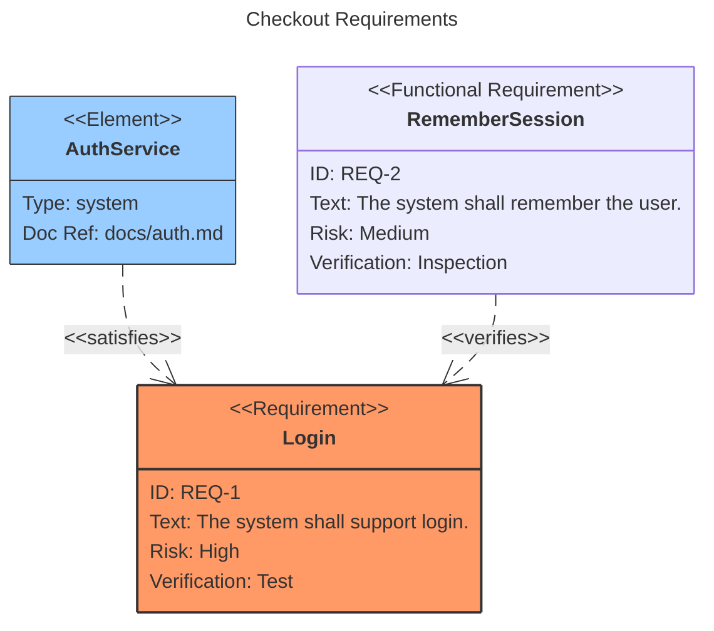

## Requirement Diagram

```mermaid
---
title: Checkout Requirements
---
requirementDiagram
    direction TB
    requirement Login:::critical {
        id: "REQ-1"
        text: "The system shall support login."
        risk: High
        verifymethod: Test
    }
    functionalRequirement RememberSession {
        id: "REQ-2"
        text: "The system shall remember the user."
        risk: Medium
        verifymethod: Inspection
    }
    element AuthService:::service {
        type: "system"
        docRef: "docs/auth.md"
    }
    AuthService - satisfies -> Login
    RememberSession - verifies -> Login
    classDef critical fill:#f96,stroke:#333,stroke-width:2px
    classDef service fill:#9cf,stroke:#333,stroke-width:1px
```