<!-- ALL-CONTRIBUTORS-BADGE:START - Do not remove or modify this section -->
[](#contributors-)
<!-- ALL-CONTRIBUTORS-BADGE:END -->
[](https://pkg.go.dev/github.com/nao1215/markdown)
[](https://github.com/nao1215/markdown/actions/workflows/unit_test.yml)
[](https://github.com/nao1215/markdown/actions/workflows/reviewdog.yml)
[](https://github.com/nao1215/markdown/actions/workflows/gosec.yml)


[English](../../README.md) | [日本語](../ja/README.md) | [中文](../zh-cn/README.md) | [한국어](../ko/README.md) | [Español](../es/README.md) | [Français](../fr/README.md)

# Что такое пакет markdown
Пакет markdown - это простой конструктор markdown на языке Golang. Пакет markdown собирает Markdown используя цепочку методов, не используя шаблонизатор как [html/template](https://pkg.go.dev/html/template). Синтаксис Markdown следует **GitHub Markdown**.

Пакет markdown изначально был разработан для сохранения результатов тестов в [nao1215/spectest](https://github.com/nao1215/spectest). Поэтому пакет markdown реализует функции, необходимые для spectest. Например, пакет markdown поддерживает **диаграммы последовательности mermaid (диаграммы сущностей-связей, диаграммы последовательности, диаграммы пути пользователя, блок-схемы, круговые диаграммы, квадрантные диаграммы, диаграммы состояний, диаграммы классов, диаграммы Ганта, архитектурные диаграммы)**, которые были необходимой функцией в spectest.

Кроме того, сложный код, который увеличивает сложность библиотеки, такой как создание вложенных списков, добавляться не будет. Я хочу сохранить эту библиотеку максимально простой.

## Поддерживаемые ОС и версии Go
- ОС: Linux, macOS, Windows
- Go: 1.21 или новее

## Поддерживаемые функции Markdown
- [x] Заголовки; H1, H2, H3, H4, H5, H6
- [x] Блок-цитаты
- [x] Маркированные списки
- [x] Нумерованные списки
- [x] Списки с флажками
- [x] Блоки кода
- [x] Горизонтальные линии
- [x] Таблицы
- [x] Форматирование текста; жирный, курсив, код, зачеркивание, жирный курсив
- [x] Текст с ссылкой
- [x] Текст с изображением
- [x] Простой текст
- [x] Детали
- [x] Уведомления; NOTE, TIP, IMPORTANT, CAUTION, WARNING
- [x] диаграммы последовательности mermaid
- [x] диаграммы пути пользователя mermaid
- [x] диаграммы сущностей-связей mermaid
- [x] блок-схемы mermaid
- [x] круговые диаграммы mermaid
- [x] квадрантные диаграммы mermaid
- [x] диаграммы состояний mermaid
- [x] диаграммы классов mermaid
- [x] диаграммы Ганта mermaid
- [x] архитектурные диаграммы mermaid (бета-функция)

### Функции, не входящие в синтаксис Markdown
- Создание значков; RedBadge(), YellowBadge(), GreenBadge().
- Создание индекса для каталога, полного файлов markdown; GenerateIndex()

## Пример
### Основное использование
```go
package main

import (
	"os"

	md "github.com/nao1215/markdown"
)

func main() {
	md.NewMarkdown(os.Stdout).
		H1("This is H1").
		PlainText("This is plain text").
		H2f("This is %s with text format", "H2").
		PlainTextf("Text formatting, such as %s and %s, %s styles.",
			md.Bold("bold"), md.Italic("italic"), md.Code("code")).
		H2("Code Block").
		CodeBlocks(md.SyntaxHighlightGo,
			`package main
import "fmt"

func main() {
	fmt.Println("Hello, World!")
}`).
		H2("List").
		BulletList("Bullet Item 1", "Bullet Item 2", "Bullet Item 3").
		OrderedList("Ordered Item 1", "Ordered Item 2", "Ordered Item 3").
		H2("CheckBox").
		CheckBox([]md.CheckBoxSet{
			{Checked: false, Text: md.Code("sample code")},
			{Checked: true, Text: md.Link("Go", "https://golang.org")},
			{Checked: false, Text: md.Strikethrough("strikethrough")},
		}).
		H2("Blockquote").
		Blockquote("If you can dream it, you can do it.").
		H3("Horizontal Rule").
		HorizontalRule().
		H2("Table").
		Table(md.TableSet{
			Header: []string{"Name", "Age", "Country"},
			Rows: [][]string{
				{"David", "23", "USA"},
				{"John", "30", "UK"},
				{"Bob", "25", "Canada"},
			},
		}).
		H2("Image").
		PlainTextf(md.Image("sample_image", "./sample.png")).
		Build()
}
```

Вывод:
````
# This is H1
This is plain text

## This is H2 with text format
Text formatting, such as **bold** and *italic*, `code` styles.

## Code Block
```go
package main
import "fmt"

func main() {
        fmt.Println("Hello, World!")
}
```

## List
- Bullet Item 1
- Bullet Item 2
- Bullet Item 3
1. Ordered Item 1
2. Ordered Item 2
3. Ordered Item 3

## CheckBox
- [ ] `sample code`
- [x] [Go](https://golang.org)
- [ ] ~~strikethrough~~

## Blockquote
> If you can dream it, you can do it.

### Horizontal Rule
---

## Table
| NAME  | AGE | COUNTRY |
|-------|-----|---------|
| David |  23 | USA     |
| John  |  30 | UK      |
| Bob   |  25 | Canada  |

## Image

````

Если вы хотите увидеть, как это выглядит в Markdown, пожалуйста, обратитесь к следующей ссылке.
- [sample.md](../generated_example.md)

### Создание Markdown с использованием `"go generate ./..."`
Вы можете создавать Markdown используя `go generate`. Сначала определите код для генерации Markdown. Затем запустите `"go generate ./..."` для создания Markdown.

[Пример кода:](../generate/main.go)
```go
package main

import (
	"os"

	md "github.com/nao1215/markdown"
)

//go:generate go run main.go

func main() {
	f, err := os.Create("generated.md")
	if err != nil {
		panic(err)
	}
	defer f.Close()

	md.NewMarkdown(f).
		H1("go generate example").
		PlainText("This markdown is generated by `go generate`").
		Build()
}
```

Выполните команду ниже:
```shell
go generate ./...
```

[Вывод:](../generate/generated.md)
````text
# go generate example
This markdown is generated by `go generate`
````

### Синтаксис уведомлений
Пакет markdown может создавать уведомления. Уведомления полезны для отображения важной информации в Markdown. Этот синтаксис поддерживается GitHub.
[Пример кода:](../alert/main.go)
```go
	md.NewMarkdown(f).
		H1("Alert example").
		Note("This is note").LF().
		Tip("This is tip").LF().
		Important("This is important").LF().
		Warning("This is warning").LF().
		Caution("This is caution").LF().
		Build()
```

[Вывод:](../alert/generated.md)
````text
# Alert example
> [!NOTE]  
> This is note

> [!TIP]  
> This is tip

> [!IMPORTANT]  
> This is important

> [!WARNING]  
> This is warning

> [!CAUTION]  
> This is caution
````

Ваше уведомление будет выглядеть так;
> [!NOTE]  
> This is note

> [!TIP]  
> This is tip

> [!IMPORTANT]  
> This is important

> [!WARNING]  
> This is warning

> [!CAUTION]  
> This is caution

### Синтаксис значков состояния
Пакет markdown может создавать красные, желтые и зеленые значки состояния.
[Пример кода:](../badge/main.go)
```go
	md.NewMarkdown(os.Stdout).
		H1("badge example").
		RedBadge("red_badge").
		YellowBadge("yellow_badge").
		GreenBadge("green_badge").
		BlueBadge("blue_badge").
		Build()
```

[Вывод:](../badge/generated.md)
````text
# badge example


````

Ваш значок будет выглядеть так:


### Синтаксис диаграммы последовательности Mermaid

```go
package main

import (
	"os"

	"github.com/nao1215/markdown"
	"github.com/nao1215/markdown/mermaid/sequence"
)

//go:generate go run main.go

func main() {
	diagram := sequence.NewDiagram(io.Discard).
		Participant("Sophia").
		Participant("David").
		Participant("Subaru").
		LF().
		SyncRequest("Sophia", "David", "Please wake up Subaru").
		SyncResponse("David", "Sophia", "OK").
		LF().
		LoopStart("until Subaru wake up").
		SyncRequest("David", "Subaru", "Wake up!").
		SyncResponse("Subaru", "David", "zzz").
		SyncRequest("David", "Subaru", "Hey!!!").
		BreakStart("if Subaru wake up").
		SyncResponse("Subaru", "David", "......").
		BreakEnd().
		LoopEnd().
		LF().
		SyncResponse("David", "Sophia", "wake up, wake up").
		String()

	markdown.NewMarkdown(os.Stdout).
		H2("Sequence Diagram").
		CodeBlocks(markdown.SyntaxHighlightMermaid, diagram).
		Build()
}
```

Вывод простого текста: [markdown здесь](../sequence/generated.md)
````
## Sequence Diagram
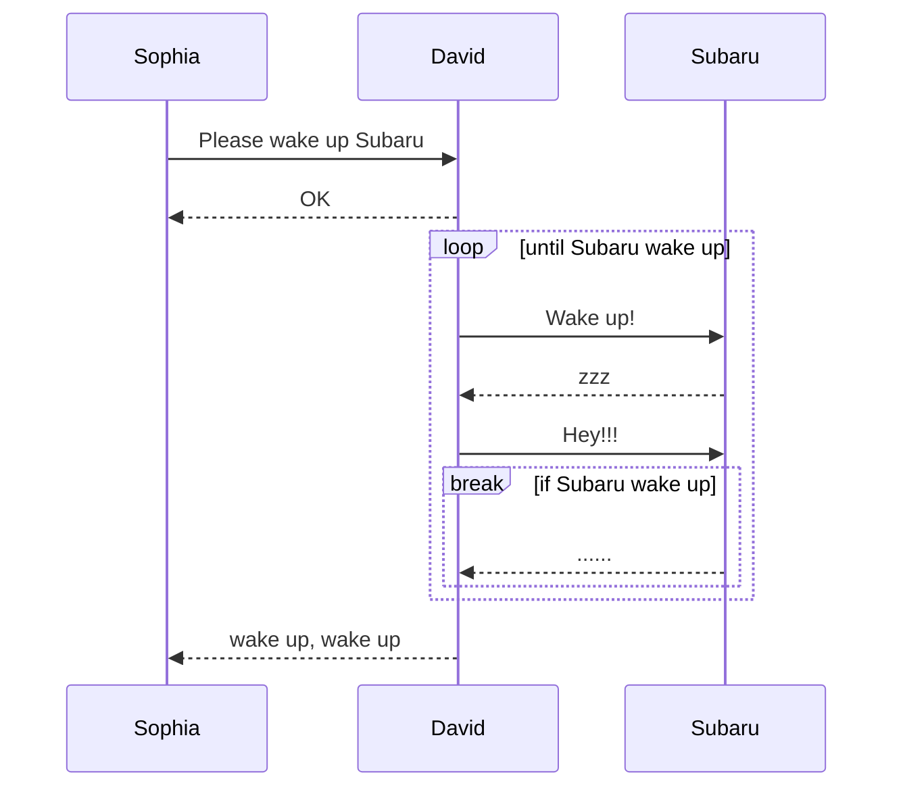
````

Вывод Mermaid:


### Синтаксис диаграммы пути пользователя Mermaid

```go
package main

import (
	"io"
	"os"

	"github.com/nao1215/markdown"
	"github.com/nao1215/markdown/mermaid/userjourney"
)

//go:generate go run main.go

func main() {
	diagram := userjourney.NewDiagram(
		io.Discard,
		userjourney.WithTitle("Checkout Journey"),
	).
		Section("Discover").
		Task("Browse products", userjourney.ScoreVerySatisfied, "Customer").
		Task("Add item to cart", userjourney.ScoreSatisfied, "Customer").
		LF().
		Section("Checkout").
		Task("Enter shipping details", userjourney.ScoreNeutral, "Customer").
		Task("Complete payment", userjourney.ScoreSatisfied, "Customer", "Payment Service").
		String()

	if err := markdown.NewMarkdown(os.Stdout).
		H2("User Journey Diagram").
		CodeBlocks(markdown.SyntaxHighlightMermaid, diagram).
		Build(); err != nil {
		panic(err)
	}
}
```

Вывод простого текста: [markdown здесь](../userjourney/generated.md)
````text
## User Journey Diagram
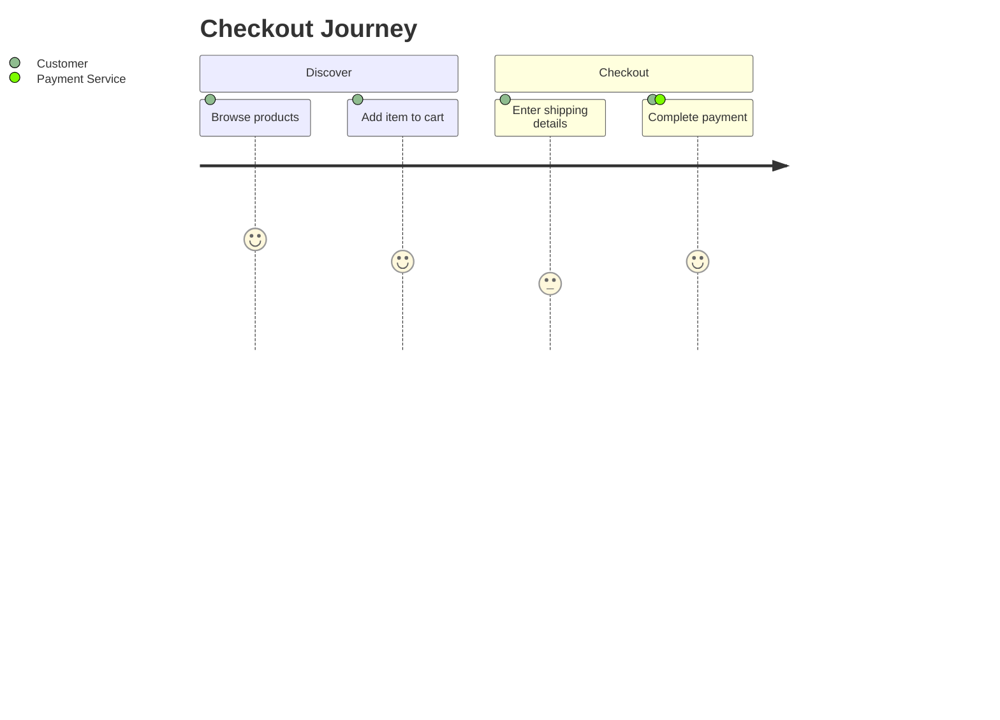
````

Вывод Mermaid:


### Синтаксис диаграммы сущностей-связей

```go
package main

import (
	"os"

	"github.com/nao1215/markdown"
	"github.com/nao1215/markdown/mermaid/er"
)

//go:generate go run main.go

func main() {
	f, err := os.Create("generated.md")
	if err != nil {
		panic(err)
	}
	defer f.Close()

	teachers := er.NewEntity(
		"teachers",
		[]*er.Attribute{
			{
				Type:         "int",
				Name:         "id",
				IsPrimaryKey: true,
				IsForeignKey: false,
				IsUniqueKey:  true,
				Comment:      "Teacher ID",
			},
			{
				Type:         "string",
				Name:         "name",
				IsPrimaryKey: false,
				IsForeignKey: false,
				IsUniqueKey:  false,
				Comment:      "Teacher Name",
			},
		},
	)
	students := er.NewEntity(
		"students",
		[]*er.Attribute{
			{
				Type:         "int",
				Name:         "id",
				IsPrimaryKey: true,
				IsForeignKey: false,
				IsUniqueKey:  true,
				Comment:      "Student ID",
			},
			{
				Type:         "string",
				Name:         "name",
				IsPrimaryKey: false,
				IsForeignKey: false,
				IsUniqueKey:  false,
				Comment:      "Student Name",
			},
			{
				Type:         "int",
				Name:         "teacher_id",
				IsPrimaryKey: false,
				IsForeignKey: true,
				IsUniqueKey:  true,
				Comment:      "Teacher ID",
			},
		},
	)
	schools := er.NewEntity(
		"schools",
		[]*er.Attribute{
			{
				Type:         "int",
				Name:         "id",
				IsPrimaryKey: true,
				IsForeignKey: false,
				IsUniqueKey:  true,
				Comment:      "School ID",
			},
			{
				Type:         "string",
				Name:         "name",
				IsPrimaryKey: false,
				IsForeignKey: false,
				IsUniqueKey:  false,
				Comment:      "School Name",
			},
			{
				Type:         "int",
				Name:         "teacher_id",
				IsPrimaryKey: false,
				IsForeignKey: true,
				IsUniqueKey:  true,
				Comment:      "Teacher ID",
			},
		},
	)

	erString := er.NewDiagram(f).
		Relationship(
			teachers,
			students,
			er.ExactlyOneRelationship, // "||"
			er.ZeroToMoreRelationship, // "}o"
			er.Identifying,            // "--"
			"Teacher has many students",
		).
		Relationship(
			teachers,
			schools,
			er.OneToMoreRelationship,  // "|}"
			er.ExactlyOneRelationship, // "||"
			er.NonIdentifying,         // ".."
			"School has many teachers",
		).
		String()

	err = markdown.NewMarkdown(f).
		H2("Entity Relationship Diagram").
		CodeBlocks(markdown.SyntaxHighlightMermaid, erString).
		Build()

	if err != nil {
		panic(err)
	}
}
```

Вывод простого текста: [markdown здесь](../er/generated.md)
````
## Entity Relationship Diagram
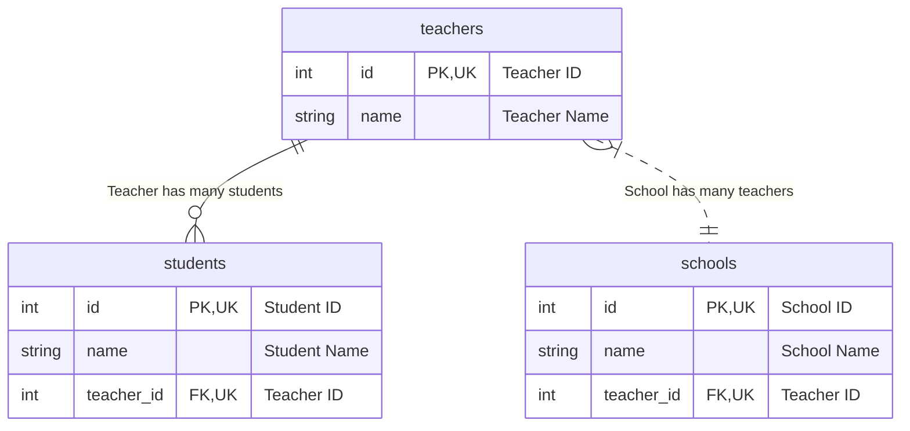
````

Вывод Mermaid:


### Синтаксис блок-схем

```go
package main

import (
	"io"
	"os"

	"github.com/nao1215/markdown"
	"github.com/nao1215/markdown/mermaid/flowchart"
)

//go:generate go run main.go

func main() {
	f, err := os.Create("generated.md")
	if err != nil {
		panic(err)
	}
	defer f.Close()

	fc := flowchart.NewFlowchart(
		io.Discard,
		flowchart.WithTitle("mermaid flowchart builder"),
		flowchart.WithOrientalTopToBottom(),
	).
		NodeWithText("A", "Node A").
		StadiumNode("B", "Node B").
		SubroutineNode("C", "Node C").
		DatabaseNode("D", "Database").
		LinkWithArrowHead("A", "B").
		LinkWithArrowHeadAndText("B", "D", "send original data").
		LinkWithArrowHead("B", "C").
		DottedLinkWithText("C", "D", "send filtered data").
		String()

	err = markdown.NewMarkdown(f).
		H2("Flowchart").
		CodeBlocks(markdown.SyntaxHighlightMermaid, fc).
		Build()

	if err != nil {
		panic(err)
	}
}
```

Вывод простого текста: [markdown здесь](../flowchart/generated.md)
````
## Flowchart
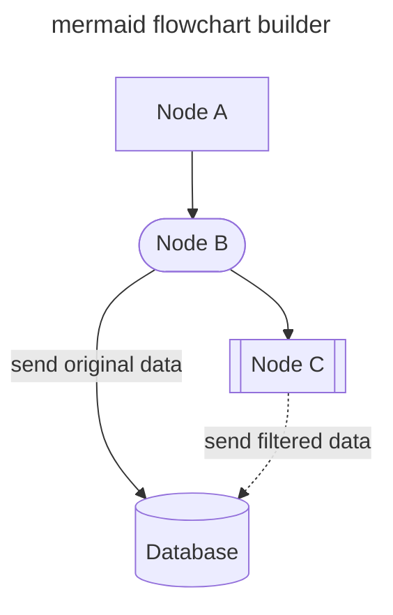
````

Вывод Mermaid:
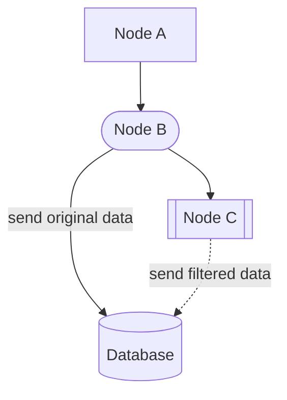

### Синтаксис круговых диаграмм

```go
package main

import (
	"io"
	"os"

	"github.com/nao1215/markdown"
	"github.com/nao1215/markdown/mermaid/piechart"
)

//go:generate go run main.go

func main() {
	f, err := os.Create("generated.md")
	if err != nil {
		panic(err)
	}
	defer f.Close()

	chart := piechart.NewPieChart(
		io.Discard,
		piechart.WithTitle("mermaid pie chart builder"),
		piechart.WithShowData(true),
	).
		LabelAndIntValue("A", 10).
		LabelAndFloatValue("B", 20.1).
		LabelAndIntValue("C", 30).
		String()

	err = markdown.NewMarkdown(f).
		H2("Pie Chart").
		CodeBlocks(markdown.SyntaxHighlightMermaid, chart).
		Build()

	if err != nil {
		panic(err)
	}
}
```

Вывод простого текста: [markdown здесь](../piechart/generated.md)
````
## Pie Chart
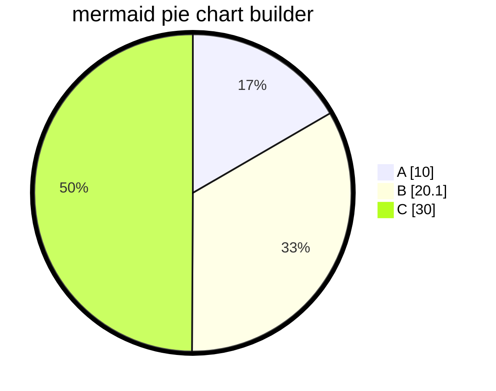
````

Вывод Mermaid:


### Архитектурные диаграммы (бета-функция)

[Mermaid предоставляет функцию визуализации архитектуры инфраструктуры как бета-версию](https://mermaid.js.org/syntax/architecture.html), и эта функция была введена.

```go
package main

import (
	"io"
	"os"

	"github.com/nao1215/markdown"
	"github.com/nao1215/markdown/mermaid/arch"
)

//go:generate go run main.go

func main() {
	f, err := os.Create("generated.md")
	if err != nil {
		panic(err)
	}
	defer f.Close()

	diagram := arch.NewArchitecture(io.Discard).
		Service("left_disk", arch.IconDisk, "Disk").
		Service("top_disk", arch.IconDisk, "Disk").
		Service("bottom_disk", arch.IconDisk, "Disk").
		Service("top_gateway", arch.IconInternet, "Gateway").
		Service("bottom_gateway", arch.IconInternet, "Gateway").
		Junction("junctionCenter").
		Junction("junctionRight").
		LF().
		Edges(
			arch.Edge{
				ServiceID: "left_disk",
				Position:  arch.PositionRight,
				Arrow:     arch.ArrowNone,
			},
			arch.Edge{
				ServiceID: "junctionCenter",
				Position:  arch.PositionLeft,
				Arrow:     arch.ArrowNone,
			}).
		Edges(
			arch.Edge{
				ServiceID: "top_disk",
				Position:  arch.PositionBottom,
				Arrow:     arch.ArrowNone,
			},
			arch.Edge{
				ServiceID: "junctionCenter",
				Position:  arch.PositionTop,
				Arrow:     arch.ArrowNone,
			}).
		Edges(
			arch.Edge{
				ServiceID: "bottom_disk",
				Position:  arch.PositionTop,
				Arrow:     arch.ArrowNone,
			},
			arch.Edge{
				ServiceID: "junctionCenter",
				Position:  arch.PositionBottom,
				Arrow:     arch.ArrowNone,
			}).
		Edges(
			arch.Edge{
				ServiceID: "junctionCenter",
				Position:  arch.PositionRight,
				Arrow:     arch.ArrowNone,
			},
			arch.Edge{
				ServiceID: "junctionRight",
				Position:  arch.PositionLeft,
				Arrow:     arch.ArrowNone,
			}).
		Edges(
			arch.Edge{
				ServiceID: "top_gateway",
				Position:  arch.PositionBottom,
				Arrow:     arch.ArrowNone,
			},
			arch.Edge{
				ServiceID: "junctionRight",
				Position:  arch.PositionTop,
				Arrow:     arch.ArrowNone,
			}).
		Edges(
			arch.Edge{
				ServiceID: "bottom_gateway",
				Position:  arch.PositionTop,
				Arrow:     arch.ArrowNone,
			},
			arch.Edge{
				ServiceID: "junctionRight",
				Position:  arch.PositionBottom,
				Arrow:     arch.ArrowNone,
			}).String() //nolint

	err = markdown.NewMarkdown(f).
		H2("Architecture Diagram").
		CodeBlocks(markdown.SyntaxHighlightMermaid, diagram).
		Build()

	if err != nil {
		panic(err)
	}
```

Вывод простого текста: [markdown здесь](../architecture/generated.md)
````
## Architecture Diagram
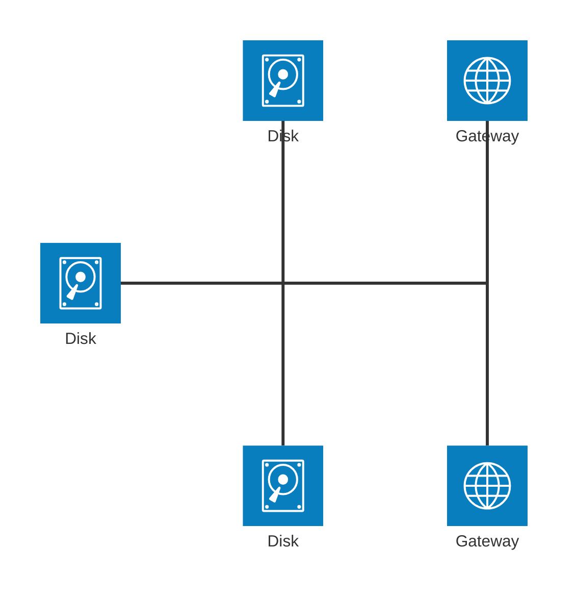
````


### Синтаксис диаграммы состояний

```go
package main

import (
	"io"
	"os"

	"github.com/nao1215/markdown"
	"github.com/nao1215/markdown/mermaid/state"
)

//go:generate go run main.go

func main() {
	f, err := os.Create("generated.md")
	if err != nil {
		panic(err)
	}
	defer f.Close()

	diagram := state.NewDiagram(io.Discard, state.WithTitle("Order State Machine")).
		StartTransition("Pending").
		State("Pending", "Order received").
		State("Processing", "Preparing order").
		State("Shipped", "Order in transit").
		State("Delivered", "Order completed").
		LF().
		TransitionWithNote("Pending", "Processing", "payment confirmed").
		TransitionWithNote("Processing", "Shipped", "items packed").
		TransitionWithNote("Shipped", "Delivered", "customer received").
		LF().
		NoteRight("Pending", "Waiting for payment").
		NoteRight("Processing", "Preparing items").
		LF().
		EndTransition("Delivered").
		String()

	err = markdown.NewMarkdown(f).
		H2("State Diagram").
		CodeBlocks(markdown.SyntaxHighlightMermaid, diagram).
		Build()

	if err != nil {
		panic(err)
	}
}
```

Вывод простого текста: [markdown здесь](../state/generated.md)
````
## State Diagram
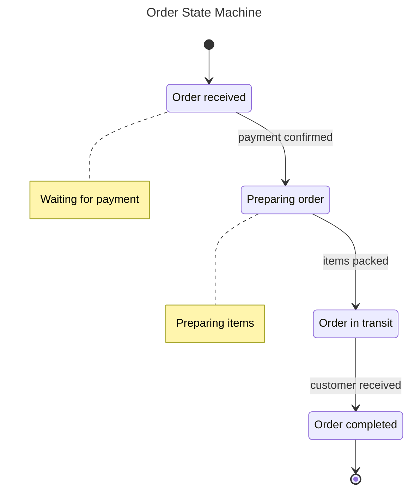
````

Вывод Mermaid:


### Синтаксис диаграммы классов

```go
package main

import (
	"io"
	"os"

	"github.com/nao1215/markdown"
	"github.com/nao1215/markdown/mermaid/class"
)

//go:generate go run main.go

func main() {
	f, err := os.Create("generated.md")
	if err != nil {
		panic(err)
	}
	defer f.Close()

	diagram := class.NewDiagram(
		io.Discard,
		class.WithTitle("Checkout Domain"),
	).
		SetDirection(class.DirectionLR).
		Class(
			"Order",
			class.WithPublicField("string", "id"),
			class.WithPublicMethod("Create", "error", "items []LineItem"),
			class.WithPublicMethod("Pay", "error"),
		).
		Class(
			"LineItem",
			class.WithPublicField("string", "sku"),
			class.WithPublicField("int", "quantity"),
			class.WithPublicMethod("Subtotal", "int"),
		).
		Interface("PaymentGateway")

	diagram.From("Order").
		Composition("LineItem", class.WithOneToMany(), class.WithRelationLabel("contains")).
		Association("PaymentGateway", class.WithRelationLabel("uses"))

	diagramString := diagram.
		NoteFor("Order", "Aggregate Root").
		String()

	err = markdown.NewMarkdown(f).
		H2("Class Diagram").
		CodeBlocks(markdown.SyntaxHighlightMermaid, diagramString).
		Build()

	if err != nil {
		panic(err)
	}
}
```

Вывод простого текста: [markdown здесь](../class/generated.md)
````text
## Class Diagram
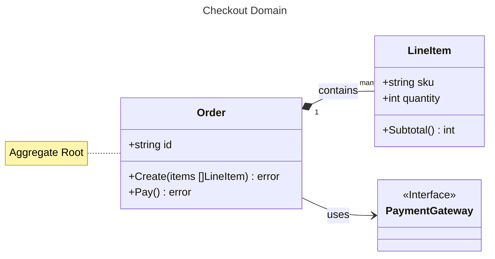
````

Вывод Mermaid:


### Синтаксис квадрантной диаграммы

```go
package main

import (
	"io"
	"os"

	"github.com/nao1215/markdown"
	"github.com/nao1215/markdown/mermaid/quadrant"
)

//go:generate go run main.go

func main() {
	f, err := os.Create("generated.md")
	if err != nil {
		panic(err)
	}
	defer f.Close()

	chart := quadrant.NewChart(io.Discard, quadrant.WithTitle("Product Prioritization")).
		XAxis("Low Effort", "High Effort").
		YAxis("Low Value", "High Value").
		LF().
		Quadrant1("Quick Wins").
		Quadrant2("Major Projects").
		Quadrant3("Fill Ins").
		Quadrant4("Thankless Tasks").
		LF().
		Point("Feature A", 0.9, 0.85).
		Point("Feature B", 0.25, 0.75).
		Point("Feature C", 0.15, 0.20).
		Point("Feature D", 0.80, 0.15).
		String()

	err = markdown.NewMarkdown(f).
		H2("Quadrant Chart").
		CodeBlocks(markdown.SyntaxHighlightMermaid, chart).
		Build()

	if err != nil {
		panic(err)
	}
}
```

Вывод простого текста: [markdown здесь](../quadrant/generated.md)
````
## Quadrant Chart
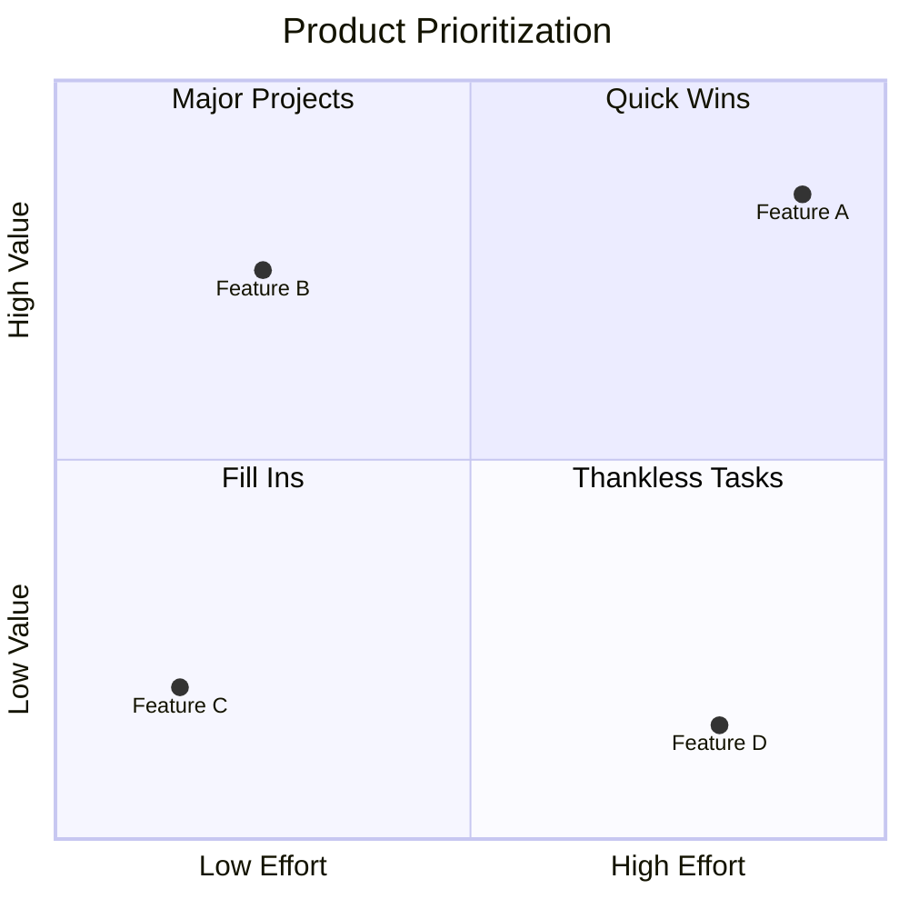
````

Вывод Mermaid:


### Синтаксис диаграммы Ганта

```go
package main

import (
	"io"
	"os"

	"github.com/nao1215/markdown"
	"github.com/nao1215/markdown/mermaid/gantt"
)

//go:generate go run main.go

func main() {
	f, err := os.Create("generated.md")
	if err != nil {
		panic(err)
	}
	defer f.Close()

	chart := gantt.NewChart(
		io.Discard,
		gantt.WithTitle("Project Schedule"),
		gantt.WithDateFormat("YYYY-MM-DD"),
	).
		Section("Planning").
		DoneTaskWithID("Requirements", "req", "2024-01-01", "5d").
		DoneTaskWithID("Design", "design", "2024-01-08", "3d").
		Section("Development").
		CriticalActiveTaskWithID("Coding", "code", "2024-01-12", "10d").
		TaskAfterWithID("Review", "review", "code", "2d").
		Section("Release").
		MilestoneWithID("Launch", "launch", "2024-01-26").
		String()

	err = markdown.NewMarkdown(f).
		H2("Gantt Chart").
		CodeBlocks(markdown.SyntaxHighlightMermaid, chart).
		Build()

	if err != nil {
		panic(err)
	}
}
```

Вывод простого текста: [markdown здесь](../gantt/generated.md)
````
## Gantt Chart
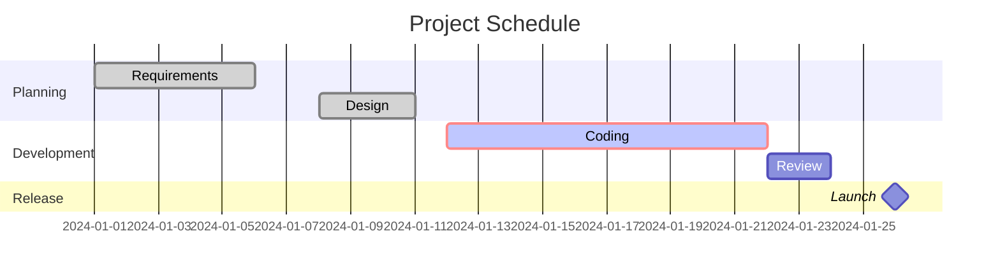
````

Вывод Mermaid:


## Создание индекса для каталога, полного файлов markdown
Пакет markdown может создать индекс для файлов Markdown в указанном каталоге. Эта функция была добавлена для генерации индексов для документов Markdown, созданных [nao1215/spectest](https://github.com/nao1215/spectest).

Например, рассмотрим следующую структуру каталогов:

```shell
testdata
├── abc
│   ├── dummy.txt
│   ├── jkl
│   │   └── text.md
│   └── test.md
├── def
│   ├── test.md
│   └── test2.md
├── expected
│   └── index.md
├── ghi
└── test.md
```

В следующей реализации создается индексный файл markdown, содержащий ссылки на все файлы markdown, расположенные в каталоге testdata.

```go
		if err := GenerateIndex(
			"testdata", // целевой каталог, содержащий файлы markdown
			WithTitle("Test Title"), // заголовок индексного markdown
			WithDescription([]string{"Test Description", "Next Description"}), // описание индексного markdown
		); err != nil {
			panic(err)
		}
```

Индексный файл Markdown создается по умолчанию в «целевом каталоге/index.md». Если вы хотите изменить этот путь, пожалуйста, используйте опцию `WithWriter()`. Имена ссылок в файле будут первым вхождением H1 или H2 в целевом Markdown. Если ни H1, ни H2 не присутствуют, именем ссылки будет имя файла назначения.

[Вывод:](../index.md)
```markdown
## Test Title
Test Description

Next Description

### testdata
- [test.md](test.md)

### abc
- [h2 is here](abc/test.md)

### jkl
- [text.md](abc/jkl/text.md)

### def
- [h2 is first, not h1](def/test.md)
- [h1 is here](def/test2.md)

### expected
- [Test Title](expected/index.md)
```

## Лицензия
[MIT License](../../LICENSE)

## Вклад
Прежде всего, спасибо за то, что нашли время для вклада! См. [CONTRIBUTING.md](../../CONTRIBUTING.md) для получения дополнительной информации. Вклады касаются не только разработки. Например, GitHub Star мотивирует меня к разработке! Пожалуйста, не стесняйтесь вносить вклад в этот проект.

[](https://star-history.com/#nao1215/markdown&Date)

### Участники ✨

Спасибо этим замечательным людям ([ключ эмодзи](https://allcontributors.org/docs/en/emoji-key)):

<!-- ALL-CONTRIBUTORS-LIST:START - Do not remove or modify this section -->
<!-- prettier-ignore-start -->
<!-- markdownlint-disable -->
<table>
  <tbody>
    <tr>
      <td align="center" valign="top" width="14.28%"><a href="https://debimate.jp/"><br /><sub><b>CHIKAMATSU Naohiro</b></sub></a><br /><a href="https://github.com/nao1215/markdown/commits?author=nao1215" title="Code">💻</a></td>
      <td align="center" valign="top" width="14.28%"><a href="https://github.com/varmakarthik12"><br /><sub><b>Karthik Sundari</b></sub></a><br /><a href="https://github.com/nao1215/markdown/commits?author=varmakarthik12" title="Code">💻</a></td>
      <td align="center" valign="top" width="14.28%"><a href="https://github.com/Avihuc"><br /><sub><b>Avihuc</b></sub></a><br /><a href="https://github.com/nao1215/markdown/commits?author=Avihuc" title="Code">💻</a></td>
      <td align="center" valign="top" width="14.28%"><a href="https://www.claranceliberi.me/"><br /><sub><b>Clarance Liberiste Ntwari</b></sub></a><br /><a href="https://github.com/nao1215/markdown/commits?author=claranceliberi" title="Code">💻</a></td>
      <td align="center" valign="top" width="14.28%"><a href="https://github.com/amitaifrey"><br /><sub><b>Amitai Frey</b></sub></a><br /><a href="https://github.com/nao1215/markdown/commits?author=amitaifrey" title="Code">💻</a></td>
    </tr>
  </tbody>
  <tfoot>
    <tr>
      <td align="center" size="13px" colspan="7">
        
          <a href="https://all-contributors.js.org/docs/en/bot/usage">Add your contributions</a>
        </img>
      </td>
    </tr>
  </tfoot>
</table>

<!-- markdownlint-restore -->
<!-- prettier-ignore-end -->

<!-- ALL-CONTRIBUTORS-LIST:END -->

Этот проект следует спецификации [all-contributors](https://github.com/all-contributors/all-contributors). Приветствуются любые виды вкладов!
